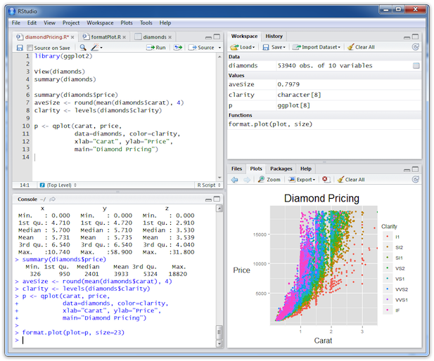

## 기초 1 과정

- 데이터 : 총 15개 업종의 1년치 구매건수 (가상의) 데이터 
- 월 * 업종 * 성별 * 요일의 변수가 존재

### 학습 목표 : 엑셀 기능들을 R로 구현하여 자동화 하기 
- 데이터 불러오기  
- 데이터 편집하기  
- 그룹별로 평균 구하기  
- 그래프 그리기  

---  .new-background

## R

* R 언어는 통계 <U>계산</U>과 <U>그래픽</U>을 위한 프로그래밍 언어  
* S-PLUS -> R (1997, GNU PROJECT)  

* 한계 : R’s biggest challenge is that most R users are not programmers  
* 극복 : Solving the “Two-Language” Problem  

### 설치 
 
* Install [R](http://www.r-project.org/)  
* Install the lastest version of [RStudio](http://rstudio.org/download/)  

--- .new-background

## 적절한 code editor 고르기
예) R Studio


--- .new-background

## Introduction
    
- The "Comprehensive R Archive Network" (CRAN)  
is a collection of sites which carry identical material, consisting of the R distribution(s), the contributed extensions, documentation for R, and binaries.

### 장점  
- Freeware
- 대화식 프로그램
- 방대한 라이브러리
- 다양한 OS 지원 / Java, C, Fortran 프로그래밍 인터페이스
- 다양한 그래픽 지원

### 단점
- Freeware --> 저자 마음대로 input 설정
- 국내자료가 부족

--- .new-background

## 오늘의 데이터

```{r, echo=F}
setwd("/Users/kimhyungjun/Dropbox/repo/r_basic/html")
```

```{r, echo=F, eval=T, opts_chunk$set(cache=TRUE)}

df <- read.csv("data/sales.csv", fileEncoding = "CP949", na.strings = "NA", colClasses = rep("character", 5))
head(df)
df[which(df$매출월 == "2월") : (which(df$매출월 == "2월") + 5), ] 

```

--- .dark .segue .nobackground

## 데이터 불러오기

---  .new-background

## 데이터 불러오기 

### 경로 설정 : Session -> Set Working Directory -> Choose Directory

### Windows

```{r, eval=T}
#df <- read.csv("data/sales.csv")
```

### MAC

```{r, eval=T}
df <- read.csv("data/sales.csv", fileEncoding = "CP949")
```

---  .new-background

### 

```{r, echo=F}
options(stringsAsFactors=FALSE)
```

```{r}
df <- read.csv("data/sales.csv", fileEncoding = "CP949", stringsAsFactors=T)
str(df)
```

---  .new-background

## Type

- character # 문자열 (예, 사람 이름)   
- factor : levels # 요인 (예, 성별, 요일, 업종)  
- numeric : int(integer) , double (예, 숫자)  
- Logic : TRUE, FALSE    

--- .new-background

## 연습

```{r}
x <- c("A", "B", "C")
y <- c(1, 1, 3)
str(x)
str(y)
```

--- &twocol w1:50% w2:50% .new-background

## logic

*** =left

```{r}
y == 1
y == 3
y == 2
```

*** =right

```{r}
y[y == 1]
y[y == 2]
y[y != 1]
```

--- .new-background

```{r}
xy <- data.frame(x, y)
xy
```

```{r, echo=T, eval=F}
xy[1, ]  ##  xy에서 1행 전체
xy[2, ]  ##  xy에서 2행 전체
xy[, 1]  ##  xy에서 1열 전체
xy[, 2]  ##  xy에서 2열 전체
```

--- .new-background

```{r}
xy
```

```{r, echo=T, eval=F}
xy[1, 1] ##  xy 에서 1행, 1열 
xy[1:3, 1] ##  xy 에서 1행 ~ 3행,  1열 
xy[1:3, 1:2] ##  xy 에서 1행 ~ 3행,  1열 ~ 2열
xy[1:2, ] ##  xy 에서 1행 ~ 2행,  1열 ~ 2열
xy[1:2, -1] ##  xy 에서 1행 ~ 2행,  1열 제외
xy[-c(1,3), ] ##  xy 에서 1행, 3행 제외,  1열
```

---  .new-background

```{r}
df <- read.csv("data/sales.csv", fileEncoding = "CP949", stringsAsFactors=F)
str(df)
```

---  .new-background

```{r, eval=F}

df[,"성별"] == "남자"

```

```{r}

df[df[, "성별"] == "남자", "성별"] <- "남"

```

---  .new-background

```{r}
df[1:5, 1]
df[1:5, "매출월"]
df$매출월[1:5]
```

---  .new-background

```{r}
df[1:5, 1] == "1월"
df[1:5, "매출월"] == "1월"
df$매출월[1:5] == "1월"
```

---  .new-background

```{r}
man.temp <- df[df[,"성별"] == "남", ]
man <- subset(df, 성별 == "남")
all.equal(man.temp, man)
woman <- subset(df, 성별 == "여")
```

---  .new-background

```{r}
man.mean <- mean(man$구매건수)
woman.mean <- mean(woman$구매건수)

man.sum <- sum(man$구매건수)
woman.sum <- sum(woman$구매건수)


```

---  .new-background

```{r}
barplot(c(man.mean, woman.mean))
```

---  .new-background

```{r}
barplot(c(man.mean, woman.mean), 
        names.arg = c("남", "여"),
        main = "남녀 구매건수 평균")
```

---  .new-background

```{r}
barplot(c(man.mean, woman.mean), 
        names.arg = c("남", "여"),
        main = "남녀 구매건수 평균", col = c("red", "blue"))
```

---  .new-background

```{r}
barplot(c(man.mean, woman.mean), 
        names.arg = c("남", "여"),
        main = "남녀 구매건수 평균", col = c("red", "blue"), density = 30)
```

---  .new-background .modal

```{r}
barplot(c(man.mean, woman.mean), 
        names.arg = c("남", "여"),
        main = "남녀 구매건수 평균", col = c("red", "blue"), density = 30, 
        legend = c("남", "여"))

```

---  .new-background

```{r}
man.5 <- subset(df, 매출월 == 5 & 성별 == "남")
man.5.mean <- mean(man.5$구매건수)

woman.5 <- subset(df, 매출월 == 5 & 성별 == "여")
woman.5.mean <- mean(woman.5$구매건수)
```

---  .new-background .modal

```{r}
barplot(c(man.5.mean, woman.5.mean), 
        names.arg = c("남", "여"),
        main = "5월 남녀 구매건수 평균 비교", col = c("red", "blue"),
        density = 30, legend = c("남", "여"))

```

--- .dark .segue .nobackground

## 직접 해보기

---  .new-background

### Task 요일별 구매건수 평균 그래프 그리기 

```{r, eval=F}

월 <- subset(df, ??? == ?)
화 <- subset(df, ??? == ?)
수 <- subset(df, ??? == ?)
목 <- subset(df, ??? == ?)
금 <- subset(df, ??? == ?)
토 <- subset(df, ??? == ?)
일 <- subset(df, ??? == ?)

```

---  .new-background

```{r, eval=F}

월mean <- ???
화mean <- ???
수mean <- ???
목mean <- ???
금mean <- ???
토mean <- ???
일mean <- ???

```

---  .new-background

```{r, eval=F}
barplot(???, 
        names.arg = c("월", "화", "수", "목", "금", "토", "일"),
        main = "요일별 구매건수 평균 비교",
        col = rainbow(7),
        density = 30,
        legend = c("월", "화", "수", "목", "금", "토", "일"))

```


---  .new-background

### Task 평일 vs 주말 구매건수 평균 그래프 그리기 

```{r, eval=F}

평일 <- subset(df, ??? == ?)  ### "==" 사용? "%in%" 사용?
주말 <- subset(df, ??? == ?)

평일mean <- ???
주말mean <- ???

barplot(???, col = ???, legend = ???, density = ???)
title(main = ???)

```

---  .new-background

```{r}

paste(5, "월")
paste(5, "월", sep="")
sprintf("%d%s", 5, "월")
sprintf("%02d%s", 5, "월")

```

---  .new-background

```{r}

for (i in 1:5)
    {
        print(i)
    }

for (i in 1:5)
    {
        print(paste(i, "월"))
        break
    }

```

---  .new-background

### 월별 & 성별 (5월 ~ 9월)

```{r}

for (i in 5:9)
{
    man <- subset(df, 매출월 == i & 성별 == "남")
    man.mean <- mean(man$구매건수)
    
    woman <- subset(df, 매출월 == i & 성별 == "여")
    woman.mean <- mean(woman$구매건수)
    
    png(filename = sprintf("%d%s", i, ".png"))
    barplot(c(man.mean, woman.mean), 
        names.arg = c("남", "여"),
        main = paste(i, "월 남녀 구매건수 평균"),
        col = c("red", "blue"),
        density = 30,
        legend = c("남", "여"))
    dev.off()
}

```

---  .new-background

### 상반기 vs 하반기

```{r}
df <- df[df[,"매출월"] %in% 1:12,]
df[,"매출월"] <- as.numeric(df[,"매출월"])
df.first <- subset(df, 매출월 <= 6 )
mean(df.first$구매건수)
df.latter <- subset(df, 매출월 > 6 )
mean(df.latter$구매건수)
```

---  .new-background

## 12개월 

```{r}
sale.month <- split(df, df$매출월)

for (i in 1:2)
{
    print(mean(sale.month[i][[1]]$구매건수))
}

sapply(sale.month, function(x) mean(x$구매건수))
```

---  .new-background

## 다음 시간  
- 데이터 편집하기  
- Missing 다루기  
- 집단 평균 비교하기  
- 상관관계 이해하기

```{r, echo=F}
df <- read.csv("data/sales.csv", fileEncoding = "CP949")
df <- df[df[,"매출월"] %in% 1:12,]
df[,"매출월"] <- as.numeric(df[,"매출월"])
df[df[, "성별"] == "남자", "성별"] <- "남"
set.seed(12345)
rowMiss <- sample(1:nrow(df), 50)
missDot <- sample(1:length(rowMiss), 20)
missSharp <- setdiff(rowMiss, missDot)
df[missDot, 5] <- "."
df[missSharp, 5] <- "#"
#write.table(df, "data/salesC.csv", row.names = F, sep =",", fileEncoding = "CP949")
```