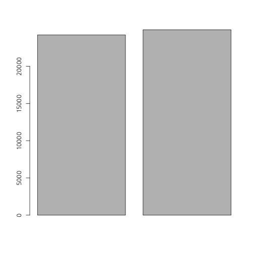
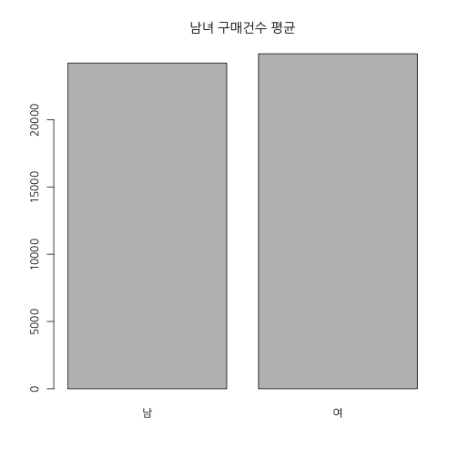
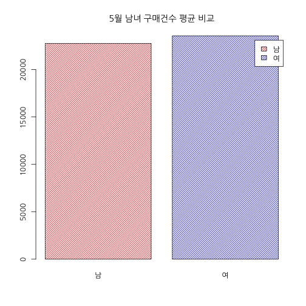

## 기초 1 과정

### 학습 목표

엑셀 자동화 : 그룹별로 평균 / 중간값 구하기   
데이터 불러오기  
데이터 편집하기  

---  .new-background

## 오늘의 데이터


```
##   매출월 요일 점포 성별 구매건수
## 1    1월                        
## 2                               
## 3      1   월    a 남자    21451
## 4      1   화    b   여    24922
## 5      1   수    c 남자     8835
## 6      1   목    d   여    13720
```

```
##     매출월 요일 점포 성별 구매건수
## 213    2월                        
## 214                               
## 215      2   월    a 남자    43421
## 216      2   화    b   여    13416
## 217      2   수    c 남자    24219
## 218      2   목    d   여    20317
```

--- .dark .segue .nobackground

## 데이터 불러오기

---  .new-background

## 데이터 불러오기 

### 경로 설정 : Session -> Set Working Directory -> Choose Directory

### Windows


```r
#df <- read.csv("data/sales.csv")
```

### MAC


```r
df <- read.csv("data/sales.csv", fileEncoding = "CP949")
```

---  .new-background

### 


```r
df <- read.csv("data/sales.csv", fileEncoding = "CP949", stringsAsFactors=T)
str(df)
```

```
## 'data.frame':	2544 obs. of  5 variables:
##  $ 매출월  : Factor w/ 25 levels "","1","10","10월",..: 9 1 2 2 2 2 2 2 2 2 ...
##  $ 요일    : Factor w/ 8 levels "","금","목","수",..: 1 1 5 8 4 3 2 7 6 5 ...
##  $ 점포    : Factor w/ 16 levels "","a","b","c",..: 1 1 2 3 4 5 6 7 8 9 ...
##  $ 성별    : Factor w/ 3 levels "","남자","여": 1 1 2 3 2 3 2 3 2 3 ...
##  $ 구매건수: int  NA NA 21451 24922 8835 13720 10826 43319 2471 10457 ...
```

---  .new-background

## Type

character  
factor : levels  
numeric : int(integer) , double  
Logic : TRUE, FALSE  

--- .new-background

## 연습


```r
x <- c("A", "B", "C")
y <- c(1, 1, 3)
str(x)
```

```
##  chr [1:3] "A" "B" "C"
```

```r
str(y)
```

```
##  num [1:3] 1 1 3
```

--- &twocol w1:50% w2:50% .new-background

## logic

*** =left


```r
y == 1
```

```
## [1]  TRUE  TRUE FALSE
```

```r
y == 3
```

```
## [1] FALSE FALSE  TRUE
```

```r
y == 2
```

```
## [1] FALSE FALSE FALSE
```

*** =right


```r
y[y == 1]
```

```
## [1] 1 1
```

```r
y[y == 2]
```

```
## numeric(0)
```

```r
y[y != 1]
```

```
## [1] 3
```

--- .new-background


```r
xy <- data.frame(x, y)
xy
```

```
##   x y
## 1 A 1
## 2 B 1
## 3 C 3
```


```r
xy[1, ]  ##  xy에서 1행 전체
xy[2, ]  ##  xy에서 2행 전체
xy[, 1]  ##  xy에서 1열 전체
xy[, 2]  ##  xy에서 2열 전체
```

--- .new-background


```r
xy
```

```
##   x y
## 1 A 1
## 2 B 1
## 3 C 3
```


```r
xy[1, 1] ##  xy 에서 1행, 1열 
xy[1:3, 1] ##  xy 에서 1행 ~ 3행,  1열 
xy[1:3, 1:2] ##  xy 에서 1행 ~ 3행,  1열 ~ 2열
xy[1:2, ] ##  xy 에서 1행 ~ 2행,  1열 ~ 2열
xy[1:2, -1] ##  xy 에서 1행 ~ 2행,  1열 제외
xy[-c(1,3), ] ##  xy 에서 1행, 3행 제외,  1열
```

---  .new-background


```r
df <- read.csv("data/sales.csv", fileEncoding = "CP949", stringsAsFactors=F)
str(df)
```

```
## 'data.frame':	2544 obs. of  5 variables:
##  $ 매출월  : chr  "1월" "" "1" "1" ...
##  $ 요일    : chr  "" "" "월" "화" ...
##  $ 점포    : chr  "" "" "a" "b" ...
##  $ 성별    : chr  "" "" "남자" "여" ...
##  $ 구매건수: int  NA NA 21451 24922 8835 13720 10826 43319 2471 10457 ...
```

---  .new-background


```r
df[,"성별"] == "남자"
```


```r
df[df[, "성별"] == "남자", "성별"] <- "남"
```

---  .new-background


```r
df[1:5, 1]
```

```
## [1] "1월" ""    "1"   "1"   "1"
```

```r
df[1:5, "매출월"]
```

```
## [1] "1월" ""    "1"   "1"   "1"
```

```r
df$매출월[1:5]
```

```
## [1] "1월" ""    "1"   "1"   "1"
```

---  .new-background


```r
df[1:5, 1] == "1월"
```

```
## [1]  TRUE FALSE FALSE FALSE FALSE
```

```r
df[1:5, "매출월"] == "1월"
```

```
## [1]  TRUE FALSE FALSE FALSE FALSE
```

```r
df$매출월[1:5] == "1월"
```

```
## [1]  TRUE FALSE FALSE FALSE FALSE
```

---  .new-background


```r
man <- df[df[,"성별"] == "남", ]
man <- subset(df, 성별 == "남")
woman <- subset(df, 성별 == "여")
```

---  .new-background


```r
man.mean <- mean(man$구매건수)
woman.mean <- mean(woman$구매건수)
```

---  .new-background


```r
barplot(c(man.mean, woman.mean))
```

 

---  .new-background


```r
barplot(c(man.mean, woman.mean), 
        names.arg = c("남", "여"),
        main = "남녀 구매건수 평균")
```

 

---  .new-background


```r
barplot(c(man.mean, woman.mean), 
        names.arg = c("남", "여"),
        main = "남녀 구매건수 평균",
        col = c("red", "blue"))
```

 

---  .new-background


```r
barplot(c(man.mean, woman.mean), 
        names.arg = c("남", "여"),
        main = "남녀 구매건수 평균",
        col = c("red", "blue"),
        density = 30)
```

 

---  .new-background


```r
barplot(c(man.mean, woman.mean), 
        names.arg = c("남", "여"),
        main = "남녀 구매건수 평균",
        col = c("red", "blue"),
        density = 30,
        legend = c("남", "여"))
```

 

---  .new-background


```r
man.5 <- subset(df, 매출월 == 5 & 성별 == "남")
man.5.mean <- mean(man.5$구매건수)

woman.5 <- subset(df, 매출월 == 5 & 성별 == "여")
woman.5.mean <- mean(woman.5$구매건수)
```

---  .new-background


```r
barplot(c(man.5.mean, woman.5.mean), 
        names.arg = c("남", "여"),
        main = "5월 남녀 구매건수 평균 비교",
        col = c("red", "blue"),
        density = 30,
        legend = c("남", "여"))
```

 

--- .dark .segue .nobackground

## 직접 해보기

---  .new-background

### Task 요일별 구매건수 평균 그래프 그리기 


```r
월 <- subset(df, ??? == ?)
화 <- subset(df, ??? == ?)
수 <- subset(df, ??? == ?)
목 <- subset(df, ??? == ?)
금 <- subset(df, ??? == ?)
토 <- subset(df, ??? == ?)
일 <- subset(df, ??? == ?)
```

---  .new-background


```r
월mean <- ???
화mean <- ???
수mean <- ???
목mean <- ???
금mean <- ???
토mean <- ???
일mean <- ???
```

---  .new-background


```r
barplot(???, 
        names.arg = c("월", "화", "수", "목", "금", "토", "일"),
        main = "요일별 구매건수 평균 비교",
        col = rainbow(7),
        density = 30,
        legend = c("월", "화", "수", "목", "금", "토", "일"))
```


---  .new-background

### Task 평일 vs 주말 구매건수 평균 그래프 그리기 


```r
평일 <- subset(df, ??? == ?)  ### "==" 사용? "%in%" 사용?
주말 <- subset(df, ??? == ?)

평일mean <- ???
주말mean <- ???

barplot(???, col = ???, legend = ???, density = ???)
title(main = ???)
```

---  .new-background


```r
paste(5, "월")
```

```
## [1] "5 월"
```

```r
paste(5, "월", sep="")
```

```
## [1] "5월"
```

```r
sprintf("%d%s", 5, "월")
```

```
## [1] "5월"
```

```r
sprintf("%02d%s", 5, "월")
```

```
## [1] "05월"
```

---  .new-background


```r
for (i in 1:5)
    {
        print(i)
    }
```

```
## [1] 1
## [1] 2
## [1] 3
## [1] 4
## [1] 5
```

```r
for (i in 1:5)
    {
        print(paste(i, "월"))
        break
    }
```

```
## [1] "1 월"
```

---  .new-background

### 월별 & 성별 (5월 ~ 9월)


```r
for (i in 5:9)
{
    man <- subset(df, 매출월 == i & 성별 == "남")
    man.mean <- mean(man$구매건수)
    
    woman <- subset(df, 매출월 == i & 성별 == "여")
    woman.mean <- mean(woman$구매건수)
    
    png(filename = sprintf("%d%s", i, ".png"))
    barplot(c(man.mean, woman.mean), 
        names.arg = c("남", "여"),
        main = paste(i, "월 남녀 구매건수 평균"),
        col = c("red", "blue"),
        density = 30,
        legend = c("남", "여"))
    dev.off()
}
```

---  .new-background

### 상반기 vs 하반기


```r
df <- df[df[,"매출월"] %in% 1:12,]
df[,"매출월"] <- as.numeric(df[,"매출월"])
df.first <- subset(df, 매출월 <= 6 )
mean(df.first$구매건수)
```

```
## [1] 24601.29
```

```r
df.latter <- subset(df, 매출월 > 6 )
mean(df.latter$구매건수)
```

```
## [1] 24504.51
```

---  .new-background

### 12개월


```r
sale.month <- split(df, df$매출월)
sapply(sale.month, function(x) mean(x$구매건수))
```

```
##        1        2        3        4        5        6        7        8 
## 24347.91 25708.40 25529.28 25247.96 23154.91 23619.28 25220.08 24482.36 
##        9       10       11       12 
## 23920.19 24190.30 24923.86 24290.30
```
