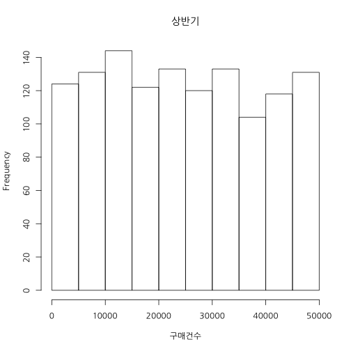

## 기초 2 과정

### 학습 목표

데이터 편집하기 
집단 평균 비교하기  
상관관계 이해하기


---  .new-background

## 오늘의 데이터


---  .new-background


```r
table(df$성별)
```

```
## 
##   남   여 
## 1260 1260
```

```r
table(df$요일)
```

```
## 
##  금  목  수  월  일  토  화 
## 360 360 360 360 360 360 360
```

```r
table(df$점포)
```

```
## 
##   a   b   c   d   e   f   g   h   i   j   k   l   m   n   o 
## 168 168 168 168 168 168 168 168 168 168 168 168 168 168 168
```

---  .new-background

### 상반기 vs 하반기


```r
df.first <- subset(df, 매출월 <= 6 )
mean(df.first$구매건수)
```

```
## [1] 24601.29
```

```r
df.latter <- subset(df, 매출월 > 6 )
mean(df.latter$구매건수)
```

```
## [1] 24504.51
```

---  .new-background

### Histogram


```r
hist(df.first$구매건수, xlab = "구매건수", main = "상반기")
```

 

---  .new-background

### Histogram


```r
hist(df.latter$구매건수, xlab = "구매건수", main = "하반기")
```

 

---  .new-background


```r
var.test(df.first$구매건수, df.latter$구매건수)
```

```
## 
## 	F test to compare two variances
## 
## data:  df.first$구매건수 and df.latter$구매건수
## F = 0.9587, num df = 1259, denom df = 1259, p-value = 0.4544
## alternative hypothesis: true ratio of variances is not equal to 1
## 95 percent confidence interval:
##  0.8583827 1.0707352
## sample estimates:
## ratio of variances 
##          0.9586973
```

---  .new-background


```r
t.test(df.first$구매건수, df.latter$구매건수)
```

```
## 
## 	Welch Two Sample t-test
## 
## data:  df.first$구매건수 and df.latter$구매건수
## t = 0.1667, df = 2516.881, p-value = 0.8676
## alternative hypothesis: true difference in means is not equal to 0
## 95 percent confidence interval:
##  -1041.646  1235.202
## sample estimates:
## mean of x mean of y 
##  24601.29  24504.51
```

---  .new-background


```r
df.high <- df[df$구매건수 >= quantile(df$구매건수, probs = .9), ]
mosaicplot(df.high$성별 ~ df.high$요일, 
           main="성별 by 요일", shade=F, 
           color = 1:7, xlab="성별", ylab="요일")
```

 

---  .new-background


```r
df.sunday <- subset(df, 요일 ==  "일")
```


```r
var.test(구매건수 ~ 성별,  df.sunday)
```

```
## 
## 	F test to compare two variances
## 
## data:  구매건수 by 성별
## F = 0.8625, num df = 179, denom df = 179, p-value = 0.3235
## alternative hypothesis: true ratio of variances is not equal to 1
## 95 percent confidence interval:
##  0.6428782 1.1572527
## sample estimates:
## ratio of variances 
##          0.8625384
```

---  .new-background


```r
t.test(구매건수 ~ 성별, df.sunday)
```

```
## 
## 	Welch Two Sample t-test
## 
## data:  구매건수 by 성별
## t = -1.1008, df = 356.061, p-value = 0.2717
## alternative hypothesis: true difference in means is not equal to 0
## 95 percent confidence interval:
##  -4741.009  1338.175
## sample estimates:
## mean in group 남 mean in group 여 
##         23427.77         25129.18
```

---  .new-background


```r
df.month <- sapply(split(df, df$매출월), function(x) x$구매건수)
cor(df.month)
```

```
##                1            2            3           4            5
## 1   1.0000000000 -0.046597870 -0.005091544  0.04965226 -0.095763459
## 2  -0.0465978701  1.000000000  0.007198092  0.04784140  0.049866797
## 3  -0.0050915442  0.007198092  1.000000000 -0.08928948  0.009266516
## 4   0.0496522589  0.047841404 -0.089289484  1.00000000  0.083159531
## 5  -0.0957634587  0.049866797  0.009266516  0.08315953  1.000000000
## 6  -0.0467665007  0.059768731  0.011398083  0.03400470 -0.011766161
## 7   0.0932324983  0.081653119 -0.064059318 -0.04259415 -0.155939433
## 8  -0.0891884815 -0.093172175  0.003177127  0.04454848  0.155339506
## 9   0.0007013688  0.114002900  0.029118759 -0.04626856 -0.052674603
## 10 -0.0266476486 -0.031764041 -0.104999236  0.02905020  0.036026462
## 11 -0.0803115160 -0.097581285 -0.046301692  0.05163380 -0.040655629
## 12 -0.1754625412 -0.052740131 -0.068930001  0.05575638 -0.038566514
##              6           7            8             9           10
## 1  -0.04676650  0.09323250 -0.089188482  0.0007013688 -0.026647649
## 2   0.05976873  0.08165312 -0.093172175  0.1140028997 -0.031764041
## 3   0.01139808 -0.06405932  0.003177127  0.0291187587 -0.104999236
## 4   0.03400470 -0.04259415  0.044548476 -0.0462685602  0.029050198
## 5  -0.01176616 -0.15593943  0.155339506 -0.0526746033  0.036026462
## 6   1.00000000  0.01109366  0.063751905  0.0698618369 -0.041238355
## 7   0.01109366  1.00000000 -0.143873398 -0.0503747033  0.099972896
## 8   0.06375191 -0.14387340  1.000000000  0.1354939122 -0.096760716
## 9   0.06986184 -0.05037470  0.135493912  1.0000000000 -0.080174057
## 10 -0.04123835  0.09997290 -0.096760716 -0.0801740572  1.000000000
## 11  0.00185299  0.01007081  0.056584691 -0.1288624049 -0.006716721
## 12  0.06028914  0.08446167 -0.082848856  0.0122945246  0.118176835
##              11          12
## 1  -0.080311516 -0.17546254
## 2  -0.097581285 -0.05274013
## 3  -0.046301692 -0.06893000
## 4   0.051633805  0.05575638
## 5  -0.040655629 -0.03856651
## 6   0.001852990  0.06028914
## 7   0.010070813  0.08446167
## 8   0.056584691 -0.08284886
## 9  -0.128862405  0.01229452
## 10 -0.006716721  0.11817684
## 11  1.000000000  0.01155653
## 12  0.011556525  1.00000000
```
