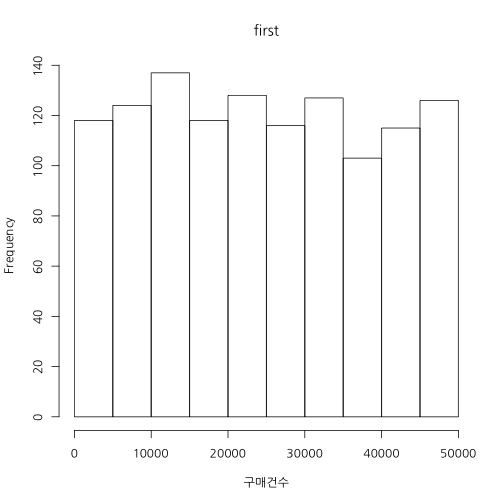
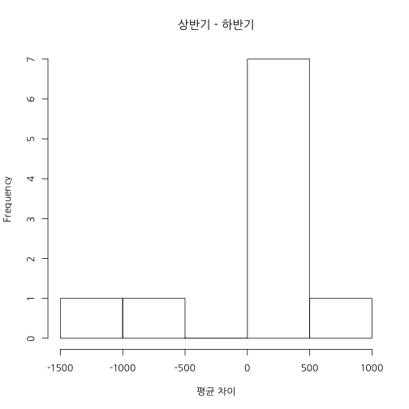
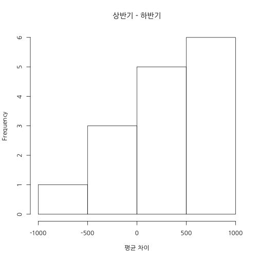
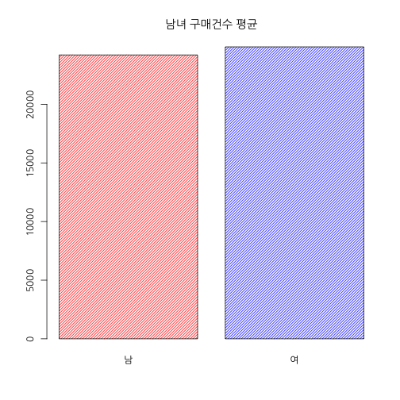

## 기초 2 과정

### 학습 목표

패키지 설치하기  
데이터 편집하기  
Missing 다루기  
집단 평균 비교하기  
상관관계 이해하기

---  .new-background

## 패키지(라이브러리)

```r
head(installed.packages())
```

```
##           Package    
## abind     "abind"    
## acepack   "acepack"  
## acss.data "acss.data"
## ACTCD     "ACTCD"    
## ada       "ada"      
## adabag    "adabag"   
##           LibPath                                                         
## abind     "/Library/Frameworks/R.framework/Versions/3.1/Resources/library"
## acepack   "/Library/Frameworks/R.framework/Versions/3.1/Resources/library"
## acss.data "/Library/Frameworks/R.framework/Versions/3.1/Resources/library"
## ACTCD     "/Library/Frameworks/R.framework/Versions/3.1/Resources/library"
## ada       "/Library/Frameworks/R.framework/Versions/3.1/Resources/library"
## adabag    "/Library/Frameworks/R.framework/Versions/3.1/Resources/library"
##           Version   Priority Depends                      Imports
## abind     "1.4-0"   NA       "R (>= 1.5.0)"               NA     
## acepack   "1.3-3.3" NA       NA                           NA     
## acss.data "1.0"     NA       "R (>= 2.10)"                NA     
## ACTCD     "1.0-0"   NA       "R (>= 2.15.1), R.methodsS3" NA     
## ada       "2.0-3"   NA       "R(>= 2.10),rpart"           NA     
## adabag    "3.2"     NA       "rpart, mlbench, caret"      NA     
##           LinkingTo Suggests Enhances License              License_is_FOSS
## abind     NA        NA       NA       "LGPL (>= 2)"        NA             
## acepack   NA        NA       NA       "MIT + file LICENSE" NA             
## acss.data NA        NA       NA       "GPL (>= 2)"         NA             
## ACTCD     NA        NA       NA       "GPL (>= 2)"         NA             
## ada       NA        NA       NA       "GPL"                NA             
## adabag    NA        NA       NA       "GPL (>= 2)"         NA             
##           License_restricts_use OS_type MD5sum NeedsCompilation Built  
## abind     NA                    NA      NA     NA               "3.1.1"
## acepack   NA                    NA      NA     "yes"            "3.1.0"
## acss.data NA                    NA      NA     "no"             "3.1.0"
## ACTCD     NA                    NA      NA     "yes"            "3.1.1"
## ada       NA                    NA      NA     NA               "3.1.0"
## adabag    NA                    NA      NA     "no"             "3.1.0"
```

---  .new-background

### 패키지 설치

```r
install.packages("bootstrap")
```

```
## 
## The downloaded binary packages are in
## 	/var/folders/_r/ytdlmf5x039_5bzh37xy121r0000gn/T//RtmpPaapYj/downloaded_packages
```


```r
install.packages("bootstrap", repos="http://cran.rstudio.com/")
```

### 패키지 정보  

[CRAN](https://www.google.co.kr/webhp?sourceid=chrome-instant&ion=1&espv=2&ie=UTF-8#q=cran)  

[CRAN Pac. by names](http://cran.r-project.org/web/packages/available_packages_by_name.html)  
  
[CRAN Pac. by Tasks](http://cran.r-project.org/web/views/)  

---  .new-background

## 오늘의 데이터


```
## 'data.frame':	2520 obs. of  5 variables:
##  $ 매출월  : int  1 1 1 1 1 1 1 1 1 1 ...
##  $ 요일    : chr  "월" "화" "수" "목" ...
##  $ 점포    : chr  "a" "b" "c" "d" ...
##  $ 성별    : chr  "남" "여" "남" "여" ...
##  $ 구매건수: chr  "21451" "24922" "." "13720" ...
```

---  .new-background


```r
df <- read.csv("data/salesC.csv", fileEncoding = "CP949", stringsAsFactors = F, na.strings = c(".", "#"))
str(df)
```

```
## 'data.frame':	2520 obs. of  5 variables:
##  $ 매출월  : int  1 1 1 1 1 1 1 1 1 1 ...
##  $ 요일    : chr  "월" "화" "수" "목" ...
##  $ 점포    : chr  "a" "b" "c" "d" ...
##  $ 성별    : chr  "남" "여" "남" "여" ...
##  $ 구매건수: int  21451 24922 NA 13720 NA NA NA NA 17081 NA ...
```

---  .new-background


```r
table(df$성별)
```

```
## 
##   남   여 
## 1260 1260
```

```r
table(df$요일)
```

```
## 
##  금  목  수  월  일  토  화 
## 360 360 360 360 360 360 360
```

```r
table(df$점포)
```

```
## 
##   a   b   c   d   e   f   g   h   i   j   k   l   m   n   o 
## 168 168 168 168 168 168 168 168 168 168 168 168 168 168 168
```

```r
table(df$매출월)
```

```
## 
##   1   2   3   4   5   6   7   8   9  10  11  12 
## 210 210 210 210 210 210 210 210 210 210 210 210
```

---  .new-background

### first vs latter


```r
df.first <- subset(df, 매출월 <= 6 )
mean(df.first$구매건수)
```

```
## [1] NA
```

```r
mean(df.first$구매건수, na.rm = T)
```

```
## [1] 24707.54
```

```r
df.latter <- subset(df, 매출월 > 6 )
mean(df.latter$구매건수, na.rm = T)
```

```
## [1] 24560.92
```

---  .new-background

### Histogram


```r
hist(df.first$구매건수, xlab = "구매건수", main = "first")
```

 

---  .new-background

### Histogram


```r
hist(df.latter$구매건수, xlab = "구매건수", main = "latter")
```

 

---  .new-background

### first vs latter


```r
library(bootstrap)
```


```r
first <- na.omit(df.first$구매건수)
latter <- na.omit(df.latter$구매건수)
first.means <- bootstrap(first, 5, mean)$thetastar
latter.means <- bootstrap(latter, 5, mean)$thetastar
```

---  .new-background .modal

hist(first.means - latter.means , main = "상반기 - 하반기", xlab = "평균 차이")

---  .new-background .modal

### first vs latter


```r
first.means <- bootstrap(first, 10, mean)$thetastar
latter.means <- bootstrap(latter, 10, mean)$thetastar
hist(first.means - latter.means, main = "상반기 - 하반기", xlab = "평균 차이")
```

 

---  .new-background .modal

### first vs latter


```r
first.means <- bootstrap(first, 15, mean)$thetastar
latter.means <- bootstrap(latter, 15, mean)$thetastar
hist(first.means - latter.means, main = "상반기 - 하반기", xlab = "평균 차이")
```

 

---  .new-background .modal

### first vs latter


```r
first.means <- bootstrap(first, 5000, mean)$thetastar
latter.means <- bootstrap(latter, 5000, mean)$thetastar
hist(first.means - latter.means, main = "상반기 - 하반기", xlab = "평균 차이")
```

 

---  .new-background .modal

### first vs first


```r
hist(first.means - first.means, main = "상반기 - 상반기", xlab = "평균 차이")
```

 

--- &twocol w1:50% w2:50% .new-background

*** =left


```r
hist(first.means - latter.means, main = "상반기 - 하반기", xlab = "평균 차이")
```

 

*** =right


```r
hist(first.means - first.means, main = "상반기 - 상반기", xlab = "평균 차이")
```

 


---  .new-background


```r
var.test(df.first$구매건수, df.latter$구매건수)
```

```
## 
## 	F test to compare two variances
## 
## data:  df.first$구매건수 and df.latter$구매건수
## F = 0.9605, num df = 1211, denom df = 1217, p-value = 0.4824
## alternative hypothesis: true ratio of variances is not equal to 1
## 95 percent confidence interval:
##  0.8582286 1.0749026
## sample estimates:
## ratio of variances 
##          0.9604674
```

---  .new-background


```r
t.test(df.first$구매건수, df.latter$구매건수)
```

```
## 
## 	Welch Two Sample t-test
## 
## data:  df.first$구매건수 and df.latter$구매건수
## t = 0.2484, df = 2427.437, p-value = 0.8039
## alternative hypothesis: true difference in means is not equal to 0
## 95 percent confidence interval:
##  -1011.026  1304.273
## sample estimates:
## mean of x mean of y 
##  24707.54  24560.92
```

---  .new-background


```r
df.sunday <- subset(df, 요일 ==  "일")
```


```r
var.test(구매건수 ~ 성별,  df.sunday)
```

```
## 
## 	F test to compare two variances
## 
## data:  구매건수 by 성별
## F = 0.8389, num df = 175, denom df = 174, p-value = 0.2469
## alternative hypothesis: true ratio of variances is not equal to 1
## 95 percent confidence interval:
##  0.6228691 1.1297685
## sample estimates:
## ratio of variances 
##          0.8389209
```

---  .new-background


```r
t.test(구매건수 ~ 성별, df.sunday)
```

```
## 
## 	Welch Two Sample t-test
## 
## data:  구매건수 by 성별
## t = -1.1314, df = 345.989, p-value = 0.2587
## alternative hypothesis: true difference in means is not equal to 0
## 95 percent confidence interval:
##  -4849.027  1307.565
## sample estimates:
## mean in group 남 mean in group 여 
##         23469.91         25240.64
```

---  .new-background


```r
df.holiday <- subset(df, 요일 %in% c("토", "일"))
```


```r
var.test(구매건수 ~ 성별,  df.holiday)
```

```
## 
## 	F test to compare two variances
## 
## data:  구매건수 by 성별
## F = 0.942, num df = 350, denom df = 344, p-value = 0.5781
## alternative hypothesis: true ratio of variances is not equal to 1
## 95 percent confidence interval:
##  0.7629188 1.1629618
## sample estimates:
## ratio of variances 
##          0.9420287
```

---  .new-background


```r
t.test(구매건수 ~ 성별, df.holiday)
```

```
## 
## 	Welch Two Sample t-test
## 
## data:  구매건수 by 성별
## t = 0.0679, df = 692.463, p-value = 0.9458
## alternative hypothesis: true difference in means is not equal to 0
## 95 percent confidence interval:
##  -2095.938  2246.211
## sample estimates:
## mean in group 남 mean in group 여 
##         24549.65         24474.51
```

---  .new-background


```r
x = 1:10; y = c(1,3,2,4,5,6,7,9,8,10);
plot(x, y)
```

 

```r
cor(x,y)
```

```
## [1] 0.9757576
```

---  .new-background


```r
x = 1:10; y = c(5,10,1,6,4,3,7,9,8,3);
plot(x, y)
```

 

```r
cor(x,y)
```

```
## [1] 0.06297909
```

---  .new-background


```r
df.sex <- split(df, df$성별)
str(df.sex)
```

```
## List of 2
##  $ 남:'data.frame':	1260 obs. of  5 variables:
##   ..$ 매출월  : int [1:1260] 1 1 1 1 1 1 1 1 1 1 ...
##   ..$ 요일    : chr [1:1260] "월" "수" "금" "일" ...
##   ..$ 점포    : chr [1:1260] "a" "c" "e" "g" ...
##   ..$ 성별    : chr [1:1260] "남" "남" "남" "남" ...
##   ..$ 구매건수: int [1:1260] 21451 NA NA NA 17081 6833 2265 NA 45928 28571 ...
##  $ 여:'data.frame':	1260 obs. of  5 variables:
##   ..$ 매출월  : int [1:1260] 1 1 1 1 1 1 1 1 1 1 ...
##   ..$ 요일    : chr [1:1260] "화" "목" "토" "월" ...
##   ..$ 점포    : chr [1:1260] "b" "d" "f" "h" ...
##   ..$ 성별    : chr [1:1260] "여" "여" "여" "여" ...
##   ..$ 구매건수: int [1:1260] 24922 13720 NA NA NA NA 32637 NA NA 22597 ...
```

```r
str(df.sex['남'])
```

```
## List of 1
##  $ 남:'data.frame':	1260 obs. of  5 variables:
##   ..$ 매출월  : int [1:1260] 1 1 1 1 1 1 1 1 1 1 ...
##   ..$ 요일    : chr [1:1260] "월" "수" "금" "일" ...
##   ..$ 점포    : chr [1:1260] "a" "c" "e" "g" ...
##   ..$ 성별    : chr [1:1260] "남" "남" "남" "남" ...
##   ..$ 구매건수: int [1:1260] 21451 NA NA NA 17081 6833 2265 NA 45928 28571 ...
```

---  .new-background


```r
x <- data.frame(sex = "남자", value1 = 123, value2 = 125)
y <- data.frame(sex = "여자", value1 = 122)
rbind(x,x)
```

```
##    sex value1 value2
## 1 남자    123    125
## 2 남자    123    125
```

```r
#rbind(x,y)
list(x,y)
```

```
## [[1]]
##    sex value1 value2
## 1 남자    123    125
## 
## [[2]]
##    sex value1
## 1 여자    122
```

---  .new-background .modal


```r
df.high <- df[df$구매건수 >= quantile(df$구매건수, probs = .9, na.rm = T), ]
mosaicplot(df.high$성별 ~ df.high$요일, 
           main="성별 by 요일", shade=F, 
           color = 1:7, xlab="성별", ylab="요일")
```

 

---  .new-background .modal


```r
mosaicplot(df.high$성별 ~ factor(df.high$요일, levels=c("월", "화", "수", "목", "금", "토", "일")), 
           main="성별 by 요일", shade=F, 
           color = 1:7, xlab="성별", ylab="요일")
```

 

---  .new-background .modal


```r
df$요일 <- factor(df$요일, levels = c("월", "화", "수", "목", "금", "토", "일"))
df.month <- sapply(split(df, df$요일), function(x) x$구매건수)
cor(df.month, use = "pairwise")
```

```
##             월           화           수           목           금
## 월 1.000000000  0.016154311  0.064546369  0.079406578  0.040402692
## 화 0.016154311  1.000000000  0.023626917  0.042367660 -0.009842181
## 수 0.064546369  0.023626917  1.000000000 -0.013638866 -0.008021839
## 목 0.079406578  0.042367660 -0.013638866  1.000000000  0.023752689
## 금 0.040402692 -0.009842181 -0.008021839  0.023752689  1.000000000
## 토 0.004223453 -0.027353194  0.061731302 -0.007748214  0.006334015
## 일 0.076669320  0.007060764  0.070943490 -0.073613125  0.050797953
##              토           일
## 월  0.004223453  0.076669320
## 화 -0.027353194  0.007060764
## 수  0.061731302  0.070943490
## 목 -0.007748214 -0.073613125
## 금  0.006334015  0.050797953
## 토  1.000000000 -0.038389203
## 일 -0.038389203  1.000000000
```

---  .new-background .modal


```r
cor(df.month, use = "complete")
```

```
##             월            화           수           목           금
## 월  1.00000000  0.0366655752  0.068360252  0.045381720  0.037236477
## 화  0.03666558  1.0000000000 -0.027486150  0.047392569 -0.008406188
## 수  0.06836025 -0.0274861497  1.000000000 -0.022420601 -0.003601449
## 목  0.04538172  0.0473925688 -0.022420601  1.000000000  0.004998727
## 금  0.03723648 -0.0084061876 -0.003601449  0.004998727  1.000000000
## 토 -0.01620401  0.0006739636  0.052459921  0.002555485 -0.018476615
## 일  0.07846102  0.0258780356  0.076646880 -0.046833326  0.060122104
##               토          일
## 월 -0.0162040109  0.07846102
## 화  0.0006739636  0.02587804
## 수  0.0524599207  0.07664688
## 목  0.0025554848 -0.04683333
## 금 -0.0184766145  0.06012210
## 토  1.0000000000 -0.04842320
## 일 -0.0484231989  1.00000000
```

