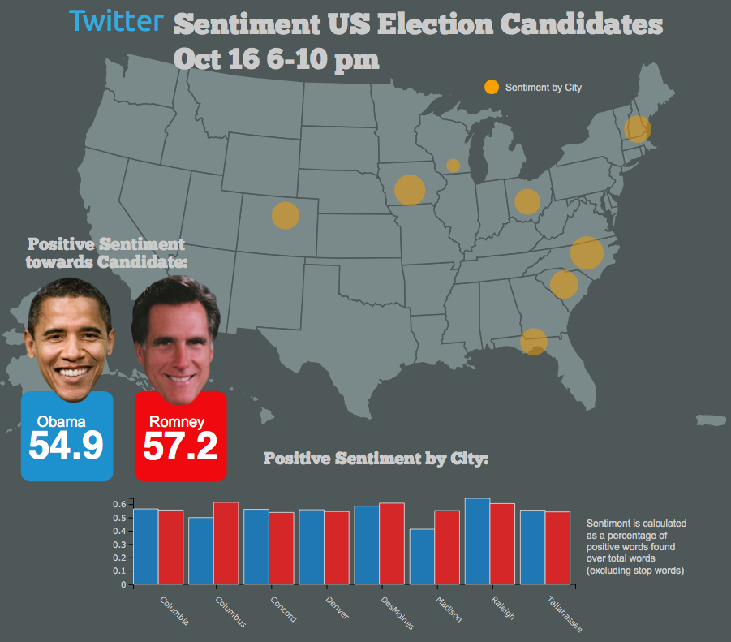

## 오늘의 목표  

<h3b> - 감정 사전 만들기</h3b>  
<h3b> - 감정 점수 만들기</h3b>  

<h3b> - 상관관계 이해하기</h3b>  
<h3b> - 회귀분석 이해하기</h3b>  
<h3b> - 모형평가 이해하기</h3b>  

--- .newbackground

## 왜 감정분석을 하는가?

<h3b> 설문지의 단점</h3b>  
<h3b> 1) 조사 비용 발생 </h3b>  
<h3b> 2) 미리 정해진 문항만 측정 가능</h3b>  
<h3b> 3) 사회적 바람직성 등 편향 발생</h3b>  

--- .newbackground

## 감정분석

<h3b> 텍스트에서 감정 단어를 추출하여 점수화</h3b>  
<h3b> 1) 기계 학습 (Machine Learning) </h3b>  
<h3b> 2) 단어 사전 기반 </h3b>

--- .newbackground

## 사전 기반 분석

<h3b> 장점 </h3b>  
<h3b> - 사용하기 간편 </h3b>  
<h3b> 단점 </h3b>  
<h3b> - 주제에 따라 사전이 달라 짐 </h3b>  
<h3b> - 동음이의어 처리 힘듦 e.g) bank </h3b>  

--- .newbackground

## 기계학습 기반 분석

<h3b> 장점 </h3b>  
<h3b> - 높은 정확도  </h3b>  
<h3b> 단점 </h3b>  
<h3b> - Over-fitting 해결 </h3b>  
<h3b> - 많은 데이터 필요 </h3b>  
<h3b> 예) 나이브 베이즈 / 최대 엔트로피 / 서포트벡터머신 / </h3b>  
<h3b>  랜덤 포레스트 / 토픽 모델 </h3b>

--- .newbackground

## 감정 분석 예시

<center></center>

--- .newbackground

## 감정 분석 예시

<center></center>


--- .newbackground

## 사전 지식 

<h3b> 감정분석: 문장에 사용된 단어로 감정을 예측 </h3b> 

<h3b>예: "이 영화는 좀 길지만 재미있고 신난다"  </h3b>    
<h3b> - 길다 -> 부정 </h3b>    
<h3b> - 재미있다 -> 긍정 </h3b>    
<h3b> - 신나다 -> 긍정  </h3b>    

--- .newbackground

## 예측 분석 

<h3b> 예측분석 </h3b> 

<h3b> 선형회귀분석 </h3b>    
<h3b> SVM </h3b>    
<h3b> RandomForest </h3b>    
<h3b> Deep Learning  </h3b>    

--- .newbackground


## 회귀분석(선형(직선) 모형) 

<h3b> 예시 </h3b>

<h3b>- 키가 1cm 증가할 때마다 몸무게가 1kg 증가  </h3b>  
<h3b>- 월 소득이 100만원 증가할 때마다 몸무게가 1kg 감소 </h3b>   
<h3b>- 부정단어가 1개 증가할 때 마다 평점 1점 감점  </h3b>  
<h3b>- 긍정단어가 1개 증가할 때 마다 평점 1점 증가  </h3b>  

--- &twocol .modal

## 상관관계

*** =left

```{r, echo = F}
x <- 1:10
y <- 1:10
```

```{r, echo=F,warning=F, fig.width=6, fig.height=6}
plot(x, y, cex.lab = 2)
cor(x, y)
```

*** =right

```{r, echo = F}
x <- 1:10
y <- 1:10
y[2] <- 10
y[8] <- 3
```

```{r, echo=F,warning=F, fig.width=6, fig.height=6}
plot(x, y, cex.lab = 2)
cor(x, y)
```

--- .newbackground .modal

## 상관관계

<h3b> x가 증가(혹은 감소)할때 y가 선형적으로 증가(혹은 감소)하는 정도 </h3b>

<h3b> scale </h3b>

<h4b> 키가 만약 cm라면, 키가 1cm 증가하면 몸무게는 1kg증가  </h4b>   
<h4b> 키가 만약 mm라면, 키가 1mm 증가하면 몸무게는 0.1kg 증가  </h4b>   

<h3b> -> 표준화해야 한다 </h3b>

--- &twocol

## 상관관계 및 회귀분석

*** =left

```{r, echo = F}
set.seed(1)
heights = rnorm(30,180,5)
heights = sort(heights, decreasing = F)
weights =  -10 + heights*.5 + rnorm(30,0,2)
```

```{r, echo=F,warning=F, fig.width=6}
plot(heights, weights, pch = 16, ylim = c(70,90), cex.lab = 2)
abline(lm(weights ~ heights), col="red")
```

*** =right

```{r results="asis", echo=F, fig.width=5, message=F}
library(xtable)
library(lm.beta)
print(xtable(coef(summary(lm(weights ~ heights)))),type="html")
```

```{r}
cor(weights, heights)
```

키가 1cm 증가하면 몸무게는 .49kg 증가


--- &twocol

## X가 2개라면?

*** =left

```{r, echo = F}
set.seed(1)
heights = rnorm(30,180,5)
heights = sort(heights, decreasing = F)
weights =  -10 + heights*.5 + rnorm(30,0,2)
iq <- 87 + heights*0 + rnorm(30,0,5)
```

```{r, echo=F,warning=F, fig.width=6, fig.height=6, message=F}
library(scatterplot3d)
test <- scatterplot3d(heights,iq,weights,color='red',
                      pch=19,col.grid='lightblue',type='h', cex.lab = 2)

my.lm<-lm(weights~heights+iq)
test$plane3d(my.lm,col='blue')
cor(weights, heights)
```

*** =right

```{r, echo=F,warning=F, fig.width=6, fig.height=6}
test <- scatterplot3d(iq,heights,weights,color='red',
                      pch=19,col.grid='lightblue',type='h', cex.lab = 2)

my.lm<-lm(weights~iq+heights)
test$plane3d(my.lm,col='blue')
cor(weights, iq)
```

--- .newbackground

## 다중회귀분석

```{r results="asis", echo=F, fig.width=5}
my.lm<-lm(weights~iq+heights)
print(xtable(coef(summary(lm(weights ~ iq + heights)))),type="html")
```

--- .newbackground

## 회귀분석의 문제 

<h3b>- 변수가 많아지면 과적합(overfitting)이 발생  </h3b>  
<h3b>- 회귀계수가 극단적으로 커지거나 작아짐 </h3b>   
<h3b>- 예측력이 떨어짐  </h3b>  
<h3b>- 과적합을 막아주는 방법이 필요  </h3b>  

--- .newbackground

## Over-fitting

<center></center>

--- .newbackground

## Over-fitting

<h3b> Over-fitting을 피하는 방법들 </h3b>  
<h3b>- Penality of Model Complexity (MSE 보정)  </h3b>  
<h3b><font color="red">- Regulization (Lasso, Ridge, Elastic Net) </font>  </h3b>  
<h3b>- Bayesian  </h3b>  
<h3b>- Drop Out, Bagging, Feature Bagging  </h3b>  

--- .newbackground

## 과적합을 막는 법 

<h3b>- 라쏘(lasso): 작은 회귀계수를 0으로 만듦   </h3b>  
<h3b>- 릿지(ridge): 전반적으로 회귀계수를 줄여줌 </h3b>   
<h3b>- 엘라스틱넷(elastic net): 라쏘 + 릿지  </h3b>  
<h3b>- 감정분석에서 라쏘를 쓰면 감정 단어만 추출됨 </h3b>  

--- .newbackground

## Lasso Vs Ridge

<center></center>

--- &twocol w1:50% w2:50% .new-background

## Lasso Vs Ridge

*** =left

```{r, echo = F, message=F}
library(glmnet)
```

```{r, echo = F, fig.width=6}
lbs_fun <- function(fit, ...) {
        L <- length(fit$lambda)
        x <- log(fit$lambda[L])
        y <- fit$beta[, L]
        labs <- names(y)
        text(x - .3*x, y , labels=labs, pos = 3, offset = .5, ...)
        legend('topright', legend=labs, col=1:length(labs), lty=1) # <<< ADDED BY ME
}

lasso.res <- glmnet(cbind(heights, iq), weights, alpha = 1)
plot(lasso.res, xvar="lambda", col=1:dim(coef(lasso.res))[1], main = "LASSO", ylim = c(0, .6), cex.lab = 1.3, ylab = "회귀계수")
lbs_fun(lasso.res)

```

*** =right

```{r, echo = F, fig.width=6}

ridge.res <- glmnet(cbind(heights, iq), weights, alpha = 0)
plot(ridge.res, xvar="lambda", col=1:dim(coef(lasso.res))[1], main = "RIDGE", ylim = c(0, .6), cex.lab = 1.3, ylab = "회귀계수")
lbs_fun(ridge.res)
```

--- .newbackground

## Over-fitting

<center></center>


--- .newbackground

## 예측력  

<h3b> MSE(Mean of Square Error) </h3b>
$$ MSE = \sum_{i=1}^{n}(Y_{i} - \hat{Y_{i}})^{2} $$

<h3b> 정확도(Accracy) </h3b>  

<center></center>
<h3b> 정확도 = (TP + TN) / (TP + FP + TN + FN) </h3b>

--- .newbackground

## 감정분석

<h3b> Data </h3b>  
<h3b> 아마존 모바일 폰 리뷰 중에서 2,000개만 </h3b>  
<h3b> 긍정평 1000개, 부정평 1000개 </h3b>  

--- .newbackground

## 5. 예제 데이터 불러오기

```{r, echo = F}
mobile <- read.csv('/Users/kimhyungjun/Dropbox/repo/r_basic/sentiment_analysis/data/mobile2014.csv', stringsAsFactors = F)
```

```{r, eval = F}
mobile <- read.csv('mobile2014.csv', stringsAsFactors = F)
```

```{r}
dim(mobile)
names(mobile)
table(mobile$Sentiment)
```

--- .newbackground

## 6. DocumentTermMatrix 만들기

```{r, warning=F, message=F}
library(tm)
```

```{r}
corpus <- Corpus(VectorSource(mobile$Texts))

##  제거할 단어 목록 확인
stopwords()
stopwords("SMART")
```

--- .newbackground

## 6. DocumentTermMatrix 만들기

```{r}
dtm <- DocumentTermMatrix(corpus,
                          control = list(tolower = T,
                                         removePunctuation = T,
                                         removeNumbers = T,
                                         stopwords = stopwords("SMART"),
                                         weighting = weightTfIdf))

dtm
```

--- .newbackground

## 7. 회귀분석으로 감정 사전 만들기

```{r, warning=F, message=F}
library(glmnet)
```

```{r}
X <- as.matrix(dtm)
Y <- mobile$Sentiment
```

```{r}
res.lm <- glmnet(X, Y, family = "binomial", lambda = 0) 
```

--- .newbackground
    
## 7. 회귀분석으로 감정 사전 만들기
    
```{r}
coef.lm <- coef(res.lm)[,1]
pos.lm <- coef.lm[coef.lm > 0]
neg.lm <- coef.lm[coef.lm < 0]
pos.lm <- sort(pos.lm, decreasing = T)
neg.lm <- sort(neg.lm, decreasing = F)
```

--- .newbackground
    
## 7. 회귀분석으로 감정 사전 만들기
    
```{r}
pos.lm[1:20]
```

--- .newbackground
    
## 7. 회귀분석으로 감정 사전 만들기
    
```{r}
neg.lm[1:20]
```

--- .newbackground

## 10. 라쏘 회귀분석으로 감정 사전 만들기

```{r}
set.seed(12345)
res.lasso <- cv.glmnet(X, Y, family = "binomial", alpha = 1,
                       nfolds = 4, type.measure = "class")
```

--- .newbackground

## 10. 라쏘 회귀분석으로 감정 사전 만들기

```{r}
plot(res.lasso)
```

--- .newbackground

## 10. 라쏘 회귀분석으로 감정 사전 만들기

```{r}
plot(res.lasso$glmnet.fit, xvar = "lambda")
```

--- .newbackground

## 10. 라쏘 회귀분석으로 감정 사전 만들기

```{r}
options(scipen = 100)
coef.lasso <- coef(res.lasso, s = "lambda.min")[,1]
pos.lasso <- coef.lasso[coef.lasso > 0]
neg.lasso <- coef.lasso[coef.lasso < 0]
pos.lasso <- sort(pos.lasso, decreasing = T)
neg.lasso <- sort(neg.lasso, decreasing = F)
```

--- .newbackground
    
## 10. 라쏘 회귀분석으로 감정 사전 만들기
    
```{r}
pos.lasso[1:20]
```

--- .newbackground
    
## 10. 라쏘 회귀분석으로 감정 사전 만들기
    
```{r}
neg.lasso[1:20]
```

--- .newbackground

## 11. 릿지 회귀분석으로 감정 사전 만들기

```{r}
set.seed(12345)
res.ridge <- cv.glmnet(X, Y, family = "binomial", alpha = 0,
                       nfolds = 4, type.measure = "class")
```

--- .newbackground

## 11. 릿지 회귀분석으로 감정 사전 만들기

```{r}
plot(res.ridge)
```

--- .newbackground

## 11. 릿지 회귀분석으로 감정 사전 만들기

```{r}
plot(res.ridge$glmnet.fit, xvar = "lambda")
```

--- .newbackground

## 11. 릿지 회귀분석으로 감정 사전 만들기

```{r}
coef.ridge <- coef(res.ridge, s = "lambda.min")[,1]
pos.ridge <- coef.ridge[coef.ridge > 0]
neg.ridge <- coef.ridge[coef.ridge < 0]
pos.ridge <- sort(pos.ridge, decreasing = T)
neg.ridge <- sort(neg.ridge, decreasing = F)
```

--- .newbackground
    
## 11. 릿지 회귀분석으로 감정 사전 만들기
    
```{r}
pos.ridge[1:20]
```

--- .newbackground
    
## 11. 릿지 회귀분석으로 감정 사전 만들기
    
```{r}
neg.ridge[1:20]
```

--- .newbackground

## 12. 엘라스틱넷으로 감정 사전 만들기

```{r}
set.seed(12345)
res.elastic <- cv.glmnet(X, Y, family = "binomial", alpha = .5,
                         nfolds = 4, type.measure="class")
```

--- .newbackground

## 12. 엘라스틱넷으로 감정 사전 만들기

```{r}
plot(res.elastic)
```

--- .newbackground

## 12. 엘라스틱넷으로 감정 사전 만들기

```{r}
plot(res.elastic$glmnet.fit, xvar = "lambda")
```

--- .newbackground

## 12. 엘라스틱넷으로 감정 사전 만들기

```{r}
coef.elastic <- coef(res.elastic, s = "lambda.min")[,1]
pos.elastic <- coef.elastic[coef.elastic > 0]
neg.elastic <- coef.elastic[coef.elastic < 0]
pos.elastic <- sort(pos.elastic, decreasing = T)
neg.elastic <- sort(neg.elastic, decreasing = F)
```

--- .newbackground
    
## 12. 엘라스틱넷으로 감정 사전 만들기
    
```{r}
pos.elastic[1:20]
```

--- .newbackground
    
## 12. 엘라스틱넷으로 감정 사전 만들기
    
```{r}
neg.elastic[1:20]
```


--- .newbackground

## 14. 감정사전을 이용한 감정분석

```{r, message=F}
library(tm.plugin.sentiment)
```

```{r}
senti.lm <- polarity(dtm, names(pos.lm), names(neg.lm))
senti.lasso <- polarity(dtm, names(pos.lasso), names(neg.lasso))
senti.ridge <- polarity(dtm, names(pos.ridge), names(neg.ridge))
senti.elastic <- polarity(dtm, names(pos.elastic), names(neg.elastic))
```

--- .newbackground

## 14. 감정사전을 이용한 감정분석

```{r}
senti.lm <- polarity(dtm, names(pos.lm), names(neg.lm))
senti.lasso <- polarity(dtm, names(pos.lasso), names(neg.lasso))
senti.ridge <- polarity(dtm, names(pos.ridge), names(neg.ridge))
senti.elastic <- polarity(dtm, names(pos.elastic), names(neg.elastic))
```

--- .newbackground

## 15. 감정분석이 얼마나 정확한가 확인하기

```{r}
senti.lm.b <- ifelse(senti.lm > 0, 1, 0)
senti.lasso.b <- ifelse(senti.lasso > 0, 1, 0)
senti.ridge.b <- ifelse(senti.ridge > 0, 1, 0)
senti.elastic.b <- ifelse(senti.elastic > 0, 1, 0)
```

--- .newbackground

## 15. 감정분석이 얼마나 정확한가 확인하기

```{r, message=F}
library(caret)
```

--- .newbackground

## 15. 감정분석이 얼마나 정확한가 확인하기

```{r}
confusionMatrix(senti.lm.b, mobile$Sentiment)
```

--- .newbackground

## 15. 감정분석이 얼마나 정확한가 확인하기

```{r}
confusionMatrix(senti.lasso.b, mobile$Sentiment)
```

--- .newbackground

## 15. 감정분석이 얼마나 정확한가 확인하기

```{r}
confusionMatrix(senti.ridge.b, mobile$Sentiment)
```

--- .newbackground

## 15. 감정분석이 얼마나 정확한가 확인하기

```{r}
confusionMatrix(senti.elastic.b, mobile$Sentiment)
```


--- .newbackground

## 15. 감정분석이 얼마나 정확한가 확인하기

```{r, echo = F}
mobile.test <- read.csv('/Users/kimhyungjun/Dropbox/repo/r_basic/sentiment_analysis/data/mobile2014_test.csv', stringsAsFactors = F)
```

```{r, eval = F}
mobile.test <- read.csv("mobile2014_test.csv", stringsAsFactors = F)
```

```{r}
dim(mobile.test)
names(mobile.test)
table(mobile.test$Sentiment)
```

--- .newbackground

## 15. 감정분석이 얼마나 정확한가 확인하기

```{r}
corpus <- Corpus(VectorSource(mobile.test$Texts))
dtm.test <- DocumentTermMatrix(corpus,
                          control = list(tolower = T,
                                         removePunctuation = T,
                                         removeNumbers = T,
                                         stopwords = stopwords("SMART"),
                                         weighting = weightTfIdf,
                                         dictionary = Terms(dtm)))
```

--- .newbackground

## 15. 감정분석이 얼마나 정확한가 확인하기

```{r}
senti.lm.test <- polarity(dtm.test, names(pos.lm), names(neg.lm))
senti.lasso.test <- polarity(dtm.test, names(pos.lasso), names(neg.lasso))
senti.ridge.test <- polarity(dtm.test, names(pos.ridge), names(neg.ridge))
senti.elastic.test <- polarity(dtm.test, names(pos.elastic), names(neg.elastic))
```

--- .newbackground

## 15. 감정분석이 얼마나 정확한가 확인하기

```{r}
senti.lm.b.test <- ifelse(senti.lm.test > 0, 1, 0)
senti.lasso.b.test <- ifelse(senti.lasso.test > 0, 1, 0)
senti.ridge.b.test <- ifelse(senti.ridge.test > 0, 1, 0)
senti.elastic.b.test <- ifelse(senti.elastic.test > 0, 1, 0)
```

--- .newbackground

## 15. 감정분석이 얼마나 정확한가 확인하기

```{r}
confusionMatrix(senti.lm.b.test, mobile.test$Sentiment)
```

--- .newbackground

## 15. 감정분석이 얼마나 정확한가 확인하기

```{r}
confusionMatrix(senti.lasso.b.test, mobile.test$Sentiment)
```

--- .newbackground

## 15. 감정분석이 얼마나 정확한가 확인하기

```{r}
confusionMatrix(senti.ridge.b.test, mobile.test$Sentiment)
```

--- .newbackground

## 15. 감정분석이 얼마나 정확한가 확인하기

```{r}
confusionMatrix(senti.elastic.b.test, mobile.test$Sentiment)
```

--- .newbackground

## 18. 감정사전의 회귀계수를 이용한 감정분석

```{r}
X.test <- as.matrix(dtm.test)
senti.lm.test.coef <- predict(res.lm , newx = X.test)
senti.lasso.test.coef <- predict(res.lasso, newx = X.test, s = "lambda.min")
senti.ridge.test.coef <- predict(res.ridge, newx = X.test, s = "lambda.min")
senti.elastic.test.coef <- predict(res.elastic, newx = X.test, s = "lambda.min")
```

--- .newbackground

## 18. 감정사전의 회귀계수를 이용한 감정분석

```{r}
senti.lm.b.test.coef <- ifelse(senti.lm.test.coef > 0, 1, 0)
senti.lasso.b.test.coef <- ifelse(senti.lasso.test.coef > 0, 1, 0)
senti.ridge.b.test.coef <- ifelse(senti.ridge.test.coef > 0, 1, 0)
senti.elastic.b.test.coef <- ifelse(senti.elastic.test.coef > 0, 1, 0)
```

--- .newbackground

## 18. 감정사전의 회귀계수를 이용한 감정분석

```{r}
confusionMatrix(senti.lm.b.test.coef, mobile.test$Sentiment)
```

--- .newbackground

## 18. 감정사전의 회귀계수를 이용한 감정분석

```{r}
confusionMatrix(senti.lasso.b.test.coef, mobile.test$Sentiment)
```

--- .newbackground

## 18. 감정사전의 회귀계수를 이용한 감정분석

```{r}
confusionMatrix(senti.ridge.b.test.coef, mobile.test$Sentiment)
```

--- .newbackground

## 18. 감정사전의 회귀계수를 이용한 감정분석

```{r}
confusionMatrix(senti.elastic.b.test.coef, mobile.test$Sentiment)
```

--- .newbackground

## 종합

```{r}
confusionMatrix(senti.lm.b, mobile$Sentiment)$overall[1]
confusionMatrix(senti.lm.b.test, mobile.test$Sentiment)$overall[1]
confusionMatrix(senti.lm.b.test.coef, mobile.test$Sentiment)$overall[1]
```

--- .newbackground

## 종합

```{r}
confusionMatrix(senti.lasso.b, mobile$Sentiment)$overall[1]
confusionMatrix(senti.lasso.b.test, mobile.test$Sentiment)$overall[1]
confusionMatrix(senti.lasso.b.test.coef, mobile.test$Sentiment)$overall[1]
```

--- .newbackground

## 종합

```{r}
confusionMatrix(senti.ridge.b, mobile$Sentiment)$overall[1]
confusionMatrix(senti.ridge.b.test, mobile.test$Sentiment)$overall[1]
confusionMatrix(senti.ridge.b.test.coef, mobile.test$Sentiment)$overall[1]
```

--- .newbackground

## 종합

```{r}
confusionMatrix(senti.elastic.b, mobile$Sentiment)$overall[1]
confusionMatrix(senti.elastic.b.test, mobile.test$Sentiment)$overall[1]
confusionMatrix(senti.elastic.b.test.coef, mobile.test$Sentiment)$overall[1]
```

