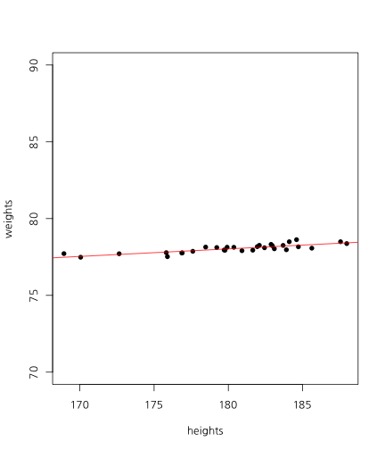
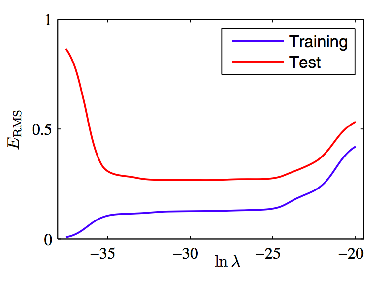
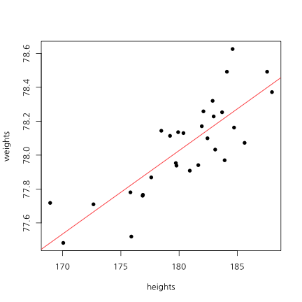

## 오늘의 목표  

<h3b> - 감정 사전 만들기</h3b>  
<h3b> - 감정 점수 만들기</h3b>  

<h3b> - 상관관계 이해하기</h3b>  
<h3b> - 회귀분석 이해하기</h3b>  
<h3b> - 모형평가 이해하기</h3b>  

--- .newbackground

## 왜 감정분석을 하는가?

<h3b> 설문지의 단점</h3b>  
<h3b> 1) 조사 비용 발생 </h3b>  
<h3b> 2) 미리 정해진 문항만 측정 가능</h3b>  
<h3b> 3) 사회적 바람직성 등 편향 발생</h3b>  

--- .newbackground

## 감정분석

<h3b> 텍스트에서 감정 단어를 추출하여 점수화</h3b>  
<h3b> 1) 기계 학습 (Machine Learning) </h3b>  
<h3b> 2) 단어 사전 기반 </h3b>

--- .newbackground

## 사전 기반 분석

<h3b> 장점 </h3b>  
<h3b> - 사용하기 간편 </h3b>  
<h3b> 단점 </h3b>  
<h3b> - 주제에 따라 사전이 달라 짐 </h3b>  
<h3b> - 동음이의어 처리 힘듦 e.g) bank </h3b>  

--- .newbackground

## 기계학습 기반 분석

<h3b> 장점 </h3b>  
<h3b> - 높은 정확도  </h3b>  
<h3b> 단점 </h3b>  
<h3b> - Over-fitting 해결 </h3b>  
<h3b> - 많은 데이터 필요 </h3b>  
<h3b> 예) 나이브 베이즈 / 최대 엔트로피 / 서포트벡터머신 / </h3b>  
<h3b>  랜덤 포레스트 / 토픽 모델 </h3b>

--- .newbackground

## 감정 분석 예시

<center></center>

--- .newbackground

## 감정 분석 예시

<center></center>


--- .newbackground

## 사전 지식 

<h3b> 감정분석: 문장에 사용된 단어로 감정을 예측 </h3b> 

<h3b>예: "이 영화는 좀 길지만 재미있고 신난다"  </h3b>    
<h3b> - 길다 -> 부정 </h3b>    
<h3b> - 재미있다 -> 긍정 </h3b>    
<h3b> - 신나다 -> 긍정  </h3b>    

--- .newbackground

## 예측 분석 

<h3b> 예측분석 </h3b> 

<h3b> 선형회귀분석 </h3b>    
<h3b> SVM </h3b>    
<h3b> RandomForest </h3b>    
<h3b> Deep Learning  </h3b>    

--- .newbackground


## 회귀분석(선형(직선) 모형) 

<h3b> 예시 </h3b>

<h3b>- 키가 1cm 증가할 때마다 몸무게가 1kg 증가  </h3b>  
<h3b>- 월 소득이 100만원 증가할 때마다 몸무게가 1kg 감소 </h3b>   
<h3b>- 부정단어가 1개 증가할 때 마다 평점 1점 감점  </h3b>  
<h3b>- 긍정단어가 1개 증가할 때 마다 평점 1점 증가  </h3b>  

--- .newbackground

## 회귀분석의 문제 

<h3b>- 변수가 많아지면 과적합(overfitting)이 발생  </h3b>  
<h3b>- 회귀계수가 극단적으로 커지거나 작아짐 </h3b>   
<h3b>- 예측력이 떨어짐  </h3b>  
<h3b>- 과적합을 막아주는 방법이 필요  </h3b>  

--- .newbackground

## 과적합을 막는 법 

<h3b>- 라쏘(lasso): 작은 회귀계수를 0으로 만듦   </h3b>  
<h3b>- 릿지(ridge): 전반적으로 회귀계수를 줄여줌 </h3b>   
<h3b>- 엘라스틱넷(elastic net): 라쏘 + 릿지  </h3b>  
<h3b>- 감정분석에서 라쏘를 쓰면 감정 단어만 추출됨 </h3b>  

--- &twocol .modal

## 상관관계

*** =left


 

```
## [1] 1
```

*** =right


 

```
## [1] 0.4885042
```

--- .newbackground .modal

## 상관관계

<h3b> x가 증가(혹은 감소)할때 y가 선형적으로 증가(혹은 감소)하는 정도 </h3b>

<h3b> scale </h3b>

<h4b> 키가 만약 cm라면, 키가 1cm 증가하면 몸무게는 1kg증가  </h4b>   
<h4b> 키가 만약 mm라면, 키가 1mm 증가하면 몸무게는 0.1kg 증가  </h4b>   

<h3b> -> 표준화해야 한다 </h3b>

--- &twocol

## 상관관계 및 회귀분석

*** =left


 

*** =right

<!-- html table generated in R 3.2.2 by xtable 1.7-4 package -->
<!-- Thu Aug 20 23:49:50 2015 -->
<table border=1>
<tr> <th>  </th> <th> Estimate </th> <th> Std. Error </th> <th> t value </th> <th> Pr(&gt;|t|) </th>  </tr>
  <tr> <td align="right"> (Intercept) </td> <td align="right"> -8.29 </td> <td align="right"> 11.74 </td> <td align="right"> -0.71 </td> <td align="right"> 0.49 </td> </tr>
  <tr> <td align="right"> heights </td> <td align="right"> 0.49 </td> <td align="right"> 0.07 </td> <td align="right"> 7.56 </td> <td align="right"> 0.00 </td> </tr>
   </table>


```r
cor(weights, heights)
```

```
## [1] 0.8194181
```

--- &twocol

## X가 2개라면?

*** =left


 

```
## [1] 0.8194181
```

*** =right

 

```
## [1] 0.09818667
```

--- .newbackground

## 다중회귀분석

<!-- html table generated in R 3.2.2 by xtable 1.7-4 package -->
<!-- Thu Aug 20 23:49:50 2015 -->
<table border=1>
<tr> <th>  </th> <th> Estimate </th> <th> Std. Error </th> <th> t value </th> <th> Pr(&gt;|t|) </th>  </tr>
  <tr> <td align="right"> (Intercept) </td> <td align="right"> -27.49 </td> <td align="right"> 12.81 </td> <td align="right"> -2.15 </td> <td align="right"> 0.04 </td> </tr>
  <tr> <td align="right"> iq </td> <td align="right"> 0.15 </td> <td align="right"> 0.06 </td> <td align="right"> 2.68 </td> <td align="right"> 0.01 </td> </tr>
  <tr> <td align="right"> heights </td> <td align="right"> 0.52 </td> <td align="right"> 0.06 </td> <td align="right"> 8.72 </td> <td align="right"> 0.00 </td> </tr>
   </table>

--- .newbackground

## 예측력  

<h3b> MSE(Mean of Square Error) </h3b>
$$ MSE = \sum_{i=1}^{n}(Y_{i} - \hat{Y_{i}})^{2} $$

<h3b> 정확도(Accracy) </h3b>  

<center></center>
<h3b> 정확도 = (TP + TN) / (TP + FP + TN + FN) </h3b>

--- &twocol

## Traninig Vs Test

*** =left

 

*** =right

 

--- .newbackground

## Over-fitting

<center></center>

--- .newbackground

## Over-fitting(과적합)

<h3b> How to avoid Over-fitting </h3b>  
<h3b>- Penality of Model Complexity (MSE 보정)  </h3b>  
<h3b><font color="red">- Regulization (Lasso, Ridge, Elastic Net) </font>  </h3b>  
<h3b>- Bayesian  </h3b>  
<h3b>- Drop Out, Bagging, Feature Bagging  </h3b>  

--- .newbackground

## Lasso Vs Ridge

<center></center>

--- &twocol

## Lasso Vs Ridge

*** =left


 

*** =right

 

--- .newbackground

## 감정분석

<h3b> Data </h3b>  
<h3b> 아마존 모바일 폰 리뷰 중에서 2,000개만 </h3b>  

--- .newbackground

## 5. 예제 데이터 불러오기


```r
mobile <- read.csv('mobile2014.csv', stringsAsFactors = F)
```


```r
dim(mobile)
```

```
## [1] 2000    7
```

```r
table(mobile$Sentiment)
```

```
## 
##    0    1 
## 1000 1000
```

--- .newbackground

## 6. DocumentTermMatrix 만들기


```r
library(tm)
```


```r
corpus <- Corpus(VectorSource(mobile$Texts))

##  제거할 단어 목록 확인
stopwords()
```

```
##   [1] "i"          "me"         "my"         "myself"     "we"        
##   [6] "our"        "ours"       "ourselves"  "you"        "your"      
##  [11] "yours"      "yourself"   "yourselves" "he"         "him"       
##  [16] "his"        "himself"    "she"        "her"        "hers"      
##  [21] "herself"    "it"         "its"        "itself"     "they"      
##  [26] "them"       "their"      "theirs"     "themselves" "what"      
##  [31] "which"      "who"        "whom"       "this"       "that"      
##  [36] "these"      "those"      "am"         "is"         "are"       
##  [41] "was"        "were"       "be"         "been"       "being"     
##  [46] "have"       "has"        "had"        "having"     "do"        
##  [51] "does"       "did"        "doing"      "would"      "should"    
##  [56] "could"      "ought"      "i'm"        "you're"     "he's"      
##  [61] "she's"      "it's"       "we're"      "they're"    "i've"      
##  [66] "you've"     "we've"      "they've"    "i'd"        "you'd"     
##  [71] "he'd"       "she'd"      "we'd"       "they'd"     "i'll"      
##  [76] "you'll"     "he'll"      "she'll"     "we'll"      "they'll"   
##  [81] "isn't"      "aren't"     "wasn't"     "weren't"    "hasn't"    
##  [86] "haven't"    "hadn't"     "doesn't"    "don't"      "didn't"    
##  [91] "won't"      "wouldn't"   "shan't"     "shouldn't"  "can't"     
##  [96] "cannot"     "couldn't"   "mustn't"    "let's"      "that's"    
## [101] "who's"      "what's"     "here's"     "there's"    "when's"    
## [106] "where's"    "why's"      "how's"      "a"          "an"        
## [111] "the"        "and"        "but"        "if"         "or"        
## [116] "because"    "as"         "until"      "while"      "of"        
## [121] "at"         "by"         "for"        "with"       "about"     
## [126] "against"    "between"    "into"       "through"    "during"    
## [131] "before"     "after"      "above"      "below"      "to"        
## [136] "from"       "up"         "down"       "in"         "out"       
## [141] "on"         "off"        "over"       "under"      "again"     
## [146] "further"    "then"       "once"       "here"       "there"     
## [151] "when"       "where"      "why"        "how"        "all"       
## [156] "any"        "both"       "each"       "few"        "more"      
## [161] "most"       "other"      "some"       "such"       "no"        
## [166] "nor"        "not"        "only"       "own"        "same"      
## [171] "so"         "than"       "too"        "very"
```

```r
stopwords("SMART")
```

```
##   [1] "a"             "a's"           "able"          "about"        
##   [5] "above"         "according"     "accordingly"   "across"       
##   [9] "actually"      "after"         "afterwards"    "again"        
##  [13] "against"       "ain't"         "all"           "allow"        
##  [17] "allows"        "almost"        "alone"         "along"        
##  [21] "already"       "also"          "although"      "always"       
##  [25] "am"            "among"         "amongst"       "an"           
##  [29] "and"           "another"       "any"           "anybody"      
##  [33] "anyhow"        "anyone"        "anything"      "anyway"       
##  [37] "anyways"       "anywhere"      "apart"         "appear"       
##  [41] "appreciate"    "appropriate"   "are"           "aren't"       
##  [45] "around"        "as"            "aside"         "ask"          
##  [49] "asking"        "associated"    "at"            "available"    
##  [53] "away"          "awfully"       "b"             "be"           
##  [57] "became"        "because"       "become"        "becomes"      
##  [61] "becoming"      "been"          "before"        "beforehand"   
##  [65] "behind"        "being"         "believe"       "below"        
##  [69] "beside"        "besides"       "best"          "better"       
##  [73] "between"       "beyond"        "both"          "brief"        
##  [77] "but"           "by"            "c"             "c'mon"        
##  [81] "c's"           "came"          "can"           "can't"        
##  [85] "cannot"        "cant"          "cause"         "causes"       
##  [89] "certain"       "certainly"     "changes"       "clearly"      
##  [93] "co"            "com"           "come"          "comes"        
##  [97] "concerning"    "consequently"  "consider"      "considering"  
## [101] "contain"       "containing"    "contains"      "corresponding"
## [105] "could"         "couldn't"      "course"        "currently"    
## [109] "d"             "definitely"    "described"     "despite"      
## [113] "did"           "didn't"        "different"     "do"           
## [117] "does"          "doesn't"       "doing"         "don't"        
## [121] "done"          "down"          "downwards"     "during"       
## [125] "e"             "each"          "edu"           "eg"           
## [129] "eight"         "either"        "else"          "elsewhere"    
## [133] "enough"        "entirely"      "especially"    "et"           
## [137] "etc"           "even"          "ever"          "every"        
## [141] "everybody"     "everyone"      "everything"    "everywhere"   
## [145] "ex"            "exactly"       "example"       "except"       
## [149] "f"             "far"           "few"           "fifth"        
## [153] "first"         "five"          "followed"      "following"    
## [157] "follows"       "for"           "former"        "formerly"     
## [161] "forth"         "four"          "from"          "further"      
## [165] "furthermore"   "g"             "get"           "gets"         
## [169] "getting"       "given"         "gives"         "go"           
## [173] "goes"          "going"         "gone"          "got"          
## [177] "gotten"        "greetings"     "h"             "had"          
## [181] "hadn't"        "happens"       "hardly"        "has"          
## [185] "hasn't"        "have"          "haven't"       "having"       
## [189] "he"            "he's"          "hello"         "help"         
## [193] "hence"         "her"           "here"          "here's"       
## [197] "hereafter"     "hereby"        "herein"        "hereupon"     
## [201] "hers"          "herself"       "hi"            "him"          
## [205] "himself"       "his"           "hither"        "hopefully"    
## [209] "how"           "howbeit"       "however"       "i"            
## [213] "i'd"           "i'll"          "i'm"           "i've"         
## [217] "ie"            "if"            "ignored"       "immediate"    
## [221] "in"            "inasmuch"      "inc"           "indeed"       
## [225] "indicate"      "indicated"     "indicates"     "inner"        
## [229] "insofar"       "instead"       "into"          "inward"       
## [233] "is"            "isn't"         "it"            "it'd"         
## [237] "it'll"         "it's"          "its"           "itself"       
## [241] "j"             "just"          "k"             "keep"         
## [245] "keeps"         "kept"          "know"          "knows"        
## [249] "known"         "l"             "last"          "lately"       
## [253] "later"         "latter"        "latterly"      "least"        
## [257] "less"          "lest"          "let"           "let's"        
## [261] "like"          "liked"         "likely"        "little"       
## [265] "look"          "looking"       "looks"         "ltd"          
## [269] "m"             "mainly"        "many"          "may"          
## [273] "maybe"         "me"            "mean"          "meanwhile"    
## [277] "merely"        "might"         "more"          "moreover"     
## [281] "most"          "mostly"        "much"          "must"         
## [285] "my"            "myself"        "n"             "name"         
## [289] "namely"        "nd"            "near"          "nearly"       
## [293] "necessary"     "need"          "needs"         "neither"      
## [297] "never"         "nevertheless"  "new"           "next"         
## [301] "nine"          "no"            "nobody"        "non"          
## [305] "none"          "noone"         "nor"           "normally"     
## [309] "not"           "nothing"       "novel"         "now"          
## [313] "nowhere"       "o"             "obviously"     "of"           
## [317] "off"           "often"         "oh"            "ok"           
## [321] "okay"          "old"           "on"            "once"         
## [325] "one"           "ones"          "only"          "onto"         
## [329] "or"            "other"         "others"        "otherwise"    
## [333] "ought"         "our"           "ours"          "ourselves"    
## [337] "out"           "outside"       "over"          "overall"      
## [341] "own"           "p"             "particular"    "particularly" 
## [345] "per"           "perhaps"       "placed"        "please"       
## [349] "plus"          "possible"      "presumably"    "probably"     
## [353] "provides"      "q"             "que"           "quite"        
## [357] "qv"            "r"             "rather"        "rd"           
## [361] "re"            "really"        "reasonably"    "regarding"    
## [365] "regardless"    "regards"       "relatively"    "respectively" 
## [369] "right"         "s"             "said"          "same"         
## [373] "saw"           "say"           "saying"        "says"         
## [377] "second"        "secondly"      "see"           "seeing"       
## [381] "seem"          "seemed"        "seeming"       "seems"        
## [385] "seen"          "self"          "selves"        "sensible"     
## [389] "sent"          "serious"       "seriously"     "seven"        
## [393] "several"       "shall"         "she"           "should"       
## [397] "shouldn't"     "since"         "six"           "so"           
## [401] "some"          "somebody"      "somehow"       "someone"      
## [405] "something"     "sometime"      "sometimes"     "somewhat"     
## [409] "somewhere"     "soon"          "sorry"         "specified"    
## [413] "specify"       "specifying"    "still"         "sub"          
## [417] "such"          "sup"           "sure"          "t"            
## [421] "t's"           "take"          "taken"         "tell"         
## [425] "tends"         "th"            "than"          "thank"        
## [429] "thanks"        "thanx"         "that"          "that's"       
## [433] "thats"         "the"           "their"         "theirs"       
## [437] "them"          "themselves"    "then"          "thence"       
## [441] "there"         "there's"       "thereafter"    "thereby"      
## [445] "therefore"     "therein"       "theres"        "thereupon"    
## [449] "these"         "they"          "they'd"        "they'll"      
## [453] "they're"       "they've"       "think"         "third"        
## [457] "this"          "thorough"      "thoroughly"    "those"        
## [461] "though"        "three"         "through"       "throughout"   
## [465] "thru"          "thus"          "to"            "together"     
## [469] "too"           "took"          "toward"        "towards"      
## [473] "tried"         "tries"         "truly"         "try"          
## [477] "trying"        "twice"         "two"           "u"            
## [481] "un"            "under"         "unfortunately" "unless"       
## [485] "unlikely"      "until"         "unto"          "up"           
## [489] "upon"          "us"            "use"           "used"         
## [493] "useful"        "uses"          "using"         "usually"      
## [497] "uucp"          "v"             "value"         "various"      
## [501] "very"          "via"           "viz"           "vs"           
## [505] "w"             "want"          "wants"         "was"          
## [509] "wasn't"        "way"           "we"            "we'd"         
## [513] "we'll"         "we're"         "we've"         "welcome"      
## [517] "well"          "went"          "were"          "weren't"      
## [521] "what"          "what's"        "whatever"      "when"         
## [525] "whence"        "whenever"      "where"         "where's"      
## [529] "whereafter"    "whereas"       "whereby"       "wherein"      
## [533] "whereupon"     "wherever"      "whether"       "which"        
## [537] "while"         "whither"       "who"           "who's"        
## [541] "whoever"       "whole"         "whom"          "whose"        
## [545] "why"           "will"          "willing"       "wish"         
## [549] "with"          "within"        "without"       "won't"        
## [553] "wonder"        "would"         "would"         "wouldn't"     
## [557] "x"             "y"             "yes"           "yet"          
## [561] "you"           "you'd"         "you'll"        "you're"       
## [565] "you've"        "your"          "yours"         "yourself"     
## [569] "yourselves"    "z"             "zero"
```

```r
dtm <- DocumentTermMatrix(corpus,
                          control = list(tolower = T,
                                         removePunctuation = T,
                                         removeNumbers = T,
                                         stopwords = stopwords("SMART"),
                                         weighting = weightTfIdf))
```

```
## Warning in weighting(x): empty document(s): 1948
```

```r
dtm
```

```
## <<DocumentTermMatrix (documents: 2000, terms: 8446)>>
## Non-/sparse entries: 46461/16845539
## Sparsity           : 100%
## Maximal term length: 132
## Weighting          : term frequency - inverse document frequency (normalized) (tf-idf)
```

--- .newbackground

## 7. 회귀분석으로 감정 사전 만들기


```r
library(glmnet)
```


```r
X <- as.matrix(dtm)
Y <- mobile$Sentiment
```


```r
res.lm <- glmnet(X, Y, family = "binomial", lambda = 0) 
```

--- .newbackground
    
## 7. 회귀분석으로 감정 사전 만들기
    

```r
coef.lm <- coef(res.lm)[,1]
pos.lm <- coef.lm[coef.lm > 0]
neg.lm <- coef.lm[coef.lm < 0]
pos.lm <- sort(pos.lm, decreasing = T)
neg.lm <- sort(neg.lm, decreasing = F)
```

