<center></center>

--- .new-background

## 워크숍 관련 온라인 사이트

http://course.mindscale.kr/course/text-analysis

<left></left>

--- .new-background

## 오늘의 목표  

<h3b> 감정 사전 만들기</h3b>  
<h3b> 감정 점수 만들기</h3b>  

<h3b> 상관관계</h3b>  
<h3b> 회귀분석</h3b>  
<h3b> 모형평가</h3b>  

--- .newbackground

## 감정분석

<h3b> - 감정 사전을 기반으로 텍스트 자료에서   
 긍정 단어와 부정 단어의 비율을 계산</h3b>  
<h3b> - 감정 사전을 어떻게 만들 것인가? </h3b>

--- .newbackground

## 사전지식 

예측이란 무엇?

자기자신 : Y가 변화하는 추세  
다른변수 : X가 Y를 예측  
- 키로 몸무게를 예측!  
- 키로 성적을 예측?  
- 예측이 잘 되려면 서로 상관(관련성)이 높아야 함  
-> 감정단어로 영화 평점을 예측  

--- .newbackground

## 회귀분석(선형(직선) 모형) 

### 예시

- 키가 1cm 증가할 때마다 몸무게가 1kg 증가  
- 월 소득이 100만원 증가할 때마다 몸무게가 1kg 감소  
- 부정단어가 1개 증가할 때 마다 평점 .1점 감점  
- 긍정단어가 1개 증가할 때 마다 평점 .1점 증가  

--- &twocol .modal

## 상관관계

*** =left


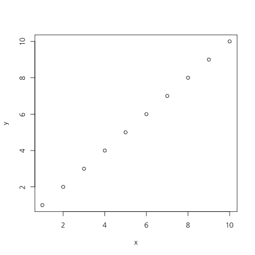 

```
## [1] 1
```

*** =right


 

```
## [1] 0.4885042
```

--- .newbackground .modal

## 상관관계

- x가 증가(혹은 감소)할때 y가 증가(혹은 감소)하는 정도

### scale

키가 만약 cm라면, 키가 1cm 증가하면 몸무게는 1kg증가  
키가 만약 mm라면, 키가 1mm 증가하면 몸무게는 0.1kg 증가  

### -> 표준화해야 한다 

--- &twocol .modal

## 둘 중 무엇이 상관이 더 클까요?

*** =left


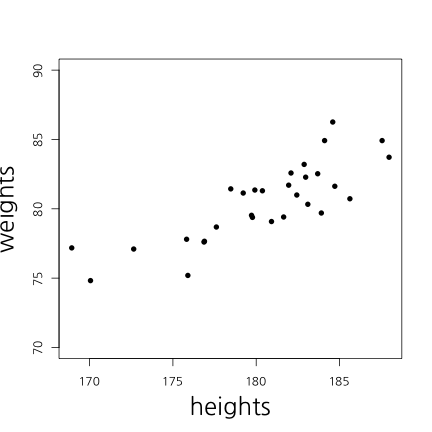 

*** =right


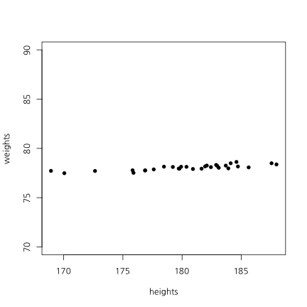 

--- &twocol

## 상관관계 및 회귀분석

*** =left


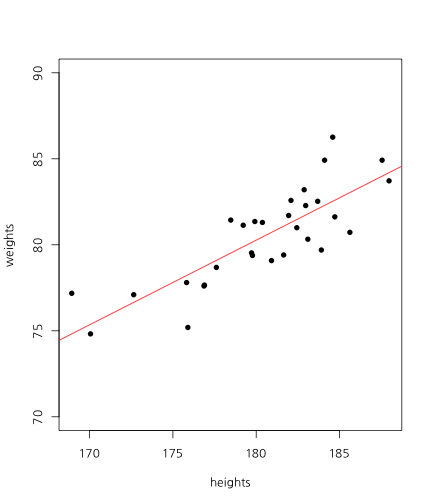 

*** =right

<!-- html table generated in R 3.1.3 by xtable 1.7-4 package -->
<!-- Tue Jul 21 22:39:51 2015 -->
<table border=1>
<tr> <th>  </th> <th> Estimate </th> <th> Std. Error </th> <th> t value </th> <th> Pr(&gt;|t|) </th>  </tr>
  <tr> <td align="right"> (Intercept) </td> <td align="right"> -8.29 </td> <td align="right"> 11.74 </td> <td align="right"> -0.71 </td> <td align="right"> 0.49 </td> </tr>
  <tr> <td align="right"> heights </td> <td align="right"> 0.49 </td> <td align="right"> 0.07 </td> <td align="right"> 7.56 </td> <td align="right"> 0.00 </td> </tr>
   </table>


```r
cor(weights, heights)
```

```
## [1] 0.8194181
```

--- &twocol

## 상관관계 및 회귀분석

*** =left


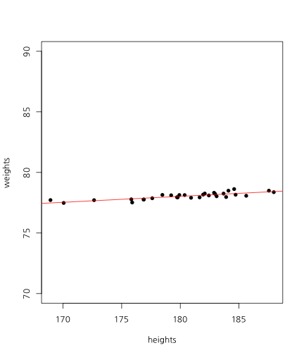 

*** =right

<!-- html table generated in R 3.1.3 by xtable 1.7-4 package -->
<!-- Tue Jul 21 22:39:51 2015 -->
<table border=1>
<tr> <th>  </th> <th> Estimate </th> <th> Std. Error </th> <th> t value </th> <th> Pr(&gt;|t|) </th>  </tr>
  <tr> <td align="right"> (Intercept) </td> <td align="right"> 69.17 </td> <td align="right"> 1.17 </td> <td align="right"> 58.93 </td> <td align="right"> 0.00 </td> </tr>
  <tr> <td align="right"> heights </td> <td align="right"> 0.05 </td> <td align="right"> 0.01 </td> <td align="right"> 7.56 </td> <td align="right"> 0.00 </td> </tr>
   </table>


```r
cor(weights, heights)
```

```
## [1] 0.8194181
```

--- &twocol

## 상관관계 및 회귀분석

*** =left

 

*** =right


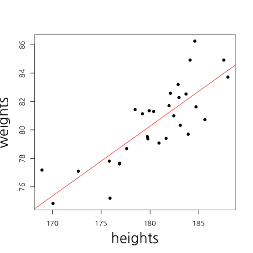 

--- &twocol

## X가 2개라면?

*** =left


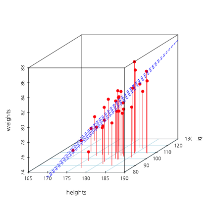 

```
## [1] 0.8194181
```

*** =right

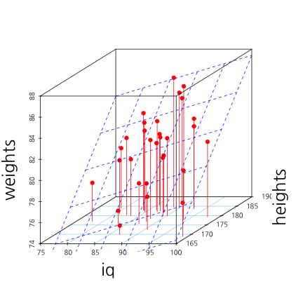 

```
## [1] 0.1387562
```

--- .newbackground

## 다중회귀분석

<!-- html table generated in R 3.1.3 by xtable 1.7-4 package -->
<!-- Sat Jul 18 17:24:39 2015 -->
<table border=1>
<tr> <th>  </th> <th> Estimate </th> <th> Std. Error </th> <th> t value </th> <th> Pr(&gt;|t|) </th>  </tr>
  <tr> <td align="right"> (Intercept) </td> <td align="right"> -20.76 </td> <td align="right"> 11.60 </td> <td align="right"> -1.79 </td> <td align="right"> 0.08 </td> </tr>
  <tr> <td align="right"> iq </td> <td align="right"> 0.08 </td> <td align="right"> 0.03 </td> <td align="right"> 2.68 </td> <td align="right"> 0.01 </td> </tr>
  <tr> <td align="right"> heights </td> <td align="right"> 0.52 </td> <td align="right"> 0.06 </td> <td align="right"> 8.66 </td> <td align="right"> 0.00 </td> </tr>
   </table>

--- &twocol

## Traninig Vs Test

*** =left

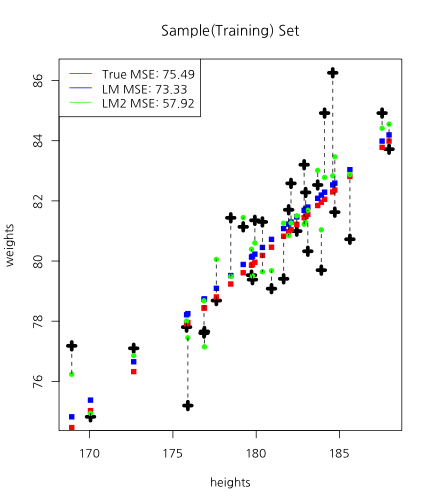 

*** =right

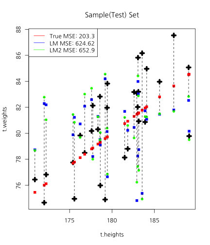 

--- .newbackground

## Over-fitting

<center>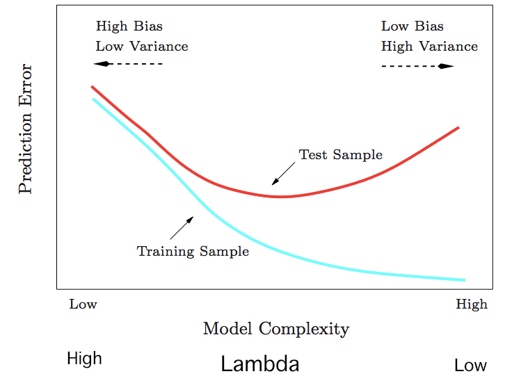</center>


--- .newbackground

## Over-fitting(과적합)

### How to avoid Over-fitting
- Penality of Model Complexity (MSE 보정)  
<font color="red">- Regulization (Lasso, Ridge, Elastic Net) </font>  
- Bayesian  
- Drop Out, Bagging, Feature Bagging  

--- .newbackground

## Lasso Vs Ridge

<center>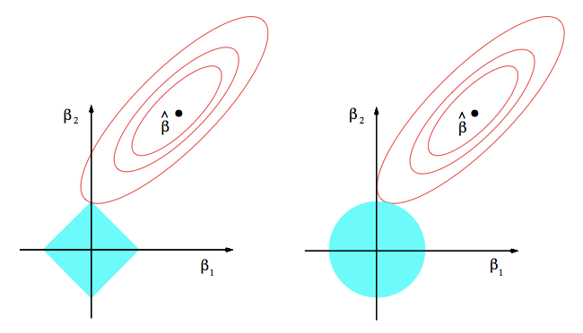</center>

--- &twocol

## Lasso Vs Ridge

*** =left


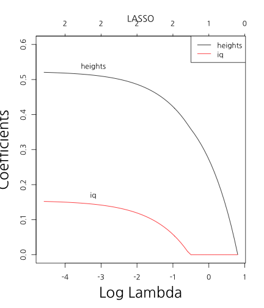 

*** =right

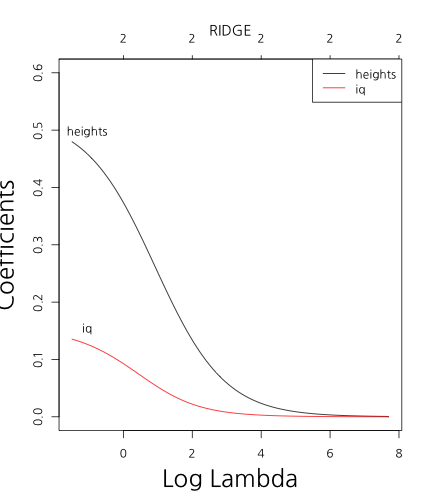 

--- .newbackground

## 감정분석

<h3b> Data </h3b>  
<h3b> 25,000 IMDB movie reviews 중에서 1,000개만 </h3b>  
<h3b> Training Vs Test = 7 Vs 3 </h3b>  

--- .newbackground

## Traing Set 과 Test Set 분리


```r
fileName <- "data/IMDBmovie/labeledTrainData.tsv"
data <- read.csv(fileName, header=T, sep="\t", quote="")
nrow(data)
```

```
## [1] 25000
```

```r
data <- data[1:1000, ]
```

--- .newbackground

## Traing Set 과 Test Set 분할


```r
totalNum <- 1:nrow(data)
set.seed(12345)
shuffledNum <- sample(totalNum, nrow(data), replace = F)
trainingNum <- shuffledNum[1:700]
testNum <- shuffledNum[701:1000]
data.train <- data[trainingNum, ]
data.test <- data[testNum, ]
```

--- .newbackground

## Term-DocumentMatrix


```r
library(tm)
```


```r
corpus <- Corpus(VectorSource(data.train$review))
tdm.train <- TermDocumentMatrix(corpus, 
                                control=list(stemming = T,
                                             tolower = T,
                                             removePunctuation = T,
                                             removeNumbers = T,
                                             stopwords=stopwords("SMART")))
```

--- .newbackground

## 주요 단어 10000개 사용


```r
library(slam)
word.count = as.array(rollup(tdm.train, 2))
word.order = order(word.count, decreasing = T)
freq.word = word.order[1 : 10000]
tdm.train <- tdm.train[freq.word, ]
```

--- .newbackground

## LASSO Regression


```r
alpha <- 1
cv.lasso <- cv.glmnet(as.matrix(t(tdm.train)), data.train$sentiment, 
                      type.measure = "class", 
                      nfolds = 4,
                      family = "binomial", 
                      alpha = alpha)
```

--- .newbackground

## LASSO Regression

```r
plot(cv.lasso)
```

 

```r
log(cv.lasso$lambda.min)
```

```
## [1] -3.59778
```

--- .newbackground

## LASSO Regression

```r
plot(cv.lasso$glmnet.fit, "lambda", label=TRUE)
```

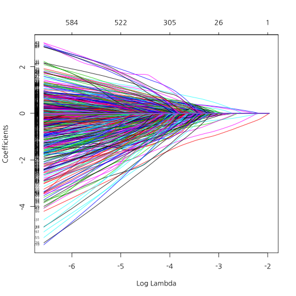 

--- .newbackground

## Ridge Regression


```r
alpha <- 0
cv.ridge <- cv.glmnet(as.matrix(t(tdm.train)), data.train$sentiment, 
                      type.measure = "class", 
                      nfolds = 4,
                      family = "binomial", 
                      alpha = alpha)
```

--- .newbackground

## RIDGE Regression


```r
plot(cv.ridge)
```

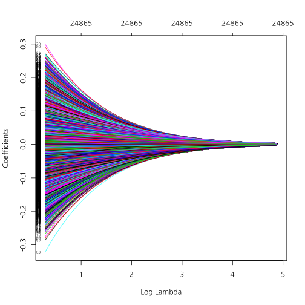 

```r
log(cv.ridge$lambda.min)
```

```
## [1] 1.402784
```

--- .newbackground

## RIDGE Regression


```r
plot(cv.ridge$glmnet.fit, "lambda", label=TRUE)
```

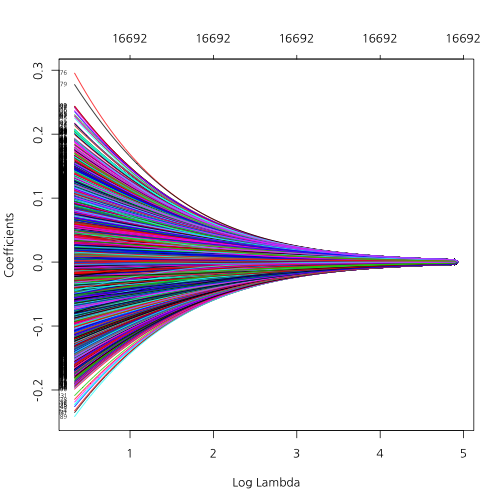 

--- .newbackground

## ElasticNet Regression


```r
alpha <- .8
cv.elastic <- cv.glmnet(as.matrix(t(tdm.train)), data.train$sentiment, 
                        type.measure = "class", 
                        nfolds = 4,
                        family = "binomial", 
                        alpha = alpha)
```

--- .newbackground

## ElasticNet Regression


```r
plot(cv.elastic)
```

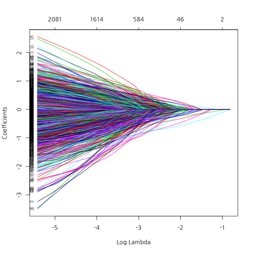 

```r
log(cv.elastic$lambda.min)
```

```
## [1] -3.281602
```

--- .newbackground

## ElasticNet Regression


```r
plot(cv.elastic$glmnet.fit, "lambda", label=TRUE)
```

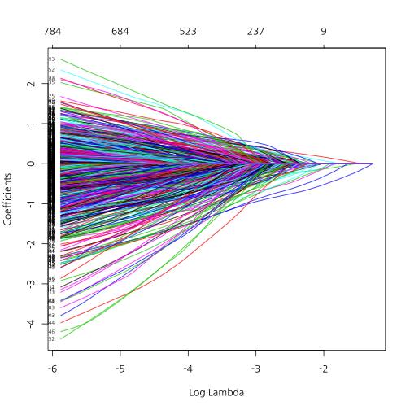 

--- .newbackground

## 감정 단어 추출


```r
coef.lasso <- coef(cv.lasso, s = "lambda.min")[,1]
coef.ridge <- coef(cv.ridge, s = "lambda.min")[,1]
coef.elastic <- coef(cv.elastic, s = "lambda.min")[,1]
```

--- .newbackground

## 감정 단어 추출


```r
pos.lasso <- sort(coef.lasso[coef.lasso > 0])
neg.lasso <- sort(coef.lasso[coef.lasso < 0])

pos.ridge <- sort(coef.ridge[coef.ridge > 0])
neg.ridge <- sort(coef.ridge[coef.ridge < 0])

pos.elastic <- sort(coef.elastic[coef.elastic > 0])
neg.elastic <- sort(coef.elastic[coef.elastic < 0])
```


```r
library(tm.plugin.sentiment)
```


```r
score.lasso <- polarity(tdm.train, names(pos.lasso), names(neg.lasso))
score.ridge <- polarity(tdm.train, names(pos.elastic), names(neg.elastic))
score.elastic <- polarity(tdm.train, names(pos.elastic), names(neg.elastic))
```

--- .newbackground

## CUT-POINT


```r
findCutpoint(data.train$sentiment, score.lasso)
```

```
## [1] 0.09090909
```

```r
findCutpoint(data.train$sentiment, score.ridge)
```

```
## [1] 0.3333333
```

```r
findCutpoint(data.train$sentiment, score.elastic)
```

```
## [1] 0.3333333
```


```r
cut.lasso <- findCutpoint(data.train$sentiment, score.lasso)
cut.ridge <- findCutpoint(data.train$sentiment, score.ridge)
cut.elastic <- findCutpoint(data.train$sentiment, score.elastic)
```

--- .newbackground

## Test Set


```r
corpus <- Corpus(VectorSource(data.test$review))

tdm.test <- TermDocumentMatrix(corpus, 
                               control=list(dictionary = Terms(tdm.train), 
                                            stemming = T,
                                            tolower = T,
                                            removePunctuation = T,
                                            removeNumbers = T,
                                            stopwords=stopwords("SMART")))
```

--- .newbackground

## Test Set


```r
score.lasso <- polarity(tdm.test, names(pos.lasso), names(neg.lasso))
score.ridge <- polarity(tdm.test, names(pos.elastic), names(neg.elastic))
score.elastic <- polarity(tdm.test, names(pos.elastic), names(neg.elastic))
```

--- .newbackground

## Test Set


```r
library(caret)
```


```r
score.lasso.b <- rep(0, length(score.lasso))
score.lasso.b[score.lasso >= cut.lasso] <- 1
confusionMatrix(score.lasso.b, data.test$sentiment)
```

```
## Confusion Matrix and Statistics
## 
##           Reference
## Prediction   0   1
##          0 118  30
##          1  49 103
##                                          
##                Accuracy : 0.7367         
##                  95% CI : (0.683, 0.7856)
##     No Information Rate : 0.5567         
##     P-Value [Acc > NIR] : 8.952e-11      
##                                          
##                   Kappa : 0.4741         
##  Mcnemar's Test P-Value : 0.04285        
##                                          
##             Sensitivity : 0.7066         
##             Specificity : 0.7744         
##          Pos Pred Value : 0.7973         
##          Neg Pred Value : 0.6776         
##              Prevalence : 0.5567         
##          Detection Rate : 0.3933         
##    Detection Prevalence : 0.4933         
##       Balanced Accuracy : 0.7405         
##                                          
##        'Positive' Class : 0              
## 
```

--- .newbackground

## Test Set


```r
score.ridge.b <- rep(0, length(score.ridge))
score.ridge.b[score.ridge >= cut.ridge] <- 1
confusionMatrix(score.ridge.b, data.test$sentiment)
```

```
## Confusion Matrix and Statistics
## 
##           Reference
## Prediction   0   1
##          0 130  42
##          1  37  91
##                                          
##                Accuracy : 0.7367         
##                  95% CI : (0.683, 0.7856)
##     No Information Rate : 0.5567         
##     P-Value [Acc > NIR] : 8.952e-11      
##                                          
##                   Kappa : 0.4644         
##  Mcnemar's Test P-Value : 0.6527         
##                                          
##             Sensitivity : 0.7784         
##             Specificity : 0.6842         
##          Pos Pred Value : 0.7558         
##          Neg Pred Value : 0.7109         
##              Prevalence : 0.5567         
##          Detection Rate : 0.4333         
##    Detection Prevalence : 0.5733         
##       Balanced Accuracy : 0.7313         
##                                          
##        'Positive' Class : 0              
## 
```

--- .newbackground

## Test Set


```r
score.elastic.b <- rep(0, length(score.elastic))
score.elastic.b[score.elastic >= cut.elastic] <- 1
confusionMatrix(score.elastic.b, data.test$sentiment)
```

```
## Confusion Matrix and Statistics
## 
##           Reference
## Prediction   0   1
##          0 130  42
##          1  37  91
##                                          
##                Accuracy : 0.7367         
##                  95% CI : (0.683, 0.7856)
##     No Information Rate : 0.5567         
##     P-Value [Acc > NIR] : 8.952e-11      
##                                          
##                   Kappa : 0.4644         
##  Mcnemar's Test P-Value : 0.6527         
##                                          
##             Sensitivity : 0.7784         
##             Specificity : 0.6842         
##          Pos Pred Value : 0.7558         
##          Neg Pred Value : 0.7109         
##              Prevalence : 0.5567         
##          Detection Rate : 0.4333         
##    Detection Prevalence : 0.5733         
##       Balanced Accuracy : 0.7313         
##                                          
##        'Positive' Class : 0              
## 
```

--- .newbackground

## glmnet 활용


```r
score.lasso <- predict(cv.lasso, as.matrix(t(tdm.train)), s = "lambda.min")
score.ridge <- predict(cv.ridge, as.matrix(t(tdm.train)), s = "lambda.min")
score.elastic <- predict(cv.elastic, as.matrix(t(tdm.train)), s = "lambda.min")
```


```r
findCutpoint(data.train$sentiment, score.lasso)
```

```
## [1] 0.1426384
```

```r
findCutpoint(data.train$sentiment, score.ridge)
```

```
## [1] -0.03759213
```

```r
findCutpoint(data.train$sentiment, score.elastic)
```

```
## [1] 0.1195488
```


```r
cut.lasso <- findCutpoint(data.train$sentiment, score.lasso)
cut.ridge <- findCutpoint(data.train$sentiment, score.ridge)
cut.elastic <- findCutpoint(data.train$sentiment, score.elastic)
```

--- .newbackground

## glmnet 활용


```r
score.lasso <- predict(cv.lasso, as.matrix(t(tdm.test)), s = "lambda.min")
score.ridge <- predict(cv.ridge, as.matrix(t(tdm.test)), s = "lambda.min")
score.elastic <- predict(cv.elastic, as.matrix(t(tdm.test)), s = "lambda.min")
```

## Test Set


```r
score.lasso.b <- rep(0, length(score.lasso))
score.lasso.b[score.lasso >= cut.lasso] <- 1
confusionMatrix(score.lasso.b, data.test$sentiment)
```

```
## Confusion Matrix and Statistics
## 
##           Reference
## Prediction   0   1
##          0 148 110
##          1  19  23
##                                           
##                Accuracy : 0.57            
##                  95% CI : (0.5119, 0.6268)
##     No Information Rate : 0.5567          
##     P-Value [Acc > NIR] : 0.3428          
##                                           
##                   Kappa : 0.0636          
##  Mcnemar's Test P-Value : 2.299e-15       
##                                           
##             Sensitivity : 0.8862          
##             Specificity : 0.1729          
##          Pos Pred Value : 0.5736          
##          Neg Pred Value : 0.5476          
##              Prevalence : 0.5567          
##          Detection Rate : 0.4933          
##    Detection Prevalence : 0.8600          
##       Balanced Accuracy : 0.5296          
##                                           
##        'Positive' Class : 0               
## 
```

--- .newbackground

## Test Set


```r
score.ridge.b <- rep(0, length(score.ridge))
score.ridge.b[score.ridge >= cut.ridge] <- 1
confusionMatrix(score.ridge.b, data.test$sentiment)
```

```
## Confusion Matrix and Statistics
## 
##           Reference
## Prediction  0  1
##          0 85 71
##          1 82 62
##                                           
##                Accuracy : 0.49            
##                  95% CI : (0.4321, 0.5481)
##     No Information Rate : 0.5567          
##     P-Value [Acc > NIR] : 0.9912          
##                                           
##                   Kappa : -0.0246         
##  Mcnemar's Test P-Value : 0.4188          
##                                           
##             Sensitivity : 0.5090          
##             Specificity : 0.4662          
##          Pos Pred Value : 0.5449          
##          Neg Pred Value : 0.4306          
##              Prevalence : 0.5567          
##          Detection Rate : 0.2833          
##    Detection Prevalence : 0.5200          
##       Balanced Accuracy : 0.4876          
##                                           
##        'Positive' Class : 0               
## 
```

--- .newbackground

## Test Set


```r
score.elastic.b <- rep(0, length(score.elastic))
score.elastic.b[score.elastic >= cut.elastic] <- 1
confusionMatrix(score.elastic.b, data.test$sentiment)
```

```
## Confusion Matrix and Statistics
## 
##           Reference
## Prediction   0   1
##          0 147 110
##          1  20  23
##                                           
##                Accuracy : 0.5667          
##                  95% CI : (0.5085, 0.6235)
##     No Information Rate : 0.5567          
##     P-Value [Acc > NIR] : 0.3865          
##                                           
##                   Kappa : 0.0571          
##  Mcnemar's Test P-Value : 5.912e-15       
##                                           
##             Sensitivity : 0.8802          
##             Specificity : 0.1729          
##          Pos Pred Value : 0.5720          
##          Neg Pred Value : 0.5349          
##              Prevalence : 0.5567          
##          Detection Rate : 0.4900          
##    Detection Prevalence : 0.8567          
##       Balanced Accuracy : 0.5266          
##                                           
##        'Positive' Class : 0               
## 
```
