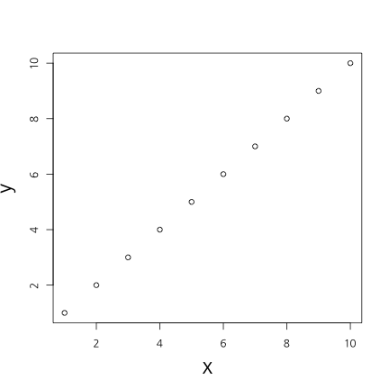
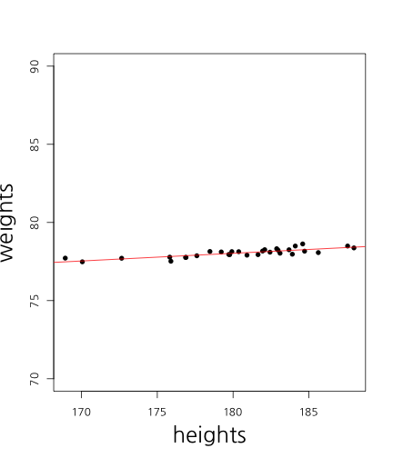

## 오늘의 목표  

<h3b> - 감정 사전 만들기</h3b>  
<h3b> - 감정 점수 만들기</h3b>  

<h3b> - 상관관계 이해하기</h3b>  
<h3b> - 회귀분석 이해하기</h3b>  
<h3b> - 모형평가 이해하기</h3b>  

--- .newbackground

## 왜 감정분석을 하는가?

<h3b> 설문지의 단점</h3b>  
<h3b> 1) 조사 비용 발생 </h3b>  
<h3b> 2) 미리 정해진 문항만 측정 가능</h3b>  
<h3b> 3) 사회적 바람직성 등 편향 발생</h3b>  

--- .newbackground

## 감정분석

<h3b> 텍스트에서 감정 단어를 추출하여 점수화</h3b>  
<h3b> 1) 기계 학습 (Machine Learning) </h3b>  
<h3b> 2) 단어 사전 기반 </h3b>

--- .newbackground

## 사전 기반 분석

<h3b> 장점 </h3b>  
<h3b> - 사용하기 간편 </h3b>  
<h3b> 단점 </h3b>  
<h3b> - 주제에 따라 사전이 달라 짐 </h3b>  
<h3b> - 동음이의어 처리 힘듦 e.g) bank </h3b>  

--- .newbackground

## 기계학습 기반 분석

<h3b> 장점 </h3b>  
<h3b> - 높은 정확도  </h3b>  
<h3b> 단점 </h3b>  
<h3b> - Over-fitting 해결 </h3b>  
<h3b> - 많은 데이터 필요 </h3b>  
<h3b> 예) 나이브 베이즈 / 최대 엔트로피 / 서포트벡터머신 / </h3b>  
<h3b>  랜덤 포레스트 / 토픽 모델 </h3b>

--- .newbackground

## 감정 분석 예시

<center></center>

--- .newbackground

## 감정 분석 예시

<center></center>


--- .newbackground

## 사전 지식 

<h3b> 감정분석: 문장에 사용된 단어로 감정을 예측 </h3b> 

<h3b>예: "이 영화는 좀 길지만 재미있고 신난다"  </h3b>    
<h3b> - 길다 -> 부정 </h3b>    
<h3b> - 재미있다 -> 긍정 </h3b>    
<h3b> - 신나다 -> 긍정  </h3b>    

--- .newbackground

## 예측 분석 

<h3b> 예측분석 </h3b> 

<h3b> 선형회귀분석 </h3b>    
<h3b> SVM </h3b>    
<h3b> RandomForest </h3b>    
<h3b> Deep Learning  </h3b>    

--- .newbackground


## 회귀분석(선형(직선) 모형) 

<h3b> 예시 </h3b>

<h3b>- 키가 1cm 증가할 때마다 몸무게가 1kg 증가  </h3b>  
<h3b>- 월 소득이 100만원 증가할 때마다 몸무게가 1kg 감소 </h3b>   
<h3b>- 부정단어가 1개 증가할 때 마다 평점 1점 감점  </h3b>  
<h3b>- 긍정단어가 1개 증가할 때 마다 평점 1점 증가  </h3b>  

--- &twocol .modal

## 상관관계

*** =left


 

```
## [1] 1
```

*** =right


 

```
## [1] 0.4885042
```

--- .newbackground .modal

## 상관관계

<h3b> x가 증가(혹은 감소)할때 y가 선형적으로 증가(혹은 감소)하는 정도 </h3b>

<h3b> scale </h3b>

<h4b> 키가 만약 cm라면, 키가 1cm 증가하면 몸무게는 1kg증가  </h4b>   
<h4b> 키가 만약 mm라면, 키가 1mm 증가하면 몸무게는 0.1kg 증가  </h4b>   

<h3b> -> 표준화해야 한다 </h3b>

--- &twocol

## 상관관계 및 회귀분석

*** =left


 

*** =right

<!-- html table generated in R 3.2.2 by xtable 1.7-4 package -->
<!-- Fri Aug 21 18:58:15 2015 -->
<table border=1>
<tr> <th>  </th> <th> Estimate </th> <th> Std. Error </th> <th> t value </th> <th> Pr(&gt;|t|) </th>  </tr>
  <tr> <td align="right"> (Intercept) </td> <td align="right"> -8.29 </td> <td align="right"> 11.74 </td> <td align="right"> -0.71 </td> <td align="right"> 0.49 </td> </tr>
  <tr> <td align="right"> heights </td> <td align="right"> 0.49 </td> <td align="right"> 0.07 </td> <td align="right"> 7.56 </td> <td align="right"> 0.00 </td> </tr>
   </table>


```r
cor(weights, heights)
```

```
## [1] 0.8194181
```

키가 1cm 증가하면 몸무게는 .49kg 증가


--- &twocol

## X가 2개라면?

*** =left


 

```
## [1] 0.8194181
```

*** =right

 

```
## [1] 0.09818667
```

--- .newbackground

## 다중회귀분석

<!-- html table generated in R 3.2.2 by xtable 1.7-4 package -->
<!-- Fri Aug 21 18:58:15 2015 -->
<table border=1>
<tr> <th>  </th> <th> Estimate </th> <th> Std. Error </th> <th> t value </th> <th> Pr(&gt;|t|) </th>  </tr>
  <tr> <td align="right"> (Intercept) </td> <td align="right"> -27.49 </td> <td align="right"> 12.81 </td> <td align="right"> -2.15 </td> <td align="right"> 0.04 </td> </tr>
  <tr> <td align="right"> iq </td> <td align="right"> 0.15 </td> <td align="right"> 0.06 </td> <td align="right"> 2.68 </td> <td align="right"> 0.01 </td> </tr>
  <tr> <td align="right"> heights </td> <td align="right"> 0.52 </td> <td align="right"> 0.06 </td> <td align="right"> 8.72 </td> <td align="right"> 0.00 </td> </tr>
   </table>

--- .newbackground

## 회귀분석의 문제 

<h3b>- 변수가 많아지면 과적합(overfitting)이 발생  </h3b>  
<h3b>- 회귀계수가 극단적으로 커지거나 작아짐 </h3b>   
<h3b>- 예측력이 떨어짐  </h3b>  
<h3b>- 과적합을 막아주는 방법이 필요  </h3b>  

--- .newbackground

## Over-fitting

<center></center>

--- .newbackground

## Over-fitting

<h3b> Over-fitting을 피하는 방법들 </h3b>  
<h3b>- Penality of Model Complexity (MSE 보정)  </h3b>  
<h3b><font color="red">- Regulization (Lasso, Ridge, Elastic Net) </font>  </h3b>  
<h3b>- Bayesian  </h3b>  
<h3b>- Drop Out, Bagging, Feature Bagging  </h3b>  

--- .newbackground

## 과적합을 막는 법 

<h3b>- 라쏘(lasso): 작은 회귀계수를 0으로 만듦   </h3b>  
<h3b>- 릿지(ridge): 전반적으로 회귀계수를 줄여줌 </h3b>   
<h3b>- 엘라스틱넷(elastic net): 라쏘 + 릿지  </h3b>  
<h3b>- 감정분석에서 라쏘를 쓰면 감정 단어만 추출됨 </h3b>  

--- .newbackground

## Lasso Vs Ridge

<center></center>

--- &twocol w1:50% w2:50% .new-background

## Lasso Vs Ridge

*** =left


 

*** =right

 

--- .newbackground

## Over-fitting

<center></center>


--- .newbackground

## 예측력  

<h3b> MSE(Mean of Square Error) </h3b>
$$ MSE = \sum_{i=1}^{n}(Y_{i} - \hat{Y_{i}})^{2} $$

<h3b> 정확도(Accracy) </h3b>  

<center></center>
<h3b> 정확도 = (TP + TN) / (TP + FP + TN + FN) </h3b>

--- .newbackground

## 감정분석

<h3b> Data </h3b>  
<h3b> 아마존 모바일 폰 리뷰 중에서 2,000개만 </h3b>  
<h3b> 긍정평 1000개, 부정평 1000개 </h3b>  

--- .newbackground

## 5. 예제 데이터 불러오기


```r
mobile <- read.csv('mobile2014.csv', stringsAsFactors = F)
```


```r
dim(mobile)
```

```
## [1] 2000    7
```

```r
names(mobile)
```

```
## [1] "X"         "Title"     "Author"    "ReviewID"  "Texts"     "YMD"      
## [7] "Sentiment"
```

```r
table(mobile$Sentiment)
```

```
## 
##    0    1 
## 1000 1000
```

--- .newbackground

## 6. DocumentTermMatrix 만들기


```r
library(tm)
```


```r
corpus <- Corpus(VectorSource(mobile$Texts))

##  제거할 단어 목록 확인
stopwords()
```

```
##   [1] "i"          "me"         "my"         "myself"     "we"        
##   [6] "our"        "ours"       "ourselves"  "you"        "your"      
##  [11] "yours"      "yourself"   "yourselves" "he"         "him"       
##  [16] "his"        "himself"    "she"        "her"        "hers"      
##  [21] "herself"    "it"         "its"        "itself"     "they"      
##  [26] "them"       "their"      "theirs"     "themselves" "what"      
##  [31] "which"      "who"        "whom"       "this"       "that"      
##  [36] "these"      "those"      "am"         "is"         "are"       
##  [41] "was"        "were"       "be"         "been"       "being"     
##  [46] "have"       "has"        "had"        "having"     "do"        
##  [51] "does"       "did"        "doing"      "would"      "should"    
##  [56] "could"      "ought"      "i'm"        "you're"     "he's"      
##  [61] "she's"      "it's"       "we're"      "they're"    "i've"      
##  [66] "you've"     "we've"      "they've"    "i'd"        "you'd"     
##  [71] "he'd"       "she'd"      "we'd"       "they'd"     "i'll"      
##  [76] "you'll"     "he'll"      "she'll"     "we'll"      "they'll"   
##  [81] "isn't"      "aren't"     "wasn't"     "weren't"    "hasn't"    
##  [86] "haven't"    "hadn't"     "doesn't"    "don't"      "didn't"    
##  [91] "won't"      "wouldn't"   "shan't"     "shouldn't"  "can't"     
##  [96] "cannot"     "couldn't"   "mustn't"    "let's"      "that's"    
## [101] "who's"      "what's"     "here's"     "there's"    "when's"    
## [106] "where's"    "why's"      "how's"      "a"          "an"        
## [111] "the"        "and"        "but"        "if"         "or"        
## [116] "because"    "as"         "until"      "while"      "of"        
## [121] "at"         "by"         "for"        "with"       "about"     
## [126] "against"    "between"    "into"       "through"    "during"    
## [131] "before"     "after"      "above"      "below"      "to"        
## [136] "from"       "up"         "down"       "in"         "out"       
## [141] "on"         "off"        "over"       "under"      "again"     
## [146] "further"    "then"       "once"       "here"       "there"     
## [151] "when"       "where"      "why"        "how"        "all"       
## [156] "any"        "both"       "each"       "few"        "more"      
## [161] "most"       "other"      "some"       "such"       "no"        
## [166] "nor"        "not"        "only"       "own"        "same"      
## [171] "so"         "than"       "too"        "very"
```

```r
stopwords("SMART")
```

```
##   [1] "a"             "a's"           "able"          "about"        
##   [5] "above"         "according"     "accordingly"   "across"       
##   [9] "actually"      "after"         "afterwards"    "again"        
##  [13] "against"       "ain't"         "all"           "allow"        
##  [17] "allows"        "almost"        "alone"         "along"        
##  [21] "already"       "also"          "although"      "always"       
##  [25] "am"            "among"         "amongst"       "an"           
##  [29] "and"           "another"       "any"           "anybody"      
##  [33] "anyhow"        "anyone"        "anything"      "anyway"       
##  [37] "anyways"       "anywhere"      "apart"         "appear"       
##  [41] "appreciate"    "appropriate"   "are"           "aren't"       
##  [45] "around"        "as"            "aside"         "ask"          
##  [49] "asking"        "associated"    "at"            "available"    
##  [53] "away"          "awfully"       "b"             "be"           
##  [57] "became"        "because"       "become"        "becomes"      
##  [61] "becoming"      "been"          "before"        "beforehand"   
##  [65] "behind"        "being"         "believe"       "below"        
##  [69] "beside"        "besides"       "best"          "better"       
##  [73] "between"       "beyond"        "both"          "brief"        
##  [77] "but"           "by"            "c"             "c'mon"        
##  [81] "c's"           "came"          "can"           "can't"        
##  [85] "cannot"        "cant"          "cause"         "causes"       
##  [89] "certain"       "certainly"     "changes"       "clearly"      
##  [93] "co"            "com"           "come"          "comes"        
##  [97] "concerning"    "consequently"  "consider"      "considering"  
## [101] "contain"       "containing"    "contains"      "corresponding"
## [105] "could"         "couldn't"      "course"        "currently"    
## [109] "d"             "definitely"    "described"     "despite"      
## [113] "did"           "didn't"        "different"     "do"           
## [117] "does"          "doesn't"       "doing"         "don't"        
## [121] "done"          "down"          "downwards"     "during"       
## [125] "e"             "each"          "edu"           "eg"           
## [129] "eight"         "either"        "else"          "elsewhere"    
## [133] "enough"        "entirely"      "especially"    "et"           
## [137] "etc"           "even"          "ever"          "every"        
## [141] "everybody"     "everyone"      "everything"    "everywhere"   
## [145] "ex"            "exactly"       "example"       "except"       
## [149] "f"             "far"           "few"           "fifth"        
## [153] "first"         "five"          "followed"      "following"    
## [157] "follows"       "for"           "former"        "formerly"     
## [161] "forth"         "four"          "from"          "further"      
## [165] "furthermore"   "g"             "get"           "gets"         
## [169] "getting"       "given"         "gives"         "go"           
## [173] "goes"          "going"         "gone"          "got"          
## [177] "gotten"        "greetings"     "h"             "had"          
## [181] "hadn't"        "happens"       "hardly"        "has"          
## [185] "hasn't"        "have"          "haven't"       "having"       
## [189] "he"            "he's"          "hello"         "help"         
## [193] "hence"         "her"           "here"          "here's"       
## [197] "hereafter"     "hereby"        "herein"        "hereupon"     
## [201] "hers"          "herself"       "hi"            "him"          
## [205] "himself"       "his"           "hither"        "hopefully"    
## [209] "how"           "howbeit"       "however"       "i"            
## [213] "i'd"           "i'll"          "i'm"           "i've"         
## [217] "ie"            "if"            "ignored"       "immediate"    
## [221] "in"            "inasmuch"      "inc"           "indeed"       
## [225] "indicate"      "indicated"     "indicates"     "inner"        
## [229] "insofar"       "instead"       "into"          "inward"       
## [233] "is"            "isn't"         "it"            "it'd"         
## [237] "it'll"         "it's"          "its"           "itself"       
## [241] "j"             "just"          "k"             "keep"         
## [245] "keeps"         "kept"          "know"          "knows"        
## [249] "known"         "l"             "last"          "lately"       
## [253] "later"         "latter"        "latterly"      "least"        
## [257] "less"          "lest"          "let"           "let's"        
## [261] "like"          "liked"         "likely"        "little"       
## [265] "look"          "looking"       "looks"         "ltd"          
## [269] "m"             "mainly"        "many"          "may"          
## [273] "maybe"         "me"            "mean"          "meanwhile"    
## [277] "merely"        "might"         "more"          "moreover"     
## [281] "most"          "mostly"        "much"          "must"         
## [285] "my"            "myself"        "n"             "name"         
## [289] "namely"        "nd"            "near"          "nearly"       
## [293] "necessary"     "need"          "needs"         "neither"      
## [297] "never"         "nevertheless"  "new"           "next"         
## [301] "nine"          "no"            "nobody"        "non"          
## [305] "none"          "noone"         "nor"           "normally"     
## [309] "not"           "nothing"       "novel"         "now"          
## [313] "nowhere"       "o"             "obviously"     "of"           
## [317] "off"           "often"         "oh"            "ok"           
## [321] "okay"          "old"           "on"            "once"         
## [325] "one"           "ones"          "only"          "onto"         
## [329] "or"            "other"         "others"        "otherwise"    
## [333] "ought"         "our"           "ours"          "ourselves"    
## [337] "out"           "outside"       "over"          "overall"      
## [341] "own"           "p"             "particular"    "particularly" 
## [345] "per"           "perhaps"       "placed"        "please"       
## [349] "plus"          "possible"      "presumably"    "probably"     
## [353] "provides"      "q"             "que"           "quite"        
## [357] "qv"            "r"             "rather"        "rd"           
## [361] "re"            "really"        "reasonably"    "regarding"    
## [365] "regardless"    "regards"       "relatively"    "respectively" 
## [369] "right"         "s"             "said"          "same"         
## [373] "saw"           "say"           "saying"        "says"         
## [377] "second"        "secondly"      "see"           "seeing"       
## [381] "seem"          "seemed"        "seeming"       "seems"        
## [385] "seen"          "self"          "selves"        "sensible"     
## [389] "sent"          "serious"       "seriously"     "seven"        
## [393] "several"       "shall"         "she"           "should"       
## [397] "shouldn't"     "since"         "six"           "so"           
## [401] "some"          "somebody"      "somehow"       "someone"      
## [405] "something"     "sometime"      "sometimes"     "somewhat"     
## [409] "somewhere"     "soon"          "sorry"         "specified"    
## [413] "specify"       "specifying"    "still"         "sub"          
## [417] "such"          "sup"           "sure"          "t"            
## [421] "t's"           "take"          "taken"         "tell"         
## [425] "tends"         "th"            "than"          "thank"        
## [429] "thanks"        "thanx"         "that"          "that's"       
## [433] "thats"         "the"           "their"         "theirs"       
## [437] "them"          "themselves"    "then"          "thence"       
## [441] "there"         "there's"       "thereafter"    "thereby"      
## [445] "therefore"     "therein"       "theres"        "thereupon"    
## [449] "these"         "they"          "they'd"        "they'll"      
## [453] "they're"       "they've"       "think"         "third"        
## [457] "this"          "thorough"      "thoroughly"    "those"        
## [461] "though"        "three"         "through"       "throughout"   
## [465] "thru"          "thus"          "to"            "together"     
## [469] "too"           "took"          "toward"        "towards"      
## [473] "tried"         "tries"         "truly"         "try"          
## [477] "trying"        "twice"         "two"           "u"            
## [481] "un"            "under"         "unfortunately" "unless"       
## [485] "unlikely"      "until"         "unto"          "up"           
## [489] "upon"          "us"            "use"           "used"         
## [493] "useful"        "uses"          "using"         "usually"      
## [497] "uucp"          "v"             "value"         "various"      
## [501] "very"          "via"           "viz"           "vs"           
## [505] "w"             "want"          "wants"         "was"          
## [509] "wasn't"        "way"           "we"            "we'd"         
## [513] "we'll"         "we're"         "we've"         "welcome"      
## [517] "well"          "went"          "were"          "weren't"      
## [521] "what"          "what's"        "whatever"      "when"         
## [525] "whence"        "whenever"      "where"         "where's"      
## [529] "whereafter"    "whereas"       "whereby"       "wherein"      
## [533] "whereupon"     "wherever"      "whether"       "which"        
## [537] "while"         "whither"       "who"           "who's"        
## [541] "whoever"       "whole"         "whom"          "whose"        
## [545] "why"           "will"          "willing"       "wish"         
## [549] "with"          "within"        "without"       "won't"        
## [553] "wonder"        "would"         "would"         "wouldn't"     
## [557] "x"             "y"             "yes"           "yet"          
## [561] "you"           "you'd"         "you'll"        "you're"       
## [565] "you've"        "your"          "yours"         "yourself"     
## [569] "yourselves"    "z"             "zero"
```

--- .newbackground

## 6. DocumentTermMatrix 만들기


```r
dtm <- DocumentTermMatrix(corpus,
                          control = list(tolower = T,
                                         removePunctuation = T,
                                         removeNumbers = T,
                                         stopwords = stopwords("SMART"),
                                         weighting = weightTfIdf))
```

```
## Warning in weighting(x): empty document(s): 1948
```

```r
dtm
```

```
## <<DocumentTermMatrix (documents: 2000, terms: 8446)>>
## Non-/sparse entries: 46461/16845539
## Sparsity           : 100%
## Maximal term length: 132
## Weighting          : term frequency - inverse document frequency (normalized) (tf-idf)
```

--- .newbackground

## 7. 회귀분석으로 감정 사전 만들기


```r
library(glmnet)
```


```r
X <- as.matrix(dtm)
Y <- mobile$Sentiment
```


```r
res.lm <- glmnet(X, Y, family = "binomial", lambda = 0) 
```

--- .newbackground
    
## 7. 회귀분석으로 감정 사전 만들기
    

```r
coef.lm <- coef(res.lm)[,1]
pos.lm <- coef.lm[coef.lm > 0]
neg.lm <- coef.lm[coef.lm < 0]
pos.lm <- sort(pos.lm, decreasing = T)
neg.lm <- sort(neg.lm, decreasing = F)
```

--- .newbackground
    
## 7. 회귀분석으로 감정 사전 만들기
    

```r
pos.lm[1:20]
```

```
##   aboutbattery     absorption     accustomed    accommodate         allthe 
##      1085.0779       971.8079       742.7851       736.4887       680.7802 
##     anywhereno  allconclusion   afterthought    beautifully            agt 
##       673.7496       658.7255       501.8829       491.0924       438.5957 
##  accidentially           blog      alongside       anymorei      acclaimed 
##       370.4009       359.6093       346.5438       279.9606       254.9961 
##           amps       advocate brightnesscall  accelerometer       accurate 
##       253.5091       229.8871       202.4650       197.5923       197.3163
```

--- .newbackground
    
## 7. 회귀분석으로 감정 사전 만들기
    

```r
neg.lm[1:20]
```

```
##     adverse  accomplish     apology      boasts     applaud     artists 
##   -337.1834   -330.4808   -298.6760   -256.1969   -253.5539   -217.8384 
##   addresses       ainol     amazoni    accesses     arrange      blocks 
##   -216.7636   -213.2872   -202.4802   -191.3860   -181.3013   -179.3567 
##   averaging comparisons   adddelete      annoys        aarp    admitted 
##   -177.2297   -176.4454   -173.5037   -168.7699   -167.4885   -163.6020 
##         aka    amazonit 
##   -156.0933   -154.2843
```

--- .newbackground

## 10. 라쏘 회귀분석으로 감정 사전 만들기


```r
set.seed(12345)
res.lasso <- cv.glmnet(X, Y, family = "binomial", alpha = 1,
                       nfolds = 4, type.measure = "class")
```

--- .newbackground

## 10. 라쏘 회귀분석으로 감정 사전 만들기


```r
plot(res.lasso)
```

 

--- .newbackground

## 10. 라쏘 회귀분석으로 감정 사전 만들기


```r
plot(res.lasso$glmnet.fit, xvar = "lambda")
```

 

--- .newbackground

## 10. 라쏘 회귀분석으로 감정 사전 만들기


```r
options(scipen = 100)
coef.lasso <- coef(res.lasso, s = "lambda.min")[,1]
pos.lasso <- coef.lasso[coef.lasso > 0]
neg.lasso <- coef.lasso[coef.lasso < 0]
pos.lasso <- sort(pos.lasso, decreasing = T)
neg.lasso <- sort(neg.lasso, decreasing = F)
```

--- .newbackground
    
## 10. 라쏘 회귀분석으로 감정 사전 만들기
    

```r
pos.lasso[1:20]
```

```
##           news      sharpness        section implementation         amoled 
##      38.577474      19.924116      17.276675      14.786139      14.263770 
##          youve      autofocus          great       whatsapp        monster 
##      11.408438      10.652642       9.939520       9.620485       8.232943 
##           love responsiveness        swiping         kitkat           eyes 
##       7.835211       6.849303       6.713517       6.351620       5.576048 
##            pro           pair           fits        perfect           easy 
##       5.325080       5.165146       4.919954       4.671299       4.651886
```

--- .newbackground
    
## 10. 라쏘 회귀분석으로 감정 사전 만들기
    

```r
neg.lasso[1:20]
```

```
##    addresses       pushed    promising consistently   repeatedly 
##    -9.274913    -8.947030    -7.709165    -6.557389    -5.723836 
##       return     versions        money        wakes        utter 
##    -5.028760    -4.801251    -4.104239    -4.060679    -3.854104 
##        elses         back          zip    contacted     swindled 
##    -3.561807    -3.413399    -3.284574    -3.154823    -3.122682 
##        sucks         july     horrible         slow     received 
##    -3.117836    -3.014597    -2.965226    -2.871529    -2.654189
```

--- .newbackground

## 11. 릿지 회귀분석으로 감정 사전 만들기


```r
set.seed(12345)
res.ridge <- cv.glmnet(X, Y, family = "binomial", alpha = 0,
                       nfolds = 4, type.measure = "class")
```

--- .newbackground

## 11. 릿지 회귀분석으로 감정 사전 만들기


```r
plot(res.ridge)
```

 

--- .newbackground

## 11. 릿지 회귀분석으로 감정 사전 만들기


```r
plot(res.ridge$glmnet.fit, xvar = "lambda")
```

 

--- .newbackground

## 11. 릿지 회귀분석으로 감정 사전 만들기


```r
coef.ridge <- coef(res.ridge, s = "lambda.min")[,1]
pos.ridge <- coef.ridge[coef.ridge > 0]
neg.ridge <- coef.ridge[coef.ridge < 0]
pos.ridge <- sort(pos.ridge, decreasing = T)
neg.ridge <- sort(neg.ridge, decreasing = F)
```

--- .newbackground
    
## 11. 릿지 회귀분석으로 감정 사전 만들기
    

```r
pos.ridge[1:20]
```

```
##   anywhereno brightnessto    yourselfi        wifig      whistle 
##     2.739847     2.738926     2.738648     2.738635     2.738580 
##    waistband commentsapps     vertical   thatbottom       copied 
##     2.738508     2.738440     2.738419     2.738313     2.738093 
##    speedcons    spacealso     smallest       cutter     sleeping 
##     2.738082     2.737937     2.737801     2.737719     2.737640 
##   screenvery    detailing       puffin       doable    phonetips 
##     2.737409     2.737377     2.737238     2.737078     2.737075
```

--- .newbackground
    
## 11. 릿지 회귀분석으로 감정 사전 만들기
    

```r
neg.ridge[1:20]
```

```
##      slowness      limiting        groove        engage discontinuing 
##     -1.500915     -1.500909     -1.500890     -1.500862     -1.500859 
##       apology        carpet   disgruntled   explanation   hypothesize 
##     -1.449195     -1.448927     -1.448633     -1.448471     -1.448232 
##      whomever       voltage           toi       jumping         scuff 
##     -1.448227     -1.448198     -1.448162     -1.448128     -1.448125 
##   returnclaim       loosely   refurbishes       reflect        paused 
##     -1.448084     -1.448064     -1.448048     -1.448016     -1.447995
```

--- .newbackground

## 12. 엘라스틱넷으로 감정 사전 만들기


```r
set.seed(12345)
res.elastic <- cv.glmnet(X, Y, family = "binomial", alpha = .5,
                         nfolds = 4, type.measure="class")
```

--- .newbackground

## 12. 엘라스틱넷으로 감정 사전 만들기


```r
plot(res.elastic)
```

 

--- .newbackground

## 12. 엘라스틱넷으로 감정 사전 만들기


```r
plot(res.elastic$glmnet.fit, xvar = "lambda")
```

 

--- .newbackground

## 12. 엘라스틱넷으로 감정 사전 만들기


```r
coef.elastic <- coef(res.elastic, s = "lambda.min")[,1]
pos.elastic <- coef.elastic[coef.elastic > 0]
neg.elastic <- coef.elastic[coef.elastic < 0]
pos.elastic <- sort(pos.elastic, decreasing = T)
neg.elastic <- sort(neg.elastic, decreasing = F)
```

--- .newbackground
    
## 12. 엘라스틱넷으로 감정 사전 만들기
    

```r
pos.elastic[1:20]
```

```
##           news         amoled      sharpness      intrusive implementation 
##      27.487451      10.570031      10.333007       9.966970       8.992294 
##          great          youve           love         kitkat           eyes 
##       6.975481       6.270957       5.106715       4.591255       4.382721 
##       whatsapp        perfect           easy           fits         remote 
##       4.193411       3.499910       3.440100       3.432532       3.380695 
##            pro      impressed        windows           fast          loves 
##       3.188608       3.149368       3.116624       3.035995       2.988360
```

--- .newbackground
    
## 12. 엘라스틱넷으로 감정 사전 만들기
    

```r
neg.elastic[1:20]
```

```
##       pushed    addresses        wakes       return    promising 
##    -7.409465    -4.587790    -4.123647    -4.070836    -3.998956 
##   repeatedly consistently        money         back    contacted 
##    -3.940290    -3.238517    -3.099030    -2.986000    -2.903110 
##        sucks        utter     versions     horrible         told 
##    -2.556260    -2.391758    -2.374289    -2.330850    -2.312851 
##       refund         slow      wouldnt     terrible     received 
##    -2.273095    -2.250336    -2.126634    -2.101997    -2.027309
```


--- .newbackground

## 14. 감정사전을 이용한 감정분석


```r
library(tm.plugin.sentiment)
```


```r
senti.lm <- polarity(dtm, names(pos.lm), names(neg.lm))
senti.lasso <- polarity(dtm, names(pos.lasso), names(neg.lasso))
senti.ridge <- polarity(dtm, names(pos.ridge), names(neg.ridge))
senti.elastic <- polarity(dtm, names(pos.elastic), names(neg.elastic))
```

--- .newbackground

## 14. 감정사전을 이용한 감정분석


```r
senti.lm <- polarity(dtm, names(pos.lm), names(neg.lm))
senti.lasso <- polarity(dtm, names(pos.lasso), names(neg.lasso))
senti.ridge <- polarity(dtm, names(pos.ridge), names(neg.ridge))
senti.elastic <- polarity(dtm, names(pos.elastic), names(neg.elastic))
```

--- .newbackground

## 15. 감정분석이 얼마나 정확한가 확인하기


```r
senti.lm.b <- ifelse(senti.lm > 0, 1, 0)
senti.lasso.b <- ifelse(senti.lasso > 0, 1, 0)
senti.ridge.b <- ifelse(senti.ridge > 0, 1, 0)
senti.elastic.b <- ifelse(senti.elastic > 0, 1, 0)
```

--- .newbackground

## 15. 감정분석이 얼마나 정확한가 확인하기


```r
library(caret)
```

--- .newbackground

## 15. 감정분석이 얼마나 정확한가 확인하기


```r
confusionMatrix(senti.lm.b, mobile$Sentiment)
```

```
## Confusion Matrix and Statistics
## 
##           Reference
## Prediction   0   1
##          0 962 535
##          1  38 464
##                                                
##                Accuracy : 0.7134               
##                  95% CI : (0.693, 0.7331)      
##     No Information Rate : 0.5003               
##     P-Value [Acc > NIR] : < 0.00000000000000022
##                                                
##                   Kappa : 0.4266               
##  Mcnemar's Test P-Value : < 0.00000000000000022
##                                                
##             Sensitivity : 0.9620               
##             Specificity : 0.4645               
##          Pos Pred Value : 0.6426               
##          Neg Pred Value : 0.9243               
##              Prevalence : 0.5003               
##          Detection Rate : 0.4812               
##    Detection Prevalence : 0.7489               
##       Balanced Accuracy : 0.7132               
##                                                
##        'Positive' Class : 0                    
## 
```

--- .newbackground

## 15. 감정분석이 얼마나 정확한가 확인하기


```r
confusionMatrix(senti.lasso.b, mobile$Sentiment)
```

```
## Confusion Matrix and Statistics
## 
##           Reference
## Prediction   0   1
##          0 978  47
##          1  18 952
##                                                
##                Accuracy : 0.9674               
##                  95% CI : (0.9587, 0.9748)     
##     No Information Rate : 0.5008               
##     P-Value [Acc > NIR] : < 0.00000000000000022
##                                                
##                   Kappa : 0.9348               
##  Mcnemar's Test P-Value : 0.0005147            
##                                                
##             Sensitivity : 0.9819               
##             Specificity : 0.9530               
##          Pos Pred Value : 0.9541               
##          Neg Pred Value : 0.9814               
##              Prevalence : 0.4992               
##          Detection Rate : 0.4902               
##    Detection Prevalence : 0.5138               
##       Balanced Accuracy : 0.9674               
##                                                
##        'Positive' Class : 0                    
## 
```

--- .newbackground

## 15. 감정분석이 얼마나 정확한가 확인하기


```r
confusionMatrix(senti.ridge.b, mobile$Sentiment)
```

```
## Confusion Matrix and Statistics
## 
##           Reference
## Prediction   0   1
##          0 984  20
##          1  16 979
##                                              
##                Accuracy : 0.982              
##                  95% CI : (0.9752, 0.9874)   
##     No Information Rate : 0.5003             
##     P-Value [Acc > NIR] : <0.0000000000000002
##                                              
##                   Kappa : 0.964              
##  Mcnemar's Test P-Value : 0.6171             
##                                              
##             Sensitivity : 0.9840             
##             Specificity : 0.9800             
##          Pos Pred Value : 0.9801             
##          Neg Pred Value : 0.9839             
##              Prevalence : 0.5003             
##          Detection Rate : 0.4922             
##    Detection Prevalence : 0.5023             
##       Balanced Accuracy : 0.9820             
##                                              
##        'Positive' Class : 0                  
## 
```

--- .newbackground

## 15. 감정분석이 얼마나 정확한가 확인하기


```r
confusionMatrix(senti.elastic.b, mobile$Sentiment)
```

```
## Confusion Matrix and Statistics
## 
##           Reference
## Prediction   0   1
##          0 977  61
##          1  18 934
##                                                
##                Accuracy : 0.9603               
##                  95% CI : (0.9508, 0.9684)     
##     No Information Rate : 0.5                  
##     P-Value [Acc > NIR] : < 0.00000000000000022
##                                                
##                   Kappa : 0.9206               
##  Mcnemar's Test P-Value : 0.000002297          
##                                                
##             Sensitivity : 0.9819               
##             Specificity : 0.9387               
##          Pos Pred Value : 0.9412               
##          Neg Pred Value : 0.9811               
##              Prevalence : 0.5000               
##          Detection Rate : 0.4910               
##    Detection Prevalence : 0.5216               
##       Balanced Accuracy : 0.9603               
##                                                
##        'Positive' Class : 0                    
## 
```


--- .newbackground

## 15. 감정분석이 얼마나 정확한가 확인하기


```r
mobile.test <- read.csv("mobile2014_test.csv", stringsAsFactors = F)
```


```r
dim(mobile.test)
```

```
## [1] 1000    7
```

```r
names(mobile.test)
```

```
## [1] "X"         "Title"     "Author"    "ReviewID"  "Texts"     "YMD"      
## [7] "Sentiment"
```

```r
table(mobile.test$Sentiment)
```

```
## 
##   0   1 
## 500 500
```

--- .newbackground

## 15. 감정분석이 얼마나 정확한가 확인하기


```r
corpus <- Corpus(VectorSource(mobile.test$Texts))
dtm.test <- DocumentTermMatrix(corpus,
                          control = list(tolower = T,
                                         removePunctuation = T,
                                         removeNumbers = T,
                                         stopwords = stopwords("SMART"),
                                         weighting = weightTfIdf,
                                         dictionary = Terms(dtm)))
```

```
## Warning in weighting(x): empty document(s): 883
```

```
## Warning in weighting(x): unreferenced term(s):  downloading aah aaps
## abombada aboutbattery aboutprice abroad abruptly absolutamente absulotly
## accelerometer accent accepting accessed accesses accessibility
## accessoriesi accessoriesin accidentially acclaimed acclimating accomplish
## accomplishing accordinglyupgrading accounts accurate accurateif
## accurateremote accustomed ace achieve aclarar acquainted acted action
## activating activitate activity actuall actualmente acurate adapt adapted
## adapter adaptor adddelete addedusing addict additionally additions adds
## adefect adept adhesive adición adjustable adjustmentglad adjustments
## admiral admitted admittedly admitting adn adobe adult advances advantage
## adventure adverse advise advocate affects afffordable affordability
## affordablelove afghanistan afternooni afterthought againin againsend
## againso againthe againthey againthird agan ages agethe aggravated
## aggravation agil agitate agreeing agreements agrivation agt
## agtsplitrefirefox ahhhh aids ailments aiming airport airvoice
## airvoicewireless aka alao albums alert alertembedding alertplaceholder
## algo align alike alittle alittleit allconclusion allmetal allot allplease
## allrate allreally allways alongside alpha alreadyi alta alter altered
## alternate alternatives alternativesthis althought altogether aluminium
## amaizing amateur amaze amazingscreen amazingthe amazomcom amazonafter
## amazonit amazonok amazonso amazonthe ambulance américa americaits amfm
## amolid ampliamente amps amused analyze anazon ancient anctipated andi
## andif andriod androidbased androidify androidmemory androidwide androit
## andwont ane angle angles angola angular animal announcements announces
## annoy annoys anouther ans answerbefore ant antennae anticipated antiquated
## antique antutu anuncia anuncio anxiously anymorei anymorethis anyonenow
## anyoneunfortunately anyplace anytime anywayim anywayso anywhereno
## anywhereon aparently aperture apkinstall aplicasiones aplications apni
## apology appcamera appfitbit applaude appleprosvery applicationoutstanding
## appmgriii appnone approve approx appsbuilt appsit appsive appsserices
## appsservices appsthe appstore appthat archived areabest areathsnks
## aredroid argentina argentinas arguably arirang arising arms aroundguess
## arrange arrival arrivalwould arrogant arrows arthritis artwork asaving
## asia asiathanks asíit aspect assisted assistedø  assisting
## associationextremely assume assuming assurance assure assuredly astounding
## atadsjbe atat athe athms ativities atoz atrix attached attack
## attentiverecommend attgoes attit attnokia attok attracted
## attsamsungmotorolasprintetc attzero atvpdkikxder audible audífonos
## audiophile audiovideoi aunt aus australian authenticate authorized authors
## autocad autofocus automail automation autonomy availablecan
## availablefunction availablegalaxy availablethis avalon averaging avid
## avoids awake awaythe awesomeamazon awesomei awesomely awesomeno
## awesometexting awewater awfulthey awkwardly awsome baby backand backed
## backi backit backlight backlit backlo backplease backside backthe backthis
## backward backwards backwardthe badplease badthe baffled bait baited bajo
## baked balanced balls ballsif bandwagon bandwitch bang bankanother banks
## barbados barcode bare barnyard barometer barrel barrier barsdots base
## batch baterry bath batt batter batterly batterys batterysaving
## batterysince batterythe batterywhen battle batts bayi bayreuth bbmcontacts
## bbs bday beach beam bear beaten beating becsuse bedefinitely bedrooms
## bedside bedtime beforefairly beforesamsung beg begini beginner beginners
## begs behalf behave behavior behaviors believeme belive bell bellevue
## belongs belowfantastic belowthis beltim benchmark benchmarks beneath
## benton bestbuy bestno betterdont betteri betterinstead betternote bevel
## bezel bgcolor biased bigdoes bighas billing bind bio bionicsamsung bistro
## bits bla blacberry blackberryi blackberrys blackberrythe blackblack
## blacked blackfor blackwireless blamed blames bland blanket blanks
## blanksave blanksince blazingly bleeding blemish bless blessing blinding
## blink bloatapps blocking blocks blockswhen blocky blog blogare blood
## bloody bloquea blow blueif blur blurb blured blurred blurry blurs blury
## blutoothit bmp boardapparently boarding boat bodies bodygiven bodymotorola
## bodysamsung bogus bold bolts bomb bone bonkers boom booster boosters
## booted borrow borrowing bosnia bossi bothers bottomfiring bou bounced
## bounds boxbatterydo boxed boxes boxso boy boyfriends brace bracketing
## brain brained brakes braking brans bravo brazilrecommende breast breath
## breather breathtaking bribe brigade brighter brightif brightnesscall
## brightnessto brightpicture brights brilliance bringing british bro
## broadcasts broadest broked brokeni brooklyn brotherwho brown browsers
## browsingthe brto bruised bubble buck budgetminded buds buffered buildi
## buildin buildquality builtmost builtone bull bullet bummer bundled buried
## burned burner burning burns businees businessi businessman butch buts
## butter buttonsi buttonwonderful butts buyagain buyersin buyfast buyi
## buynext buzz buzzers buzzing byeno bypass caboose cabsince cad caharger
## caint cajahasta cake caked cal calculate calculations calderon calendars
## calender calibration calificación california callnot callsconscamera
## callsecondary callsø  callssamsung cam cámara camcorder camcorderbuilt
## camer cameraand cameraas camerabright camerafeels camerafinal cameragood
## camerait cameraits cameral cameranot camerasimply camerasometime
## camperthis camrea canada canbought cancel cancelar canceled cancelled
## cancels cannibalize canpurchase cantidad cantotally capableno capacitive
## capacity capgb captured características carateristics cardart cardit
## cardphone cardthis cardtransfering caredfor caribbean carlos carma
## carribbean carriermy carriersubsidized carrierswith carries carrydo
## cartoon casebut casehttpwwwamazoncomgpproductbhvvikrefcmcrrypprdttlsol
## casethe cash casual cat catalina catastrophic catcherr catches catching
## caught caution cdata cellphonesfinally celluar celualr centers centrobuy
## centura certainty chage chamber champ changealso changedthe channelfollow
## channels chaos character characteristic characteristics chargedall
## chargedsome chargeit chargeonly chargerbut chargeris chargeroverall
## chargerport chargerstarted chargerthis chargewhen charginga chargingi
## chargingthe charms chasor chattering cheapcellphonereplacement
## cheapfeeling cheaphowever cheapit cheapo cheek cheep cheers cheesy
## cherokee chews chimes chipped chipset chock choicea choicebut chooses
## choosing choreit chrips chromebook chromecast chucking cingular circa
## circle cities ciudad clans clarify clarityanother clarityit claro clash
## classeasy classi classic cleaner clearlyalso clearno clearwhat cleverly
## clicked client cliff clipdivstyleheight clipdivstyleheighthpx clipping
## clockbecause clocks clone clones clot cloudy clue clumsyexcellent
## clunkiest cnet coating coding coldstartstorage collar collect collection
## colorado colorblind colorslimmer colorused colours comapnies comaptibility
## combat combines comcast comercial comersi comical comings command
## commendable commentsapps commitment communicatedi commutethe commuting
## compañía companydaniel companyif compares comparisongreat compartment
## compartments compatibilityclose compelled compensate competitioncons
## competitionhardware competitive competitor complainti complaintthe
## compleat completamente complexso complicated compliment compliments comply
## comprehensive compromise compromising computadoras computerandroid
## comunicate concepto concernnot concert conclude concluded concludes
## conclussionstheres concrete condeson condición conditionall conditioni
## conditionloads conducts confidence configurable configure configuring
## confirmation conformed confort confusing confusingits conrol consequences
## consgood considerable considers consthe consthis constructed consume
## consumerfriendly consumption contac contactsand contender contento
## contents contextsince continual continually continuing continuous
## contracted contracting contracy contrary contrto contry convenientalso
## convenientgreat conveniently conversationnokia conversations conversions
## converts convoluted convoy cookie coolness copypaste corning corporate
## corporation corrections correctphone
```

--- .newbackground

## 15. 감정분석이 얼마나 정확한가 확인하기


```r
senti.lm.test <- polarity(dtm.test, names(pos.lm), names(neg.lm))
senti.lasso.test <- polarity(dtm.test, names(pos.lasso), names(neg.lasso))
senti.ridge.test <- polarity(dtm.test, names(pos.ridge), names(neg.ridge))
senti.elastic.test <- polarity(dtm.test, names(pos.elastic), names(neg.elastic))
```

--- .newbackground

## 15. 감정분석이 얼마나 정확한가 확인하기


```r
senti.lm.b.test <- ifelse(senti.lm.test > 0, 1, 0)
senti.lasso.b.test <- ifelse(senti.lasso.test > 0, 1, 0)
senti.ridge.b.test <- ifelse(senti.ridge.test > 0, 1, 0)
senti.elastic.b.test <- ifelse(senti.elastic.test > 0, 1, 0)
```

--- .newbackground

## 15. 감정분석이 얼마나 정확한가 확인하기


```r
confusionMatrix(senti.lm.b.test, mobile.test$Sentiment)
```

```
## Confusion Matrix and Statistics
## 
##           Reference
## Prediction   0   1
##          0 445 301
##          1  55 198
##                                                
##                Accuracy : 0.6436               
##                  95% CI : (0.6131, 0.6734)     
##     No Information Rate : 0.5005               
##     P-Value [Acc > NIR] : < 0.00000000000000022
##                                                
##                   Kappa : 0.2869               
##  Mcnemar's Test P-Value : < 0.00000000000000022
##                                                
##             Sensitivity : 0.8900               
##             Specificity : 0.3968               
##          Pos Pred Value : 0.5965               
##          Neg Pred Value : 0.7826               
##              Prevalence : 0.5005               
##          Detection Rate : 0.4454               
##    Detection Prevalence : 0.7467               
##       Balanced Accuracy : 0.6434               
##                                                
##        'Positive' Class : 0                    
## 
```

--- .newbackground

## 15. 감정분석이 얼마나 정확한가 확인하기


```r
confusionMatrix(senti.lasso.b.test, mobile.test$Sentiment)
```

```
## Confusion Matrix and Statistics
## 
##           Reference
## Prediction   0   1
##          0 447  86
##          1  45 411
##                                                
##                Accuracy : 0.8675               
##                  95% CI : (0.8448, 0.8881)     
##     No Information Rate : 0.5025               
##     P-Value [Acc > NIR] : < 0.00000000000000022
##                                                
##                   Kappa : 0.7352               
##  Mcnemar's Test P-Value : 0.0004744            
##                                                
##             Sensitivity : 0.9085               
##             Specificity : 0.8270               
##          Pos Pred Value : 0.8386               
##          Neg Pred Value : 0.9013               
##              Prevalence : 0.4975               
##          Detection Rate : 0.4520               
##    Detection Prevalence : 0.5389               
##       Balanced Accuracy : 0.8677               
##                                                
##        'Positive' Class : 0                    
## 
```

--- .newbackground

## 15. 감정분석이 얼마나 정확한가 확인하기


```r
confusionMatrix(senti.ridge.b.test, mobile.test$Sentiment)
```

```
## Confusion Matrix and Statistics
## 
##           Reference
## Prediction   0   1
##          0 444  85
##          1  56 414
##                                               
##                Accuracy : 0.8589              
##                  95% CI : (0.8357, 0.8799)    
##     No Information Rate : 0.5005              
##     P-Value [Acc > NIR] : < 0.0000000000000002
##                                               
##                   Kappa : 0.7177              
##  Mcnemar's Test P-Value : 0.01837             
##                                               
##             Sensitivity : 0.8880              
##             Specificity : 0.8297              
##          Pos Pred Value : 0.8393              
##          Neg Pred Value : 0.8809              
##              Prevalence : 0.5005              
##          Detection Rate : 0.4444              
##    Detection Prevalence : 0.5295              
##       Balanced Accuracy : 0.8588              
##                                               
##        'Positive' Class : 0                   
## 
```

--- .newbackground

## 15. 감정분석이 얼마나 정확한가 확인하기


```r
confusionMatrix(senti.elastic.b.test, mobile.test$Sentiment)
```

```
## Confusion Matrix and Statistics
## 
##           Reference
## Prediction   0   1
##          0 454  82
##          1  39 416
##                                                
##                Accuracy : 0.8779               
##                  95% CI : (0.8559, 0.8976)     
##     No Information Rate : 0.5025               
##     P-Value [Acc > NIR] : < 0.00000000000000022
##                                                
##                   Kappa : 0.7559               
##  Mcnemar's Test P-Value : 0.0001344            
##                                                
##             Sensitivity : 0.9209               
##             Specificity : 0.8353               
##          Pos Pred Value : 0.8470               
##          Neg Pred Value : 0.9143               
##              Prevalence : 0.4975               
##          Detection Rate : 0.4581               
##    Detection Prevalence : 0.5409               
##       Balanced Accuracy : 0.8781               
##                                                
##        'Positive' Class : 0                    
## 
```

--- .newbackground

## 18. 감정사전의 회귀계수를 이용한 감정분석


```r
X.test <- as.matrix(dtm.test)
senti.lm.test.coef <- predict(res.lm , newx = X.test)
senti.lasso.test.coef <- predict(res.lasso, newx = X.test, s = "lambda.min")
senti.ridge.test.coef <- predict(res.ridge, newx = X.test, s = "lambda.min")
senti.elastic.test.coef <- predict(res.elastic, newx = X.test, s = "lambda.min")
```

--- .newbackground

## 18. 감정사전의 회귀계수를 이용한 감정분석


```r
senti.lm.b.test.coef <- ifelse(senti.lm.test.coef > 0, 1, 0)
senti.lasso.b.test.coef <- ifelse(senti.lasso.test.coef > 0, 1, 0)
senti.ridge.b.test.coef <- ifelse(senti.ridge.test.coef > 0, 1, 0)
senti.elastic.b.test.coef <- ifelse(senti.elastic.test.coef > 0, 1, 0)
```

--- .newbackground

## 18. 감정사전의 회귀계수를 이용한 감정분석


```r
confusionMatrix(senti.lm.b.test.coef, mobile.test$Sentiment)
```

```
## Confusion Matrix and Statistics
## 
##           Reference
## Prediction   0   1
##          0 363 111
##          1 137 389
##                                              
##                Accuracy : 0.752              
##                  95% CI : (0.724, 0.7785)    
##     No Information Rate : 0.5                
##     P-Value [Acc > NIR] : <0.0000000000000002
##                                              
##                   Kappa : 0.504              
##  Mcnemar's Test P-Value : 0.1124             
##                                              
##             Sensitivity : 0.7260             
##             Specificity : 0.7780             
##          Pos Pred Value : 0.7658             
##          Neg Pred Value : 0.7395             
##              Prevalence : 0.5000             
##          Detection Rate : 0.3630             
##    Detection Prevalence : 0.4740             
##       Balanced Accuracy : 0.7520             
##                                              
##        'Positive' Class : 0                  
## 
```

--- .newbackground

## 18. 감정사전의 회귀계수를 이용한 감정분석


```r
confusionMatrix(senti.lasso.b.test.coef, mobile.test$Sentiment)
```

```
## Confusion Matrix and Statistics
## 
##           Reference
## Prediction   0   1
##          0 459  72
##          1  41 428
##                                               
##                Accuracy : 0.887               
##                  95% CI : (0.8657, 0.906)     
##     No Information Rate : 0.5                 
##     P-Value [Acc > NIR] : < 0.0000000000000002
##                                               
##                   Kappa : 0.774               
##  Mcnemar's Test P-Value : 0.00477             
##                                               
##             Sensitivity : 0.9180              
##             Specificity : 0.8560              
##          Pos Pred Value : 0.8644              
##          Neg Pred Value : 0.9126              
##              Prevalence : 0.5000              
##          Detection Rate : 0.4590              
##    Detection Prevalence : 0.5310              
##       Balanced Accuracy : 0.8870              
##                                               
##        'Positive' Class : 0                   
## 
```

--- .newbackground

## 18. 감정사전의 회귀계수를 이용한 감정분석


```r
confusionMatrix(senti.ridge.b.test.coef, mobile.test$Sentiment)
```

```
## Confusion Matrix and Statistics
## 
##           Reference
## Prediction   0   1
##          0 417  67
##          1  83 433
##                                              
##                Accuracy : 0.85               
##                  95% CI : (0.8263, 0.8716)   
##     No Information Rate : 0.5                
##     P-Value [Acc > NIR] : <0.0000000000000002
##                                              
##                   Kappa : 0.7                
##  Mcnemar's Test P-Value : 0.2207             
##                                              
##             Sensitivity : 0.8340             
##             Specificity : 0.8660             
##          Pos Pred Value : 0.8616             
##          Neg Pred Value : 0.8391             
##              Prevalence : 0.5000             
##          Detection Rate : 0.4170             
##    Detection Prevalence : 0.4840             
##       Balanced Accuracy : 0.8500             
##                                              
##        'Positive' Class : 0                  
## 
```

--- .newbackground

## 18. 감정사전의 회귀계수를 이용한 감정분석


```r
confusionMatrix(senti.elastic.b.test.coef, mobile.test$Sentiment)
```

```
## Confusion Matrix and Statistics
## 
##           Reference
## Prediction   0   1
##          0 464  68
##          1  36 432
##                                                
##                Accuracy : 0.896                
##                  95% CI : (0.8754, 0.9142)     
##     No Information Rate : 0.5                  
##     P-Value [Acc > NIR] : < 0.00000000000000022
##                                                
##                   Kappa : 0.792                
##  Mcnemar's Test P-Value : 0.002367             
##                                                
##             Sensitivity : 0.9280               
##             Specificity : 0.8640               
##          Pos Pred Value : 0.8722               
##          Neg Pred Value : 0.9231               
##              Prevalence : 0.5000               
##          Detection Rate : 0.4640               
##    Detection Prevalence : 0.5320               
##       Balanced Accuracy : 0.8960               
##                                                
##        'Positive' Class : 0                    
## 
```

--- .newbackground

## 종합


```r
confusionMatrix(senti.lm.b, mobile$Sentiment)$overall[1]
```

```
##  Accuracy 
## 0.7133567
```

```r
confusionMatrix(senti.lm.b.test, mobile.test$Sentiment)$overall[1]
```

```
##  Accuracy 
## 0.6436436
```

```r
confusionMatrix(senti.lm.b.test.coef, mobile.test$Sentiment)$overall[1]
```

```
## Accuracy 
##    0.752
```

--- .newbackground

## 종합


```r
confusionMatrix(senti.lasso.b, mobile$Sentiment)$overall[1]
```

```
##  Accuracy 
## 0.9674185
```

```r
confusionMatrix(senti.lasso.b.test, mobile.test$Sentiment)$overall[1]
```

```
## Accuracy 
## 0.867543
```

```r
confusionMatrix(senti.lasso.b.test.coef, mobile.test$Sentiment)$overall[1]
```

```
## Accuracy 
##    0.887
```

--- .newbackground

## 종합


```r
confusionMatrix(senti.ridge.b, mobile$Sentiment)$overall[1]
```

```
## Accuracy 
## 0.981991
```

```r
confusionMatrix(senti.ridge.b.test, mobile.test$Sentiment)$overall[1]
```

```
##  Accuracy 
## 0.8588589
```

```r
confusionMatrix(senti.ridge.b.test.coef, mobile.test$Sentiment)$overall[1]
```

```
## Accuracy 
##     0.85
```

--- .newbackground

## 종합


```r
confusionMatrix(senti.elastic.b, mobile$Sentiment)$overall[1]
```

```
##  Accuracy 
## 0.9603015
```

```r
confusionMatrix(senti.elastic.b.test, mobile.test$Sentiment)$overall[1]
```

```
##  Accuracy 
## 0.8779011
```

```r
confusionMatrix(senti.elastic.b.test.coef, mobile.test$Sentiment)$overall[1]
```

```
## Accuracy 
##    0.896
```

