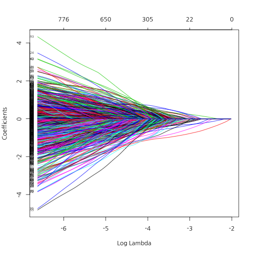
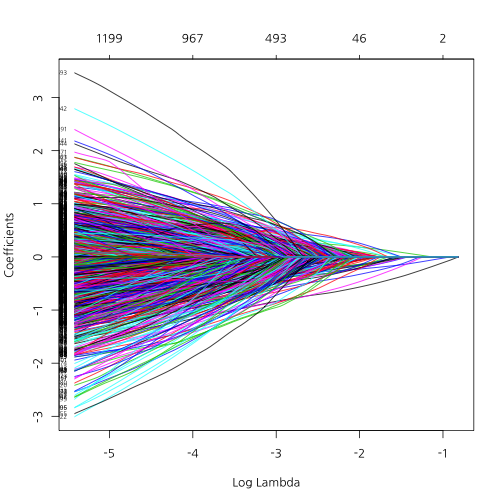

## 퀀트랩 소개

<center></center>

--- .new-background

## 워크숍 관련 온라인 사이트

http://course.mindscale.kr/course/text-analysis

<left></left>

--- .new-background

## 오늘의 목표  

<h3b> - 감정 사전 만들기</h3b>  
<h3b> - 감정 점수 만들기</h3b>  

<h3b> - 상관관계 이해하기</h3b>  
<h3b> - 회귀분석 이해하기</h3b>  
<h3b> - 모형평가 이해하기</h3b>  

--- .newbackground

## 왜 감정분석을 하는가?

<h3b> 설문지의 단점</h3b>  
<h3b> 1) 조사 비용 발생 </h3b>  
<h3b> 2) 미리 정해진 문항만 측정 가능</h3b>  
<h3b> 3) 사회적 바람직성 등 편향 발생</h3b>  

--- .newbackground

## 감정분석

<h3b> 텍스트에서 감정 단어를 추출하여 점수화</h3b>  
<h3b> 1) 기계 학습 (Machine Learning) </h3b>  
<h3b> 2) 단어 사전 기반 </h3b>

--- .newbackground

## 사전 기반 분석

<h3b> 장점 </h3b>  
<h3b> - 사용하기 간편 </h3b>  
<h3b> 단점 </h3b>  
<h3b> - 주제에 따라 사전이 달라 짐 </h3b>  
<h3b> - 동음이의어 처리 힘듦 e.g) bank </h3b>  

--- .newbackground

## 기계학습 기반 분석

<h3b> 장점 </h3b>  
<h3b> - 높은 정확도  </h3b>  
<h3b> 단점 </h3b>  
<h3b> - Over-fitting 해결 </h3b>  
<h3b> - 많은 데이터 필요 </h3b>  
<h3b> 예) 나이브 베이즈 / 최대 엔트로피 / 서포트지지벡터머신 / </h3b>  
<h3b>  랜덤 포레스트 / 토픽 모델 </h3b>

--- .newbackground

## 감정 분석 예시

<center></center>

--- .newbackground

## 감정 분석 예시

<center></center>


--- .newbackground

## 사전 지식 

<h3b> 예측이란 무엇? </h3b> 

<h4b>자기자신(Y) : Y가 변화하는 추세  </h4b>    
<h4b>다른변수(X,Y) : X가 Y를 예측  </h4b>    
<h4b> - 키로 몸무게를 예측! </h4b>    
<h4b> - 키로 성적을 예측?   </h4b>    

<h3b> 예측이 잘 되려면 서로 상관(관련성)이 높아야 함</h3b>  
<h4b> -> 감정단어로 영화 평점을 예측 </h4b>  

--- .newbackground

## 회귀분석(선형(직선) 모형) 

<h3b> 예시 </h3b>

<h4b>- 키가 1cm 증가할 때마다 몸무게가 1kg 증가  </h4b>  
<h4b>- 월 소득이 100만원 증가할 때마다 몸무게가 1kg 감소 </h4b>   
<h4b>- 부정단어가 1개 증가할 때 마다 평점 .1점 감점  </h4b>  
<h4b>- 긍정단어가 1개 증가할 때 마다 평점 .1점 증가  </h4b>  

--- &twocol .modal

## 상관관계

*** =left


 

```
## [1] 1
```

*** =right


 

```
## [1] 0.4885042
```

--- .newbackground .modal

## 상관관계

<h3b> x가 증가(혹은 감소)할때 y가 선형적으로 증가(혹은 감소)하는 정도 </h3b>

<h3b> scale </h3b>

<h4b> 키가 만약 cm라면, 키가 1cm 증가하면 몸무게는 1kg증가  </h4b>   
<h4b> 키가 만약 mm라면, 키가 1mm 증가하면 몸무게는 0.1kg 증가  </h4b>   

<h3b> -> 표준화해야 한다 </h3b>

--- &twocol .modal

## 둘 중 무엇이 상관이 더 클까요?

*** =left


 

*** =right


 

--- &twocol

## 상관관계 및 회귀분석

*** =left


 

*** =right

<!-- html table generated in R 3.1.3 by xtable 1.7-4 package -->
<!-- Mon Jul 27 21:54:01 2015 -->
<table border=1>
<tr> <th>  </th> <th> Estimate </th> <th> Std. Error </th> <th> t value </th> <th> Pr(&gt;|t|) </th>  </tr>
  <tr> <td align="right"> (Intercept) </td> <td align="right"> -8.29 </td> <td align="right"> 11.74 </td> <td align="right"> -0.71 </td> <td align="right"> 0.49 </td> </tr>
  <tr> <td align="right"> heights </td> <td align="right"> 0.49 </td> <td align="right"> 0.07 </td> <td align="right"> 7.56 </td> <td align="right"> 0.00 </td> </tr>
   </table>


```r
cor(weights, heights)
```

```
## [1] 0.8194181
```

--- &twocol

## 상관관계 및 회귀분석

*** =left


 

*** =right

<!-- html table generated in R 3.1.3 by xtable 1.7-4 package -->
<!-- Mon Jul 27 21:54:02 2015 -->
<table border=1>
<tr> <th>  </th> <th> Estimate </th> <th> Std. Error </th> <th> t value </th> <th> Pr(&gt;|t|) </th>  </tr>
  <tr> <td align="right"> (Intercept) </td> <td align="right"> 69.17 </td> <td align="right"> 1.17 </td> <td align="right"> 58.93 </td> <td align="right"> 0.00 </td> </tr>
  <tr> <td align="right"> heights </td> <td align="right"> 0.05 </td> <td align="right"> 0.01 </td> <td align="right"> 7.56 </td> <td align="right"> 0.00 </td> </tr>
   </table>


```r
cor(weights, heights)
```

```
## [1] 0.8194181
```

--- &twocol

## 상관관계 및 회귀분석

*** =left

 

*** =right


 

--- &twocol

## X가 2개라면?

*** =left


 

```
## [1] 0.8194181
```

*** =right

 

```
## [1] 0.09818667
```

--- .newbackground

## 다중회귀분석

<!-- html table generated in R 3.1.3 by xtable 1.7-4 package -->
<!-- Mon Jul 27 21:54:02 2015 -->
<table border=1>
<tr> <th>  </th> <th> Estimate </th> <th> Std. Error </th> <th> t value </th> <th> Pr(&gt;|t|) </th>  </tr>
  <tr> <td align="right"> (Intercept) </td> <td align="right"> -27.49 </td> <td align="right"> 12.81 </td> <td align="right"> -2.15 </td> <td align="right"> 0.04 </td> </tr>
  <tr> <td align="right"> iq </td> <td align="right"> 0.15 </td> <td align="right"> 0.06 </td> <td align="right"> 2.68 </td> <td align="right"> 0.01 </td> </tr>
  <tr> <td align="right"> heights </td> <td align="right"> 0.52 </td> <td align="right"> 0.06 </td> <td align="right"> 8.72 </td> <td align="right"> 0.00 </td> </tr>
   </table>

--- .newbackground

## 예측력  

<h3b> MSE(Mean of Square Error) </h3b>
$$ MSE = \sum_{i=1}^{n}(Y_{i} - \hat{Y_{i}})^{2} $$

<h3b> 정확도(Accracy) </h3b>  

<center></center>
<h3b> 정확도 = (TP + TN) / (TP + FP + TN + FN) </h3b>

--- &twocol

## Traninig Vs Test

*** =left

 

*** =right

 

--- .newbackground

## Over-fitting

<center></center>


--- .newbackground

## Over-fitting(과적합)

<h3b> How to avoid Over-fitting </h3b>  
<h3b>- Penality of Model Complexity (MSE 보정)  </h3b>  
<h3b><font color="red">- Regulization (Lasso, Ridge, Elastic Net) </font>  </h3b>  
<h3b>- Bayesian  </h3b>  
<h3b>- Drop Out, Bagging, Feature Bagging  </h3b>  

--- .newbackground

## Lasso Vs Ridge

<center></center>

--- &twocol

## Lasso Vs Ridge

*** =left


 

*** =right

 

--- .newbackground

## 감정분석

<h3b> Data </h3b>  
<h3b> 25,000 IMDB movie reviews 중에서 1,000개만 </h3b>  
<h3b> Training Vs Test = 7 Vs 3 </h3b>  

--- .newbackground

## Traing Set 과 Test Set 분할


```r
fileName <- "data/IMDBmovie/labeledTrainData.tsv"
data <- read.csv(fileName, header=T, sep="\t", quote="")
nrow(data)
```

```
## [1] 25000
```

```r
data <- data[1:1000, ]
```

--- .newbackground

## Traing Set 과 Test Set 분할


```r
totalNum <- 1:nrow(data)
set.seed(12345)
shuffledNum <- sample(totalNum, nrow(data), replace = F)
trainingNum <- shuffledNum[1:700]
testNum <- shuffledNum[701:1000]
data.train <- data[trainingNum, ]
data.test <- data[testNum, ]
```

--- .newbackground

## Term-DocumentMatrix


```r
library(tm)
```


```r
corpus <- Corpus(VectorSource(data.train$review))
tdm.train <- TermDocumentMatrix(corpus, 
                                control=list(tolower = T,
                                             removePunctuation = T,
                                             removeNumbers = T,
                                             stopwords=stopwords("SMART")))
```

--- .newbackground

## 주요 단어 10000개 사용


```r
library(slam)
word.count = as.array(rollup(tdm.train, 2))
word.order = order(word.count, decreasing = T)
freq.word = word.order[1 : 10000]
tdm.train <- tdm.train[freq.word, ]
```

--- .newbackground

## LASSO Regression


```r
alpha <- 1
cv.lasso <- cv.glmnet(as.matrix(t(tdm.train)), data.train$sentiment, 
                      type.measure = "class", 
                      nfolds = 4,
                      family = "binomial", 
                      alpha = alpha)
```

--- .newbackground

## LASSO Regression

```r
plot(cv.lasso)
```

 

```r
log(cv.lasso$lambda.min)
```

```
## [1] -3.272161
```

--- .newbackground

## LASSO Regression

```r
plot(cv.lasso$glmnet.fit, "lambda", label=TRUE)
```

 

--- .newbackground

## Ridge Regression


```r
alpha <- 0
cv.ridge <- cv.glmnet(as.matrix(t(tdm.train)), data.train$sentiment, 
                      type.measure = "class", 
                      nfolds = 4,
                      family = "binomial", 
                      alpha = alpha)
```

--- .newbackground

## RIDGE Regression


```r
plot(cv.ridge)
```

 

```r
log(cv.ridge$lambda.min)
```

```
## [1] 0.6119973
```

--- .newbackground

## RIDGE Regression


```r
plot(cv.ridge$glmnet.fit, "lambda", label=TRUE)
```

 

--- .newbackground

## ElasticNet Regression


```r
alpha <- .5
cv.elastic <- cv.glmnet(as.matrix(t(tdm.train)), data.train$sentiment, 
                        type.measure = "class", 
                        nfolds = 4,
                        family = "binomial", 
                        alpha = alpha)
```

--- .newbackground

## ElasticNet Regression


```r
plot(cv.elastic)
```

 

```r
log(cv.elastic$lambda.min)
```

```
## [1] -2.811599
```

--- .newbackground

## ElasticNet Regression


```r
plot(cv.elastic$glmnet.fit, "lambda", label=TRUE)
```

 

--- .newbackground

## 감정 단어 추출


```r
coef.lasso <- coef(cv.lasso, s = "lambda.min")[,1]
coef.ridge <- coef(cv.ridge, s = "lambda.min")[,1]
coef.elastic <- coef(cv.elastic, s = "lambda.min")[,1]
```

--- .newbackground

## 감정 단어 추출


```r
pos.lasso <- sort(coef.lasso[coef.lasso > 0])
neg.lasso <- sort(coef.lasso[coef.lasso < 0])
```


```r
pos.lasso[1:5]
```

```
##   hilarious       drama        life       world         bit 
## 0.004800054 0.008611723 0.038371849 0.044125055 0.051063664
```

```r
neg.lasso[1:5]
```

```
##      worst      waste       save    wouldnt whatsoever 
## -1.0178384 -0.8242384 -0.6190533 -0.5708966 -0.5378581
```

--- .newbackground

## 감정 단어 추출


```r
pos.ridge <- sort(coef.ridge[coef.ridge > 0])
neg.ridge <- sort(coef.ridge[coef.ridge < 0])
```


```r
pos.ridge[1:5]
```

```
##        hints      fathers     scripted   frequently    obsession 
## 2.801103e-06 1.891073e-05 4.397610e-05 4.478976e-05 5.434588e-05
```

```r
neg.ridge[1:5]
```

```
##             binks           coughed        betterhard bottomofthebarrel 
##        -0.1925666        -0.1925665        -0.1845028        -0.1845024 
##       capturelike 
##        -0.1835726
```

--- .newbackground

## 감정 단어 추출


```r
pos.elastic <- sort(coef.elastic[coef.elastic > 0])
neg.elastic <- sort(coef.elastic[coef.elastic < 0])
```


```r
pos.elastic[1:5]
```

```
##   brilliant        dark    american       naive      humour 
## 0.002717850 0.005426420 0.008651522 0.008926515 0.010264251
```

```r
neg.elastic[1:5]
```

```
##      worst      waste    wouldnt whatsoever       save 
## -0.8711227 -0.7880778 -0.6300778 -0.6222940 -0.6193373
```


--- .newbackground

## 감정 단어 점수화


```r
library(tm.plugin.sentiment)
```


```r
score.lasso <- polarity(tdm.train, names(pos.lasso), names(neg.lasso))
score.ridge <- polarity(tdm.train, names(pos.elastic), names(neg.elastic))
score.elastic <- polarity(tdm.train, names(pos.elastic), names(neg.elastic))
```

--- .newbackground

## CUT-POINT


```r
findCutpoint(data.train$sentiment, score.lasso)
```

```
## [1] 0.2
```

```r
findCutpoint(data.train$sentiment, score.ridge)
```

```
## [1] 0.05882353
```

```r
findCutpoint(data.train$sentiment, score.elastic)
```

```
## [1] 0.05882353
```


```r
cut.lasso <- findCutpoint(data.train$sentiment, score.lasso)
cut.ridge <- findCutpoint(data.train$sentiment, score.ridge)
cut.elastic <- findCutpoint(data.train$sentiment, score.elastic)
```

--- .newbackground

## Test Set


```r
corpus <- Corpus(VectorSource(data.test$review))

tdm.test <- TermDocumentMatrix(corpus, 
                               control=list(dictionary = Terms(tdm.train), 
                                            tolower = T,
                                            removePunctuation = T,
                                            removeNumbers = T,
                                            stopwords=stopwords("SMART")))
```

--- .newbackground

## Test Set


```r
score.lasso <- polarity(tdm.test, names(pos.lasso), names(neg.lasso))
score.ridge <- polarity(tdm.test, names(pos.elastic), names(neg.elastic))
score.elastic <- polarity(tdm.test, names(pos.elastic), names(neg.elastic))
```

--- .newbackground

## Test Set


```r
library(caret)
```


```r
score.lasso.b <- rep(0, length(score.lasso))
score.lasso.b[score.lasso >= cut.lasso] <- 1
confusionMatrix(score.lasso.b, data.test$sentiment)
```

```
## Confusion Matrix and Statistics
## 
##           Reference
## Prediction   0   1
##          0 131  59
##          1  36  74
##                                           
##                Accuracy : 0.6833          
##                  95% CI : (0.6274, 0.7356)
##     No Information Rate : 0.5567          
##     P-Value [Acc > NIR] : 4.879e-06       
##                                           
##                   Kappa : 0.3469          
##  Mcnemar's Test P-Value : 0.024           
##                                           
##             Sensitivity : 0.7844          
##             Specificity : 0.5564          
##          Pos Pred Value : 0.6895          
##          Neg Pred Value : 0.6727          
##              Prevalence : 0.5567          
##          Detection Rate : 0.4367          
##    Detection Prevalence : 0.6333          
##       Balanced Accuracy : 0.6704          
##                                           
##        'Positive' Class : 0               
## 
```

--- .newbackground

## Test Set


```r
score.ridge.b <- rep(0, length(score.ridge))
score.ridge.b[score.ridge >= cut.ridge] <- 1
confusionMatrix(score.ridge.b, data.test$sentiment)
```

```
## Confusion Matrix and Statistics
## 
##           Reference
## Prediction   0   1
##          0 130  45
##          1  37  88
##                                           
##                Accuracy : 0.7267          
##                  95% CI : (0.6725, 0.7763)
##     No Information Rate : 0.5567          
##     P-Value [Acc > NIR] : 9.443e-10       
##                                           
##                   Kappa : 0.4428          
##  Mcnemar's Test P-Value : 0.4395          
##                                           
##             Sensitivity : 0.7784          
##             Specificity : 0.6617          
##          Pos Pred Value : 0.7429          
##          Neg Pred Value : 0.7040          
##              Prevalence : 0.5567          
##          Detection Rate : 0.4333          
##    Detection Prevalence : 0.5833          
##       Balanced Accuracy : 0.7200          
##                                           
##        'Positive' Class : 0               
## 
```

--- .newbackground

## Test Set


```r
score.elastic.b <- rep(0, length(score.elastic))
score.elastic.b[score.elastic >= cut.elastic] <- 1
confusionMatrix(score.elastic.b, data.test$sentiment)
```

```
## Confusion Matrix and Statistics
## 
##           Reference
## Prediction   0   1
##          0 130  45
##          1  37  88
##                                           
##                Accuracy : 0.7267          
##                  95% CI : (0.6725, 0.7763)
##     No Information Rate : 0.5567          
##     P-Value [Acc > NIR] : 9.443e-10       
##                                           
##                   Kappa : 0.4428          
##  Mcnemar's Test P-Value : 0.4395          
##                                           
##             Sensitivity : 0.7784          
##             Specificity : 0.6617          
##          Pos Pred Value : 0.7429          
##          Neg Pred Value : 0.7040          
##              Prevalence : 0.5567          
##          Detection Rate : 0.4333          
##    Detection Prevalence : 0.5833          
##       Balanced Accuracy : 0.7200          
##                                           
##        'Positive' Class : 0               
## 
```

--- .newbackground

## glmnet 활용


```r
score.lasso <- predict(cv.lasso, as.matrix(t(tdm.train)), s = "lambda.min")
score.ridge <- predict(cv.ridge, as.matrix(t(tdm.train)), s = "lambda.min")
score.elastic <- predict(cv.elastic, as.matrix(t(tdm.train)), s = "lambda.min")
```


```r
findCutpoint(data.train$sentiment, score.lasso)
```

```
## [1] 0.1043392
```

```r
findCutpoint(data.train$sentiment, score.ridge)
```

```
## [1] 0.03085342
```

```r
findCutpoint(data.train$sentiment, score.elastic)
```

```
## [1] 0.1470654
```


```r
cut.lasso <- findCutpoint(data.train$sentiment, score.lasso)
cut.ridge <- findCutpoint(data.train$sentiment, score.ridge)
cut.elastic <- findCutpoint(data.train$sentiment, score.elastic)
```

--- .newbackground

## glmnet 활용


```r
score.lasso <- predict(cv.lasso, as.matrix(t(tdm.test)), s = "lambda.min")
score.ridge <- predict(cv.ridge, as.matrix(t(tdm.test)), s = "lambda.min")
score.elastic <- predict(cv.elastic, as.matrix(t(tdm.test)), s = "lambda.min")
```

## Test Set


```r
score.lasso.b <- rep(0, length(score.lasso))
score.lasso.b[score.lasso >= cut.lasso] <- 1
confusionMatrix(score.lasso.b, data.test$sentiment)
```

```
## Confusion Matrix and Statistics
## 
##           Reference
## Prediction   0   1
##          0   3   3
##          1 164 130
##                                           
##                Accuracy : 0.4433          
##                  95% CI : (0.3863, 0.5015)
##     No Information Rate : 0.5567          
##     P-Value [Acc > NIR] : 1               
##                                           
##                   Kappa : -0.0041         
##  Mcnemar's Test P-Value : <2e-16          
##                                           
##             Sensitivity : 0.01796         
##             Specificity : 0.97744         
##          Pos Pred Value : 0.50000         
##          Neg Pred Value : 0.44218         
##              Prevalence : 0.55667         
##          Detection Rate : 0.01000         
##    Detection Prevalence : 0.02000         
##       Balanced Accuracy : 0.49770         
##                                           
##        'Positive' Class : 0               
## 
```

--- .newbackground

## Test Set


```r
score.ridge.b <- rep(0, length(score.ridge))
score.ridge.b[score.ridge >= cut.ridge] <- 1
confusionMatrix(score.ridge.b, data.test$sentiment)
```

```
## Confusion Matrix and Statistics
## 
##           Reference
## Prediction  0  1
##          0 90 74
##          1 77 59
##                                           
##                Accuracy : 0.4967          
##                  95% CI : (0.4387, 0.5547)
##     No Information Rate : 0.5567          
##     P-Value [Acc > NIR] : 0.9840          
##                                           
##                   Kappa : -0.0174         
##  Mcnemar's Test P-Value : 0.8707          
##                                           
##             Sensitivity : 0.5389          
##             Specificity : 0.4436          
##          Pos Pred Value : 0.5488          
##          Neg Pred Value : 0.4338          
##              Prevalence : 0.5567          
##          Detection Rate : 0.3000          
##    Detection Prevalence : 0.5467          
##       Balanced Accuracy : 0.4913          
##                                           
##        'Positive' Class : 0               
## 
```

--- .newbackground

## Test Set


```r
score.elastic.b <- rep(0, length(score.elastic))
score.elastic.b[score.elastic >= cut.elastic] <- 1
confusionMatrix(score.elastic.b, data.test$sentiment)
```

```
## Confusion Matrix and Statistics
## 
##           Reference
## Prediction   0   1
##          0 120 100
##          1  47  33
##                                           
##                Accuracy : 0.51            
##                  95% CI : (0.4519, 0.5679)
##     No Information Rate : 0.5567          
##     P-Value [Acc > NIR] : 0.9537          
##                                           
##                   Kappa : -0.0347         
##  Mcnemar's Test P-Value : 1.796e-05       
##                                           
##             Sensitivity : 0.7186          
##             Specificity : 0.2481          
##          Pos Pred Value : 0.5455          
##          Neg Pred Value : 0.4125          
##              Prevalence : 0.5567          
##          Detection Rate : 0.4000          
##    Detection Prevalence : 0.7333          
##       Balanced Accuracy : 0.4833          
##                                           
##        'Positive' Class : 0               
## 
```
