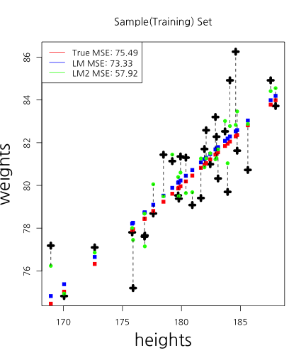
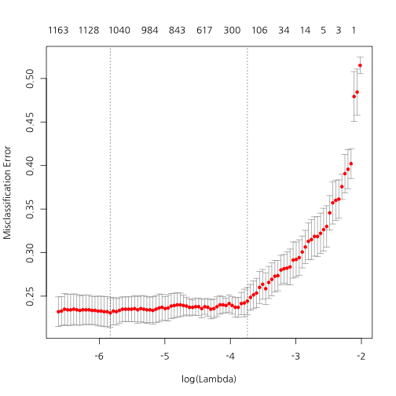
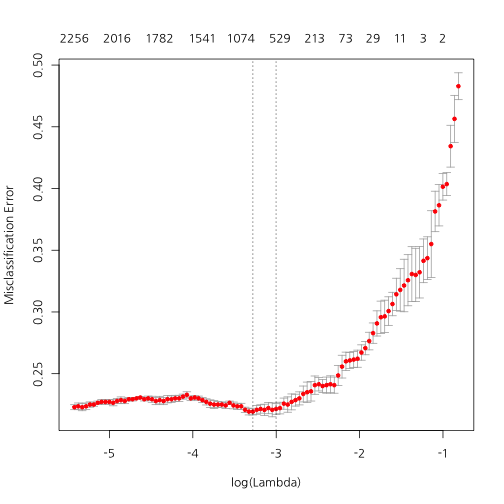

## 퀀트랩 소개

<center></center>

--- .new-background

## 워크숍 관련 온라인 사이트

http://course.mindscale.kr/course/text-analysis

<left></left>

--- .new-background

## 오늘의 목표  

<h3b> - 감정 사전 만들기</h3b>  
<h3b> - 감정 점수 만들기</h3b>  

<h3b> - 상관관계 이해하기</h3b>  
<h3b> - 회귀분석 이해하기</h3b>  
<h3b> - 모형평가 이해하기</h3b>  

--- .newbackground

## 왜 감정분석을 하는가?

<h3b> 설문지의 단점</h3b>  
<h3b> 1) 조사 비용 발생 </h3b>  
<h3b> 2) 미리 정해진 문항만 측정 가능</h3b>  
<h3b> 3) 사회적 바람직성 등 편향 발생</h3b>  

--- .newbackground

## 감정분석

<h3b> 텍스트에서 감정 단어를 추출하여 점수화</h3b>  
<h3b> 1) 기계 학습 (Machine Learning) </h3b>  
<h3b> 2) 단어 사전 기반 </h3b>

--- .newbackground

## 사전 기반 분석

<h3b> 장점 </h3b>  
<h3b> - 사용하기 간편 </h3b>  
<h3b> 단점 </h3b>  
<h3b> - 주제에 따라 사전이 달라 짐 </h3b>  
<h3b> - 동음이의어 처리 힘듦 e.g) bank </h3b>  

--- .newbackground

## 기계학습 기반 분석

<h3b> 장점 </h3b>  
<h3b> - 높은 정확도  </h3b>  
<h3b> 단점 </h3b>  
<h3b> - Over-fitting 해결 </h3b>  
<h3b> - 많은 데이터 필요 </h3b>  
<h3b> 예) 나이브 베이즈 / 최대 엔트로피 / 서포트지지벡터머신 / </h3b>  
<h3b>  랜덤 포레스트 / 토픽 모델 </h3b>

--- .newbackground

## 감정 분석 예시

<center></center>

--- .newbackground

## 감정 분석 예시

<center></center>


--- .newbackground

## 사전 지식 

<h3b> 예측이란 무엇? </h3b> 

<h4b>자기자신(Y) : Y가 변화하는 추세  </h4b>    
<h4b>다른변수(X,Y) : X가 Y를 예측  </h4b>    
<h4b> - 키로 몸무게를 예측! </h4b>    
<h4b> - 키로 성적을 예측?   </h4b>    

<h3b> 예측이 잘 되려면 서로 상관(관련성)이 높아야 함</h3b>  
<h4b> -> 감정단어로 영화 평점을 예측 </h4b>  

--- .newbackground

## 회귀분석(선형(직선) 모형) 

<h3b> 예시 </h3b>

<h4b>- 키가 1cm 증가할 때마다 몸무게가 1kg 증가  </h4b>  
<h4b>- 월 소득이 100만원 증가할 때마다 몸무게가 1kg 감소 </h4b>   
<h4b>- 부정단어가 1개 증가할 때 마다 평점 .1점 감점  </h4b>  
<h4b>- 긍정단어가 1개 증가할 때 마다 평점 .1점 증가  </h4b>  

--- &twocol .modal

## 상관관계

*** =left


 

```
## [1] 1
```

*** =right


 

```
## [1] 0.4885042
```

--- .newbackground .modal

## 상관관계

<h3b> x가 증가(혹은 감소)할때 y가 선형적으로 증가(혹은 감소)하는 정도 </h3b>

<h3b> scale </h3b>

<h4b> 키가 만약 cm라면, 키가 1cm 증가하면 몸무게는 1kg증가  </h4b>   
<h4b> 키가 만약 mm라면, 키가 1mm 증가하면 몸무게는 0.1kg 증가  </h4b>   

<h3b> -> 표준화해야 한다 </h3b>

--- &twocol .modal

## 둘 중 무엇이 상관이 더 클까요?

*** =left


 

*** =right


 

--- &twocol

## 상관관계 및 회귀분석

*** =left


 

*** =right

<!-- html table generated in R 3.1.3 by xtable 1.7-4 package -->
<!-- Tue Jul 28 22:06:22 2015 -->
<table border=1>
<tr> <th>  </th> <th> Estimate </th> <th> Std. Error </th> <th> t value </th> <th> Pr(&gt;|t|) </th>  </tr>
  <tr> <td align="right"> (Intercept) </td> <td align="right"> -8.29 </td> <td align="right"> 11.74 </td> <td align="right"> -0.71 </td> <td align="right"> 0.49 </td> </tr>
  <tr> <td align="right"> heights </td> <td align="right"> 0.49 </td> <td align="right"> 0.07 </td> <td align="right"> 7.56 </td> <td align="right"> 0.00 </td> </tr>
   </table>


```r
cor(weights, heights)
```

```
## [1] 0.8194181
```

--- &twocol

## 상관관계 및 회귀분석

*** =left


 

*** =right

<!-- html table generated in R 3.1.3 by xtable 1.7-4 package -->
<!-- Tue Jul 28 22:06:23 2015 -->
<table border=1>
<tr> <th>  </th> <th> Estimate </th> <th> Std. Error </th> <th> t value </th> <th> Pr(&gt;|t|) </th>  </tr>
  <tr> <td align="right"> (Intercept) </td> <td align="right"> 69.17 </td> <td align="right"> 1.17 </td> <td align="right"> 58.93 </td> <td align="right"> 0.00 </td> </tr>
  <tr> <td align="right"> heights </td> <td align="right"> 0.05 </td> <td align="right"> 0.01 </td> <td align="right"> 7.56 </td> <td align="right"> 0.00 </td> </tr>
   </table>


```r
cor(weights, heights)
```

```
## [1] 0.8194181
```

--- &twocol

## 상관관계 및 회귀분석

*** =left

 

*** =right


 

--- &twocol

## X가 2개라면?

*** =left


 

```
## [1] 0.8194181
```

*** =right

 

```
## [1] 0.09818667
```

--- .newbackground

## 다중회귀분석

<!-- html table generated in R 3.1.3 by xtable 1.7-4 package -->
<!-- Tue Jul 28 22:06:24 2015 -->
<table border=1>
<tr> <th>  </th> <th> Estimate </th> <th> Std. Error </th> <th> t value </th> <th> Pr(&gt;|t|) </th>  </tr>
  <tr> <td align="right"> (Intercept) </td> <td align="right"> -27.49 </td> <td align="right"> 12.81 </td> <td align="right"> -2.15 </td> <td align="right"> 0.04 </td> </tr>
  <tr> <td align="right"> iq </td> <td align="right"> 0.15 </td> <td align="right"> 0.06 </td> <td align="right"> 2.68 </td> <td align="right"> 0.01 </td> </tr>
  <tr> <td align="right"> heights </td> <td align="right"> 0.52 </td> <td align="right"> 0.06 </td> <td align="right"> 8.72 </td> <td align="right"> 0.00 </td> </tr>
   </table>

--- .newbackground

## 예측력  

<h3b> MSE(Mean of Square Error) </h3b>
$$ MSE = \sum_{i=1}^{n}(Y_{i} - \hat{Y_{i}})^{2} $$

<h3b> 정확도(Accracy) </h3b>  

<center></center>
<h3b> 정확도 = (TP + TN) / (TP + FP + TN + FN) </h3b>

--- &twocol

## Traninig Vs Test

*** =left

 

*** =right

 

--- .newbackground

## Over-fitting

<center></center>


--- .newbackground

## Over-fitting(과적합)

<h3b> How to avoid Over-fitting </h3b>  
<h3b>- Penality of Model Complexity (MSE 보정)  </h3b>  
<h3b><font color="red">- Regulization (Lasso, Ridge, Elastic Net) </font>  </h3b>  
<h3b>- Bayesian  </h3b>  
<h3b>- Drop Out, Bagging, Feature Bagging  </h3b>  

--- .newbackground

## Lasso Vs Ridge

<center></center>

--- &twocol

## Lasso Vs Ridge

*** =left


 

*** =right

 

--- .newbackground

## 감정분석

<h3b> Data </h3b>  
<h3b> 25,000 IMDB movie reviews 중에서 1,000개만 </h3b>  
<h3b> Training Vs Test = 7 Vs 3 </h3b>  

--- .newbackground

## Traing Set 과 Test Set 분할


```r
fileName <- "data/IMDBmovie/labeledTrainData.tsv"
data <- read.csv(fileName, header=T, sep="\t", quote="")
nrow(data)
```

```
## [1] 25000
```

```r
data <- data[1:2000, ]
```

--- .newbackground

## Traing Set 과 Test Set 분할


```r
totalNum <- 1:nrow(data)
set.seed(12345)
shuffledNum <- sample(totalNum, nrow(data), replace = F)
trainingNum <- shuffledNum[1:1400]
testNum <- shuffledNum[1401:2000]
data.train <- data[trainingNum, ]
data.test <- data[testNum, ]
```

--- .newbackground

## Term-DocumentMatrix


```r
library(tm)
```


```r
corpus <- Corpus(VectorSource(data.train$review))
tdm.train <- TermDocumentMatrix(corpus, 
                                control=list(tolower = T,
                                             removePunctuation = T,
                                             removeNumbers = T,
                                             stopwords=stopwords("SMART")))
```

--- .newbackground

## LASSO Regression


```r
alpha <- 1
cv.lasso <- cv.glmnet(as.matrix(t(tdm.train)), data.train$sentiment, 
                      type.measure = "class", 
                      nfolds = 4,
                      family = "binomial", 
                      alpha = alpha)
```

--- .newbackground

## LASSO Regression

```r
plot(cv.lasso)
```

 

```r
log(cv.lasso$lambda.min)
```

```
## [1] -4.344838
```

--- .newbackground

## LASSO Regression

```r
plot(cv.lasso$glmnet.fit, "lambda", label=TRUE)
```

 

--- .newbackground

## Ridge Regression


```r
alpha <- 0
cv.ridge <- cv.glmnet(as.matrix(t(tdm.train)), data.train$sentiment, 
                      type.measure = "class", 
                      nfolds = 4,
                      family = "binomial", 
                      alpha = alpha)
```

--- .newbackground

## RIDGE Regression


```r
plot(cv.ridge)
```

 

```r
log(cv.ridge$lambda.min)
```

```
## [1] 1.493029
```

--- .newbackground

## RIDGE Regression


```r
plot(cv.ridge$glmnet.fit, "lambda", label=TRUE)
```

 

--- .newbackground

## ElasticNet Regression


```r
alpha <- .3
cv.elastic <- cv.glmnet(as.matrix(t(tdm.train)), data.train$sentiment, 
                        type.measure = "class", 
                        nfolds = 4,
                        family = "binomial", 
                        alpha = alpha)
```

--- .newbackground

## ElasticNet Regression


```r
plot(cv.elastic)
```

 

```r
log(cv.elastic$lambda.min)
```

```
## [1] -3.419966
```

--- .newbackground

## ElasticNet Regression


```r
plot(cv.elastic$glmnet.fit, "lambda", label=TRUE)
```

 

--- .newbackground

## 감정 단어 추출


```r
coef.lasso <- coef(cv.lasso, s = "lambda.min")[,1]
coef.ridge <- coef(cv.ridge, s = "lambda.min")[,1]
coef.elastic <- coef(cv.elastic, s = "lambda.min")[,1]
```

--- .newbackground

## 감정 단어 추출


```r
pos.lasso <- sort(coef.lasso[coef.lasso > 0])
neg.lasso <- sort(coef.lasso[coef.lasso < 0])
```


```r
pos.lasso[1:5]
```

```
##    collapses  patricyoure       againi       veneer      subject 
## 3.120188e-15 4.940365e-15 1.424454e-06 1.517951e-06 6.820669e-06
```

```r
neg.lasso[1:5]
```

```
## economically        worst     returned       commit       wooden 
##    -1.409192    -1.349991    -1.297906    -1.266191    -1.255193
```

--- .newbackground

## 감정 단어 추출


```r
pos.ridge <- sort(coef.ridge[coef.ridge > 0])
neg.ridge <- sort(coef.ridge[coef.ridge < 0])
```


```r
pos.ridge[1:5]
```

```
##          jew      streets          rob         plan        stall 
## 3.042999e-07 2.091328e-05 2.313824e-05 2.362472e-05 2.417472e-05
```

```r
neg.ridge[1:5]
```

```
##        evolving     typecasting       cancelled     cameosimans 
##     -0.10789309     -0.10340770     -0.10157122     -0.09999705 
## selfdeprecating 
##     -0.09974657
```

--- .newbackground

## 감정 단어 추출


```r
pos.elastic <- sort(coef.elastic[coef.elastic > 0])
neg.elastic <- sort(coef.elastic[coef.elastic < 0])
```


```r
pos.elastic[1:5]
```

```
##            theni       mutilating              ive             ride 
##     0.0002650247     0.0003448974     0.0003601619     0.0003829296 
## weirdstrangeeven 
##     0.0009908731
```

```r
neg.elastic[1:5]
```

```
##          pic     returned       commit economically     enamored 
##    -1.332630    -1.270371    -1.207446    -1.156321    -1.140002
```


--- .newbackground

## 감정 단어 점수화


```r
library(tm.plugin.sentiment)
```


```r
score.lasso <- polarity(tdm.train, names(pos.lasso), names(neg.lasso))
score.ridge <- polarity(tdm.train, names(pos.elastic), names(neg.elastic))
score.elastic <- polarity(tdm.train, names(pos.elastic), names(neg.elastic))
```

--- .newbackground

## CUT-POINT


```r
findCutpoint(data.train$sentiment, score.lasso)
```

```
## [1] 0
```

```r
findCutpoint(data.train$sentiment, score.ridge)
```

```
## [1] 0.106383
```

```r
findCutpoint(data.train$sentiment, score.elastic)
```

```
## [1] 0.106383
```

--- .newbackground

## CUT-POINT


```r
library(pROC)
```


```r
plot.roc(data.train$sentiment, score.lasso, print.thres = T)
```

 

```
## 
## Call:
## plot.roc.default(x = data.train$sentiment, predictor = score.lasso,     print.thres = T)
## 
## Data: score.lasso in 694 controls (data.train$sentiment 0) < 702 cases (data.train$sentiment 1).
## Area under the curve: 0.9897
```

--- .newbackground

## CUT-POINT


```r
cut.lasso <- findCutpoint(data.train$sentiment, score.lasso)
cut.ridge <- findCutpoint(data.train$sentiment, score.ridge)
cut.elastic <- findCutpoint(data.train$sentiment, score.elastic)
```

--- .newbackground

## Test Set


```r
corpus <- Corpus(VectorSource(data.test$review))

tdm.test <- TermDocumentMatrix(corpus, 
                               control=list(dictionary = Terms(tdm.train), 
                                            tolower = T,
                                            removePunctuation = T,
                                            removeNumbers = T,
                                            stopwords=stopwords("SMART")))
```

--- .newbackground

## Test Set


```r
score.lasso <- polarity(tdm.test, names(pos.lasso), names(neg.lasso))
score.ridge <- polarity(tdm.test, names(pos.elastic), names(neg.elastic))
score.elastic <- polarity(tdm.test, names(pos.elastic), names(neg.elastic))
```

--- .newbackground

## Test Set


```r
library(caret)
```


```r
score.lasso.b <- rep(0, length(score.lasso))
score.lasso.b[score.lasso >= cut.lasso] <- 1
confusionMatrix(score.lasso.b, data.test$sentiment)
```

```
## Confusion Matrix and Statistics
## 
##           Reference
## Prediction   0   1
##          0 222  35
##          1  87 256
##                                           
##                Accuracy : 0.7967          
##                  95% CI : (0.7622, 0.8282)
##     No Information Rate : 0.515           
##     P-Value [Acc > NIR] : < 2.2e-16       
##                                           
##                   Kappa : 0.5951          
##  Mcnemar's Test P-Value : 3.887e-06       
##                                           
##             Sensitivity : 0.7184          
##             Specificity : 0.8797          
##          Pos Pred Value : 0.8638          
##          Neg Pred Value : 0.7464          
##              Prevalence : 0.5150          
##          Detection Rate : 0.3700          
##    Detection Prevalence : 0.4283          
##       Balanced Accuracy : 0.7991          
##                                           
##        'Positive' Class : 0               
## 
```

--- .newbackground

## Test Set


```r
score.ridge.b <- rep(0, length(score.ridge))
score.ridge.b[score.ridge >= cut.ridge] <- 1
confusionMatrix(score.ridge.b, data.test$sentiment)
```

```
## Confusion Matrix and Statistics
## 
##           Reference
## Prediction   0   1
##          0 248  58
##          1  61 233
##                                           
##                Accuracy : 0.8017          
##                  95% CI : (0.7675, 0.8329)
##     No Information Rate : 0.515           
##     P-Value [Acc > NIR] : <2e-16          
##                                           
##                   Kappa : 0.6031          
##  Mcnemar's Test P-Value : 0.8545          
##                                           
##             Sensitivity : 0.8026          
##             Specificity : 0.8007          
##          Pos Pred Value : 0.8105          
##          Neg Pred Value : 0.7925          
##              Prevalence : 0.5150          
##          Detection Rate : 0.4133          
##    Detection Prevalence : 0.5100          
##       Balanced Accuracy : 0.8016          
##                                           
##        'Positive' Class : 0               
## 
```

--- .newbackground

## Test Set


```r
score.elastic.b <- rep(0, length(score.elastic))
score.elastic.b[score.elastic >= cut.elastic] <- 1
confusionMatrix(score.elastic.b, data.test$sentiment)
```

```
## Confusion Matrix and Statistics
## 
##           Reference
## Prediction   0   1
##          0 248  58
##          1  61 233
##                                           
##                Accuracy : 0.8017          
##                  95% CI : (0.7675, 0.8329)
##     No Information Rate : 0.515           
##     P-Value [Acc > NIR] : <2e-16          
##                                           
##                   Kappa : 0.6031          
##  Mcnemar's Test P-Value : 0.8545          
##                                           
##             Sensitivity : 0.8026          
##             Specificity : 0.8007          
##          Pos Pred Value : 0.8105          
##          Neg Pred Value : 0.7925          
##              Prevalence : 0.5150          
##          Detection Rate : 0.4133          
##    Detection Prevalence : 0.5100          
##       Balanced Accuracy : 0.8016          
##                                           
##        'Positive' Class : 0               
## 
```

--- .newbackground

## glmnet 활용


```r
score.lasso <- predict(cv.lasso, as.matrix(t(tdm.train)), s = "lambda.min")
score.ridge <- predict(cv.ridge, as.matrix(t(tdm.train)), s = "lambda.min")
score.elastic <- predict(cv.elastic, as.matrix(t(tdm.train)), s = "lambda.min")
```

--- .newbackground

## glmnet 활용


```r
findCutpoint(data.train$sentiment, score.lasso)
```

```
## [1] 0.03829955
```

```r
findCutpoint(data.train$sentiment, score.ridge)
```

```
## [1] -0.01393038
```

```r
findCutpoint(data.train$sentiment, score.elastic)
```

```
## [1] 0.2442177
```


```r
cut.lasso <- findCutpoint(data.train$sentiment, score.lasso)
cut.ridge <- findCutpoint(data.train$sentiment, score.ridge)
cut.elastic <- findCutpoint(data.train$sentiment, score.elastic)
```

--- .newbackground

## glmnet 활용


```r
score.lasso <- predict(cv.lasso, as.matrix(t(tdm.test)), s = "lambda.min")
score.ridge <- predict(cv.ridge, as.matrix(t(tdm.test)), s = "lambda.min")
score.elastic <- predict(cv.elastic, as.matrix(t(tdm.test)), s = "lambda.min")
```

--- .newbackground

## Test Set


```r
score.lasso.b <- rep(0, length(score.lasso))
score.lasso.b[score.lasso >= cut.lasso] <- 1
confusionMatrix(score.lasso.b, data.test$sentiment)
```

```
## Confusion Matrix and Statistics
## 
##           Reference
## Prediction   0   1
##          0 245  47
##          1  64 244
##                                           
##                Accuracy : 0.815           
##                  95% CI : (0.7816, 0.8453)
##     No Information Rate : 0.515           
##     P-Value [Acc > NIR] : <2e-16          
##                                           
##                   Kappa : 0.6303          
##  Mcnemar's Test P-Value : 0.1288          
##                                           
##             Sensitivity : 0.7929          
##             Specificity : 0.8385          
##          Pos Pred Value : 0.8390          
##          Neg Pred Value : 0.7922          
##              Prevalence : 0.5150          
##          Detection Rate : 0.4083          
##    Detection Prevalence : 0.4867          
##       Balanced Accuracy : 0.8157          
##                                           
##        'Positive' Class : 0               
## 
```

--- .newbackground

## Test Set


```r
score.ridge.b <- rep(0, length(score.ridge))
score.ridge.b[score.ridge >= cut.ridge] <- 1
confusionMatrix(score.ridge.b, data.test$sentiment)
```

```
## Confusion Matrix and Statistics
## 
##           Reference
## Prediction   0   1
##          0 238  40
##          1  71 251
##                                           
##                Accuracy : 0.815           
##                  95% CI : (0.7816, 0.8453)
##     No Information Rate : 0.515           
##     P-Value [Acc > NIR] : < 2.2e-16       
##                                           
##                   Kappa : 0.6308          
##  Mcnemar's Test P-Value : 0.004407        
##                                           
##             Sensitivity : 0.7702          
##             Specificity : 0.8625          
##          Pos Pred Value : 0.8561          
##          Neg Pred Value : 0.7795          
##              Prevalence : 0.5150          
##          Detection Rate : 0.3967          
##    Detection Prevalence : 0.4633          
##       Balanced Accuracy : 0.8164          
##                                           
##        'Positive' Class : 0               
## 
```

--- .newbackground

## Test Set


```r
score.elastic.b <- rep(0, length(score.elastic))
score.elastic.b[score.elastic >= cut.elastic] <- 1
confusionMatrix(score.elastic.b, data.test$sentiment)
```

```
## Confusion Matrix and Statistics
## 
##           Reference
## Prediction   0   1
##          0 261  68
##          1  48 223
##                                           
##                Accuracy : 0.8067          
##                  95% CI : (0.7728, 0.8375)
##     No Information Rate : 0.515           
##     P-Value [Acc > NIR] : < 2e-16         
##                                           
##                   Kappa : 0.6122          
##  Mcnemar's Test P-Value : 0.07771         
##                                           
##             Sensitivity : 0.8447          
##             Specificity : 0.7663          
##          Pos Pred Value : 0.7933          
##          Neg Pred Value : 0.8229          
##              Prevalence : 0.5150          
##          Detection Rate : 0.4350          
##    Detection Prevalence : 0.5483          
##       Balanced Accuracy : 0.8055          
##                                           
##        'Positive' Class : 0               
## 
```

--- .newbackground

## 다른 데이터에 적용

<h3b> Data </h3b>  
<h3b> Amazon Books Reviews 중에서 2,000개</h3b>  

--- .newbackground

## Test Set


```r
books.review <- read.csv("data/Amazon_books.csv", stringsAsFactors = F)
```

--- .newbackground

## Test Set


```r
corpus <- Corpus(VectorSource(books.review$texts))

tdm.test <- TermDocumentMatrix(corpus, 
                               control=list(dictionary = Terms(tdm.train), 
                                            tolower = T,
                                            removePunctuation = T,
                                            removeNumbers = T,
                                            stopwords=stopwords("SMART")))
```

--- .newbackground

## Test Set


```r
score.elastic <- polarity(tdm.test, names(pos.elastic), names(neg.elastic))
```

--- .newbackground

## Test Set


```r
score.elastic.b <- rep(0, length(score.elastic))
score.elastic.b[score.elastic >= cut.elastic] <- 1
confusionMatrix(score.elastic.b, books.review$sentiment)
```

```
## Confusion Matrix and Statistics
## 
##           Reference
## Prediction   0   1
##          0 717 290
##          1 283 710
##                                           
##                Accuracy : 0.7135          
##                  95% CI : (0.6931, 0.7332)
##     No Information Rate : 0.5             
##     P-Value [Acc > NIR] : <2e-16          
##                                           
##                   Kappa : 0.427           
##  Mcnemar's Test P-Value : 0.8021          
##                                           
##             Sensitivity : 0.7170          
##             Specificity : 0.7100          
##          Pos Pred Value : 0.7120          
##          Neg Pred Value : 0.7150          
##              Prevalence : 0.5000          
##          Detection Rate : 0.3585          
##    Detection Prevalence : 0.5035          
##       Balanced Accuracy : 0.7135          
##                                           
##        'Positive' Class : 0               
## 
```


