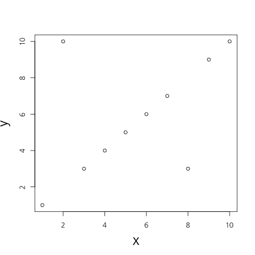
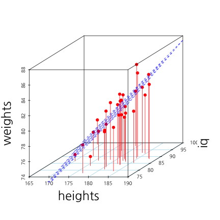
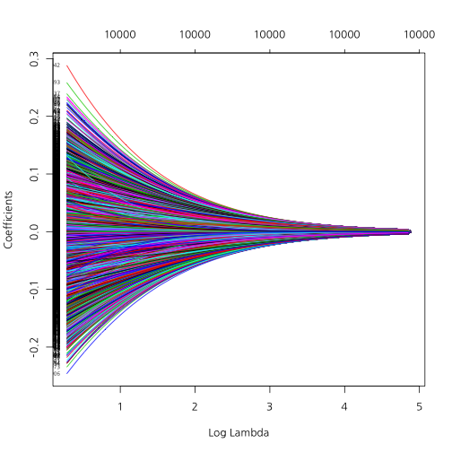

<center></center>

--- .new-background

## 워크숍 관련 온라인 사이트

http://course.mindscale.kr/course/text-analysis

<left></left>

--- .new-background

## 오늘의 목표  

<h3b> 감정 사전 만들기</h3b>  
<h3b> 감정 점수 만들기</h3b>  

<h3b> 상관관계</h3b>  
<h3b> 회귀분석</h3b>  
<h3b> 모형평가</h3b>  

--- .newbackground

## 감정분석

<h3b> - 감정 사전을 기반으로 텍스트 자료에서   
 긍정 단어와 부정 단어의 비율을 계산</h3b>  
<h3b> - 감정 사전을 어떻게 만들 것인가? </h3b>

--- .newbackground

## 사전지식 

예측이란 무엇?

자기자신 : Y가 변화하는 추세  
다른변수 : X가 Y를 예측  
- 키로 몸무게를 예측!  
- 키로 성적을 예측?  
- 예측이 잘 되려면 서로 상관(관련성)이 높아야 함  
-> 감정단어로 영화 평점을 예측  

--- .newbackground

## 회귀분석(선형(직선) 모형) 

### 예시

- 키가 1cm 증가할 때마다 몸무게가 1kg 증가  
- 월 소득이 100만원 증가할 때마다 몸무게가 1kg 감소  
- 부정단어가 1개 증가할 때 마다 평점 .1점 감점  
- 긍정단어가 1개 증가할 때 마다 평점 .1점 증가  

--- &twocol .modal

## 상관관계

*** =left


 

```
## [1] 1
```

*** =right


 

```
## [1] 0.4885042
```

--- .newbackground .modal

## 상관관계

- x가 증가(혹은 감소)할때 y가 증가(혹은 감소)하는 정도

### scale

키가 만약 cm라면, 키가 1cm 증가하면 몸무게는 1kg증가  
키가 만약 mm라면, 키가 1mm 증가하면 몸무게는 0.1kg 증가  

### -> 표준화해야 한다 

--- &twocol .modal

## 둘 중 무엇이 상관이 더 클까요?

*** =left


 

*** =right


 

--- &twocol

## 상관관계 및 회귀분석

*** =left


 

*** =right

<!-- html table generated in R 3.1.3 by xtable 1.7-4 package -->
<!-- Thu Jul 16 21:27:52 2015 -->
<table border=1>
<tr> <th>  </th> <th> Estimate </th> <th> Std. Error </th> <th> t value </th> <th> Pr(&gt;|t|) </th>  </tr>
  <tr> <td align="right"> (Intercept) </td> <td align="right"> -8.29 </td> <td align="right"> 11.74 </td> <td align="right"> -0.71 </td> <td align="right"> 0.49 </td> </tr>
  <tr> <td align="right"> heights </td> <td align="right"> 0.49 </td> <td align="right"> 0.07 </td> <td align="right"> 7.56 </td> <td align="right"> 0.00 </td> </tr>
   </table>


```r
cor(weights, heights)
```

```
## [1] 0.8194181
```

--- &twocol

## 상관관계 및 회귀분석

*** =left


 

*** =right

<!-- html table generated in R 3.1.3 by xtable 1.7-4 package -->
<!-- Thu Jul 16 21:27:52 2015 -->
<table border=1>
<tr> <th>  </th> <th> Estimate </th> <th> Std. Error </th> <th> t value </th> <th> Pr(&gt;|t|) </th>  </tr>
  <tr> <td align="right"> (Intercept) </td> <td align="right"> 69.17 </td> <td align="right"> 1.17 </td> <td align="right"> 58.93 </td> <td align="right"> 0.00 </td> </tr>
  <tr> <td align="right"> heights </td> <td align="right"> 0.05 </td> <td align="right"> 0.01 </td> <td align="right"> 7.56 </td> <td align="right"> 0.00 </td> </tr>
   </table>


```r
cor(weights, heights)
```

```
## [1] 0.8194181
```

--- &twocol

## 상관관계 및 회귀분석

*** =left

 

*** =right


 

--- &twocol

## X가 2개라면?

*** =left


 

```
## [1] 0.8194181
```

*** =right

 

```
## [1] 0.1387562
```

--- .newbackground

## 다중회귀분석

<!-- html table generated in R 3.1.3 by xtable 1.7-4 package -->
<!-- Sat Jul 18 17:24:39 2015 -->
<table border=1>
<tr> <th>  </th> <th> Estimate </th> <th> Std. Error </th> <th> t value </th> <th> Pr(&gt;|t|) </th>  </tr>
  <tr> <td align="right"> (Intercept) </td> <td align="right"> -20.76 </td> <td align="right"> 11.60 </td> <td align="right"> -1.79 </td> <td align="right"> 0.08 </td> </tr>
  <tr> <td align="right"> iq </td> <td align="right"> 0.08 </td> <td align="right"> 0.03 </td> <td align="right"> 2.68 </td> <td align="right"> 0.01 </td> </tr>
  <tr> <td align="right"> heights </td> <td align="right"> 0.52 </td> <td align="right"> 0.06 </td> <td align="right"> 8.66 </td> <td align="right"> 0.00 </td> </tr>
   </table>

--- &twocol

## Traninig Vs Test

*** =left

 

*** =right

 

--- .newbackground

## Over-fitting

<center></center>


--- .newbackground

## Over-fitting(과적합)

### How to avoid Over-fitting
- Penality of Model Complexity (MSE 보정)  
<font color="red">- Regulization (Lasso, Ridge, Elastic Net) </font>  
- Bayesian  
- Drop Out, Bagging, Feature Bagging  

--- .newbackground

## Lasso Vs Ridge

<center></center>

--- &twocol

## Lasso Vs Ridge

*** =left


 

*** =right

 

--- .newbackground

## 감정분석

<h5b> Data </h5b>  
<h5b> 10,000 IMDB movie reviews </h5b>  
<h5b> Training Vs Test = 7 Vs 3 </h5b>  

--- .newbackground

## Traing Set 과 Test Set 분리


```r
fileName <- "data/IMDBmovie/labeledTrainData.tsv"
data <- read.csv(fileName, header=T, sep="\t", quote="")
nrow(data)
```

```
## [1] 25000
```

```r
data <- data[1:1000, ]
```

--- .newbackground

## Traing Set 과 Test Set 분할


```r
totalNum <- 1:nrow(data)
set.seed(12345)
shuffledNum <- sample(totalNum, nrow(data), replace = F)
trainingNum <- shuffledNum[1:700]
testNum <- shuffledNum[701:1000]
train.data <- data[trainingNum, ]
test.data <- data[testNum, ]
```

--- .newbackground

## Term-DocumentMatrix


```r
library(tm)
```

```
## Loading required package: NLP
```


```r
corpus <- Corpus(VectorSource(train.data$review))
tdm.train <- TermDocumentMatrix(corpus, 
                                control=list(stemming = T,
                                             tolower = T,
                                             removePunctuation = T,
                                             removeNumbers = T,
                                             stopwords=stopwords("SMART")))
```

--- .newbackground

## 주요 단어 10000개 사용


```r
library(slam)
word.count = as.array(rollup(tdm.train, 2))
word.order = order(word.count, decreasing = T)
freq.word = word.order[1 : 10000]
tdm.train <- tdm.train[freq.word, ]
```

--- .newbackground

## Preparation


```r
library("doMC")
```

```
## Loading required package: foreach
## Loading required package: iterators
## Loading required package: parallel
```

```r
registerDoMC(cores=4)
```

--- .newbackground

## LASSO Regression


```r
alpha <- 1
cv.lasso <- cv.glmnet(as.matrix(t(tdm.train)), train.data$sentiment, 
                      type.measure = "class", 
                      nfolds = 4,
                      family = "binomial", 
                      alpha = alpha,
                      parallel = T)
```

```
## Warning: executing %dopar% sequentially: no parallel backend registered
```

--- .newbackground

## LASSO Regression

```r
plot(cv.lasso)
```

 

```r
log(cv.lasso$lambda.min)
```

```
## [1] -3.365195
```

--- .newbackground

## LASSO Regression

```r
plot(cv.lasso$glmnet.fit, "lambda", label=TRUE)
```

 

--- .newbackground

## Ridge Regression


```r
alpha <- 0
cv.ridge <- cv.glmnet(as.matrix(t(tdm.train)), train.data$sentiment, 
                      type.measure = "class", 
                      nfolds = 4,
                      family = "binomial", 
                      alpha = alpha,
                      parallel = T)
```

--- .newbackground

## RIDGE Regression

```r
plot(cv.ridge)
```

 

```r
log(cv.ridge$lambda.min)
```

```
## [1] 0.5654804
```

--- .newbackground

## RIDGE Regression

```r
plot(cv.ridge$glmnet.fit, "lambda", label=TRUE)
```

 

